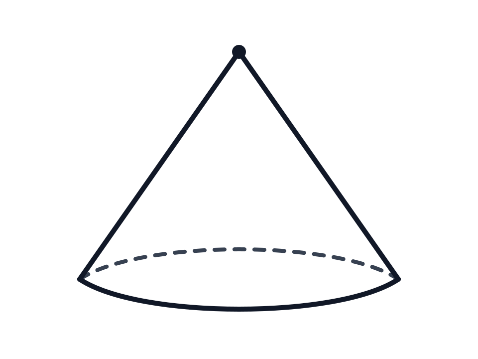
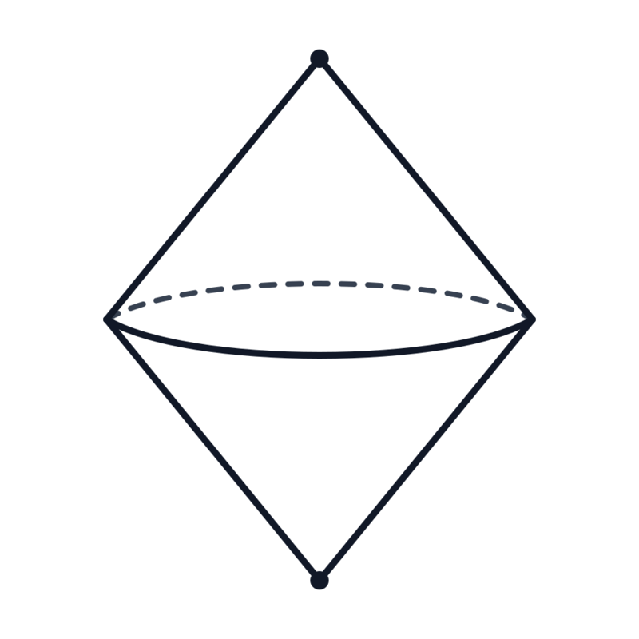
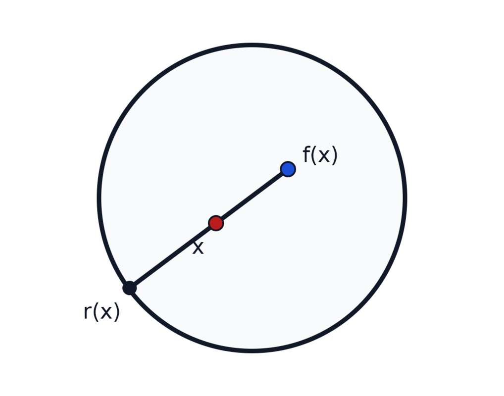
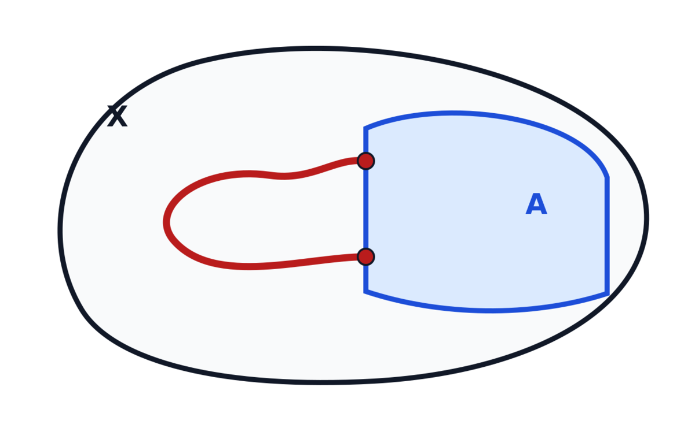
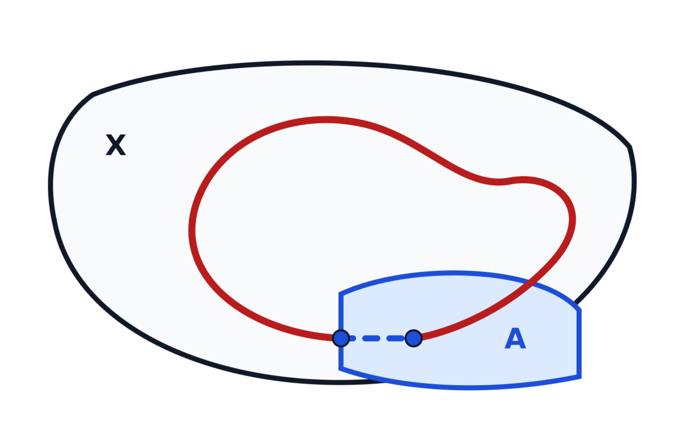
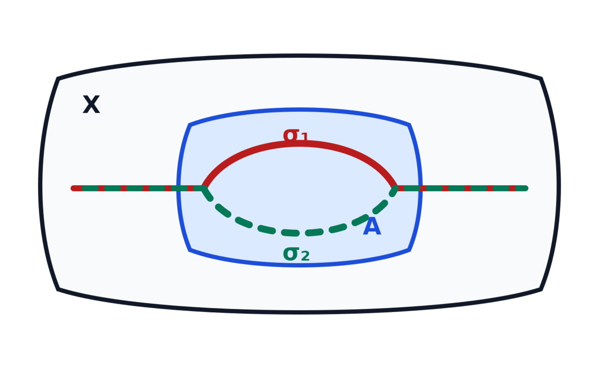

# Tentang komponen ini {.unnumbered #o012-fom-u003-notice data-course-route-unit-id="D60-R10"}

Komponen ini merupakan terjemahan dan adaptasi bahasa Indonesia atas Bagian
1.5–1.6 *Algebraic Topology* karya Yeheli Fomberg, berdasarkan kuliah Nir
Lazarovich pada musim semi 2025. Otoritas sumber dibekukan pada commit
[563194fae879178b9a6871b249513bfc27968975](https://git.sr.ht/~yp/math-notes/tree/563194fae879178b9a6871b249513bfc27968975/item/algebraic_topology.tex).
Rentang yang diterjemahkan ialah baris 1291–1922: 632 baris fisik, 24.270 byte
setelah normalisasi LF dan satu LF penutup, dengan SHA-256
870e617b30b82eb8a557b0733096623a73375ed079601e7e7938ce489d0ce064.

Catatan sumber tersedia di bawah
[Creative Commons Attribution-ShareAlike 4.0 International (CC BY-SA 4.0)](https://creativecommons.org/licenses/by-sa/4.0/).
Terjemahan, pemformatan semantik, koreksi terbatas, perbaikan bukti, dan materi
penguasaan asli di bawah ini diterbitkan dengan lisensi yang sama. Perubahan
dicatat secara eksplisit dalam blok audit dan ledger. Tidak ada prosa dari
bank soal Fomberg terpisah maupun materi MIT yang disalin ke dalam komponen
ini.

Edisi ini independen dan tidak menyiratkan dukungan, pengesahan, atau afiliasi
dengan Yeheli Fomberg, Nir Lazarovich, ataupun institusi mereka. Produksi
terjemahan, struktur semantik, dan QA dibantu oleh
**OpenAI Codex gpt-5.6-sol, Ultra** atas arahan pengguna.

# Barisan eksak dan homologi relatif {#o012-fom-u003}

## Barisan eksak {#o012-fom-u003-s05 data-source-lines="1291-1564"}

::: {.definition #o012-fom-u003-def-exact-sequence data-source-lines="1293-1305"}
**Definisi (barisan eksak).** Suatu barisan grup abelian (atau, lebih umum,
suatu barisan objek)

::: {.figure #o012-fom-u003-fig-exact-sequence data-source-lines="1295-1301"}
$$
\cdots
\xrightarrow{\alpha_{i+2}} A_{i+1}
\xrightarrow{\alpha_{i+1}} A_i
\xrightarrow{\alpha_i} A_{i-1}
\xrightarrow{\alpha_{i-1}}\cdots
$$

**Diagram semantik.** Panah masuk ke $A_i$ ialah $\alpha_{i+1}$, sedangkan
panah keluar dari $A_i$ ialah $\alpha_i$.
:::

disebut **eksak** jika

$$
\ker\alpha_i=\operatorname{im}\alpha_{i+1}
$$

untuk setiap $i$. Jika kesamaan itu berlaku untuk suatu $i$ tertentu, barisan
tersebut disebut **eksak pada $A_i$**.
:::

::: {.remark #o012-fom-u003-rem-trivial-homology data-source-lines="1306-1309"}
**Catatan.** Suatu barisan eksak jika dan hanya jika barisan tersebut merupakan
kompleks rantai yang semua grup homologinya trivial.
:::

::: {.remark #o012-fom-u003-rem-why-exact data-source-lines="1310-1317"}
**Catatan.** Barisan-barisan ini disebut eksak karena, sementara biasanya kita
hanya mempunyai
$\operatorname{im}\alpha_{n+1}\subseteq\ker\alpha_n$, di sini citra
$\alpha_{n+1}$ **tepat sama dengan** kernel $\alpha_n$. Artinya, jika
$a\in A_n$ dipetakan ke nol, maka mesti ada $b\in A_{n+1}$ sehingga
$\alpha_{n+1}(b)=a$. Kita juga tetap mempunyai sifat

$$
\alpha_n\circ\alpha_{n+1}=0.
$$
:::

::: {.example #o012-fom-u003-ex-injective data-source-lines="1319-1328"}
**Contoh.** Barisan

::: {.figure #o012-fom-u003-fig-injective data-source-lines="1321-1325"}
$$
0\longrightarrow A\xrightarrow{\alpha}B
$$

**Diagram semantik.** Grup nol masuk ke $A$, lalu $A$ dipetakan ke $B$ oleh
$\alpha$.
:::

eksak jika dan hanya jika $\ker\alpha=0$, jika dan hanya jika $\alpha$
injektif.
:::

::: {.example #o012-fom-u003-ex-surjective data-source-lines="1329-1338"}
**Contoh.** Barisan

::: {.figure #o012-fom-u003-fig-surjective data-source-lines="1331-1335"}
$$
A\xrightarrow{\beta}B\longrightarrow0
$$

**Diagram semantik.** $A$ dipetakan ke $B$ oleh $\beta$, lalu $B$ dipetakan
ke grup nol.
:::

eksak jika dan hanya jika $\operatorname{im}\beta=B$, jika dan hanya jika
$\beta$ surjektif.
:::

::: {.example #o012-fom-u003-ex-isomorphism data-source-label="exmp:short-exact-sequence-isomorphism" data-source-lines="1339-1350"}
**Contoh.** Dengan menggabungkan dua hasil terakhir, kita memperoleh bahwa
barisan

::: {.figure #o012-fom-u003-fig-isomorphism data-source-lines="1342-1348"}
$$
0\longrightarrow A\xrightarrow{\alpha}B\longrightarrow0
$$

**Diagram semantik.** Satu-satunya pemetaan yang bukan pemetaan ke atau dari
grup nol adalah $\alpha\colon A\to B$.
:::

eksak jika dan hanya jika $\alpha$ merupakan isomorfisma.
:::

::: {.example #o012-fom-u003-ex-short-exact data-source-lines="1352-1367"}
**Contoh (barisan eksak pendek).** Barisan eksak pendek ialah barisan eksak
berbentuk

::: {.figure #o012-fom-u003-fig-short-exact data-source-lines="1354-1360"}
$$
0\longrightarrow A\xrightarrow{\alpha}B
\xrightarrow{\beta}C\longrightarrow0.
$$

**Diagram semantik.** $\alpha$ memasukkan $A$ ke $B$, $\beta$ memetakan $B$
ke $C$, dan kedua ujung barisan adalah grup nol.
:::

Ini berarti bahwa $\alpha$ harus injektif dan $\beta$ harus surjektif. Cara
lain untuk memahaminya ialah mengidentifikasi $A$ dengan
$\operatorname{im}\alpha\subseteq B$ dan memandang $C$ sebagai hasil bagi
dari $B$. Karena $\ker\beta=\operatorname{im}\alpha$, kita dapat menuliskan

$$
C\cong B/\operatorname{im}\alpha\cong B/A
$$

setelah identifikasi tersebut.
:::

::: {.definition #o012-fom-u003-def-good-pair data-source-lines="1369-1374"}
**Definisi (pasangan baik).** Misalkan $X$ ruang topologis dan
$A\subseteq X$. Pasangan $(X,A)$ disebut **pasangan baik** jika $A$ mempunyai
suatu lingkungan terbuka $A\subseteq U\subseteq X$ sedemikian sehingga $A$
merupakan retrak deformasi dari $U$.
:::

::: {.theorem #o012-fom-u003-thm-les-quotient data-source-label="thm:les-of-quotient-space" data-source-lines="1376-1389"}
**Teorema.** Misalkan $(X,A)$ pasangan baik. Maka terdapat barisan eksak

::: {.figure #o012-fom-u003-fig-les-quotient data-source-lines="1380-1386"}
$$
\begin{aligned}
\cdots&\xrightarrow{\partial}\widetilde H_n(A)
\xrightarrow{i_*}\widetilde H_n(X)
\xrightarrow{q_*}\widetilde H_n(X/A)
\xrightarrow{\partial}\widetilde H_{n-1}(A)\\
&\xrightarrow{i_*}\widetilde H_{n-1}(X)
\xrightarrow{q_*}\widetilde H_{n-1}(X/A)
\longrightarrow\cdots\\
\cdots&\xrightarrow{\partial}\widetilde H_0(A)
\xrightarrow{i_*}\widetilde H_0(X)
\xrightarrow{q_*}\widetilde H_0(X/A)
\longrightarrow0,
\end{aligned}
$$

**Diagram semantik.** Sesudah $q_*$ pada setiap derajat, pemetaan penghubung
$\partial$ turun satu derajat ke homologi tereduksi $A$; pola itu berulang
sampai derajat nol dan berakhir di grup nol.
:::

dengan $i\colon A\hookrightarrow X$ pemetaan inklusi dan
$q\colon X\to X/A$ pemetaan hasil bagi.
:::

::: {.source-omission #o012-fom-u003-forward-quotient-les data-origin="edition-original" data-source-lines="1376-1389" data-proof-status="forward-proof" data-repair-id="FOM-U003-QUOTIENT-LES"}
**Penanda bukti maju.** Sumber menyatakan teorema ini tanpa bukti, lalu
memakainya dua kali sebelum homologi relatif dan eksisi dikembangkan. Edisi
ini tidak menganggapnya telah dibuktikan pada titik ini. Setelah teorema eksisi
ditutup pada Unit Fomberg 004, bukti lengkap akan diperoleh dari isomorfisma
alami $H_n(X,A)\cong\widetilde H_n(X/A)$ untuk pasangan baik dan barisan eksak
panjang pasangan. Perhitungan sfera dan suspensi berikut memakai hasil standar
ini dengan status bukti maju tersebut dinyatakan secara terbuka.
:::

::: {.corollary #o012-fom-u003-cor-sphere-homology data-source-label="cor:homologies-of-spheres" data-source-lines="1391-1401"}
**Akibat.** Kita mempunyai

$$
\widetilde H_k(S^n)=
\begin{cases}
\mathbb Z,&k=n,\\
\{0\},&\text{selain itu}.
\end{cases}
$$
:::

::: {.proof #o012-fom-u003-proof-sphere-homology data-source-lines="1402-1443"}
**Bukti.** Untuk langkah induksi $n\geq1$, nyatakan $X=\mathbb D^n$ dan
$A=\partial\mathbb D^n$. Setelah
memeriksa bahwa pasangan ini merupakan pasangan baik,
[teorema barisan eksak ruang hasil bagi](#o012-fom-u003-thm-les-quotient)
memberi barisan eksak.

:::: {.proof-supplement #o012-fom-u003-proof-good-pair-disk data-origin="edition-original" data-source-lines="1403-1405"}
**Pelengkap bukti edisi (pasangan baik).** Pemeriksaan yang dilewati sumber
dapat diberikan secara eksplisit. Ambil lingkungan terbuka relatif

$$
U=\{x\in\mathbb D^n:\lVert x\rVert>1/2\}.
$$

Pemetaan $r(x)=x/\lVert x\rVert$ meretraksikan $U$ ke
$\partial\mathbb D^n$, dan

$$
H(x,t)=\left((1-t)+\frac{t}{\lVert x\rVert}\right)x
$$

adalah retraksi deformasi: ia tetap berada di $U$ dan menetapkan setiap titik
batas. Jadi $(\mathbb D^n,\partial\mathbb D^n)$ memang pasangan baik.
::::

Barisan eksak yang diperoleh ialah

::: {.figure #o012-fom-u003-fig-disk-boundary-les data-source-lines="1407-1413"}
$$
\begin{aligned}
\cdots&\xrightarrow{\partial}\widetilde H_k(\partial\mathbb D^n)
\xrightarrow{i_*}\widetilde H_k(\mathbb D^n)
\xrightarrow{q_*}\widetilde H_k(\mathbb D^n/\partial\mathbb D^n)
\xrightarrow{\partial}\widetilde H_{k-1}(\partial\mathbb D^n)\\
&\xrightarrow{i_*}\widetilde H_{k-1}(\mathbb D^n)
\xrightarrow{q_*}\widetilde H_{k-1}(\mathbb D^n/\partial\mathbb D^n)
\longrightarrow\cdots\\
\cdots&\xrightarrow{\partial}\widetilde H_0(\partial\mathbb D^n)
\xrightarrow{i_*}\widetilde H_0(\mathbb D^n)
\xrightarrow{q_*}\widetilde H_0(\mathbb D^n/\partial\mathbb D^n)
\longrightarrow0.
\end{aligned}
$$

**Diagram semantik.** Ini adalah barisan pada teorema sebelumnya dengan
$(X,A)=(\mathbb D^n,\partial\mathbb D^n)$.
:::

Kita mengetahui bahwa grup-grup homologi tereduksi $\mathbb D^n$ trivial,
sehingga kita dapat mengambil subbarisan eksak

::: {.figure #o012-fom-u003-fig-sphere-short-exact-first data-source-lines="1416-1422"}
$$
0\longrightarrow
\widetilde H_k(\mathbb D^n/\partial\mathbb D^n)
\xrightarrow{\partial}
\widetilde H_{k-1}(\partial\mathbb D^n)
\longrightarrow0.
$$

**Diagram semantik.** Pemetaan penghubung $\partial$ berada di antara dua
grup nol dalam potongan barisan eksak ini.
:::

Karena
$\mathbb D^n/\partial\mathbb D^n\cong S^n$ dan
$\partial\mathbb D^n\cong S^{n-1}$, barisan tersebut setara dengan

::: {.figure #o012-fom-u003-fig-sphere-short-exact data-source-lines="1423-1430"}
$$
0\longrightarrow\widetilde H_k(S^n)
\xrightarrow{\partial}\widetilde H_{k-1}(S^{n-1})
\longrightarrow0.
$$

**Diagram semantik.** Pemetaan penghubung mengidentifikasi homologi tereduksi
sfera-$n$ pada derajat $k$ dengan homologi tereduksi sfera-$(n-1)$ pada derajat
$k-1$.
:::

Karena barisan ini eksak, sebagaimana pada [contoh isomorfisma
di atas](#o012-fom-u003-ex-isomorphism), kita memperoleh

$$
\widetilde H_k(S^n)\cong\widetilde H_{k-1}(S^{n-1}).
$$

Selanjutnya, kita mengetahui bahwa

$$
\widetilde H_k(S^0)=
\begin{cases}
\mathbb Z,&k=0,\\
\{0\},&\text{selain itu}.
\end{cases}
$$

Hasilnya sekarang mengikuti dengan induksi. $\square$
:::

::: {.definition #o012-fom-u003-def-cone data-source-lines="1446-1449"}
**Definisi (kerucut suatu ruang).** Misalkan $X$ ruang topologis. Kita
mendefinisikan **kerucut** $X$ sebagai

$$
CX=\bigl(X\times[0,1]\bigr)/\bigl(X\times\{1\}\bigr).
$$
:::

::: {.example #o012-fom-u003-ex-circle-cone data-source-lines="1450-1462"}
**Contoh.** Misalkan $X=S^1$. Kerucut ruang tersebut adalah

$$
CX=CS^1.
$$

::: {.figure #o012-fom-u003-fig-circle-cone data-source-lines="1453-1461"}
{.semantic-redraw width=72%}

**Diagram semantik (kerucut lingkaran).** Sebuah lingkaran mendatar menjadi
alas. Setengah lingkaran depan digambar dengan garis utuh dan setengah bagian
belakang dengan garis putus-putus. Setiap titik lingkaran menuju satu titik
puncak di atasnya; dua garis pembangkit dari sisi kiri dan kanan alas menuju
puncak memperlihatkan bentuk kerucut.
:::
:::

::: {.definition #o012-fom-u003-def-suspension data-source-lines="1464-1468"}
**Definisi (suspensi suatu ruang).** Misalkan $X$ ruang topologis. Kita
mendefinisikan **suspensi** $X$ sebagai

$$
SX=CX/X
=CX/\bigl(X\times\{0\}\bigr).
$$

Di sini $X$ pada hasil bagi pertama diidentifikasi dengan alas
$X\times\{0\}\subset CX$.
:::

::: {.example #o012-fom-u003-ex-circle-suspension data-source-lines="1469-1483"}
**Contoh.** Misalkan $X=S^1$. Suspensi ruang tersebut adalah

$$
SX=SS^1.
$$

::: {.figure #o012-fom-u003-fig-circle-suspension data-source-lines="1472-1482"}
{.semantic-redraw width=65%}

**Diagram semantik (suspensi lingkaran).** Sebuah lingkaran mendatar menjadi
khatulistiwa. Setengah lingkaran depan digambar dengan garis utuh dan setengah
bagian belakang dengan garis putus-putus. Dari sisi kiri dan kanan lingkaran,
garis-garis menuju satu puncak di atas dan satu puncak di bawah; bentuknya
merupakan kerucut ganda.
:::
:::

::: {.remark #o012-fom-u003-rem-suspension-sphere data-source-lines="1484-1489"}
**Catatan.** Perhatikan bahwa $SS^n$ homeomorfik dengan $S^{n+1}$. Sekarang
kita dapat menggeneralisasi pernyataan

$$
\widetilde H_k(S^n)\cong\widetilde H_{k-1}(S^{n-1})
$$

dari [akibat tentang homologi sfera](#o012-fom-u003-cor-sphere-homology).
:::

::: {.proposition #o012-fom-u003-prop-suspension-homology data-source-lines="1491-1494"}
**Proposisi.** Misalkan $X$ ruang topologis tak kosong. Untuk setiap
$n\geq1$,

$$
\widetilde H_n(SX)\cong\widetilde H_{n-1}(X).
$$
:::

::: {.proof #o012-fom-u003-proof-suspension-homology data-source-lines="1495-1522"}
**Bukti.** Kita mengetahui bahwa $CX/X=SX$.

:::: {.proof-supplement #o012-fom-u003-proof-good-pair-cone data-origin="edition-original" data-source-lines="1495-1499"}
**Pelengkap bukti edisi (pasangan baik).** Pasangan $(CX,X)$ merupakan
pasangan baik. Jika $q\colon X\times[0,1]\to CX$ adalah pemetaan hasil
bagi, maka $U=q(X\times[0,1/2))$ merupakan lingkungan terbuka dari salinan
alas $X=q(X\times\{0\})$. Homotopi

$$
K([x,s],t)=[x,(1-t)s]
$$

merupakan retraksi deformasi $U$ ke alas dan menetapkan alas titik demi titik.
::::

Karena itu [teorema barisan eksak ruang hasil
bagi](#o012-fom-u003-thm-les-quotient) memberi barisan eksak

::: {.figure #o012-fom-u003-fig-cone-les data-source-lines="1500-1506"}
$$
\begin{aligned}
\cdots&\xrightarrow{\partial}\widetilde H_n(X)
\xrightarrow{i_*}\widetilde H_n(CX)
\xrightarrow{q_*}\widetilde H_n(SX)
\xrightarrow{\partial}\widetilde H_{n-1}(X)\\
&\xrightarrow{i_*}\widetilde H_{n-1}(CX)
\xrightarrow{q_*}\widetilde H_{n-1}(SX)
\longrightarrow\cdots\\
\cdots&\xrightarrow{\partial}\widetilde H_0(X)
\xrightarrow{i_*}\widetilde H_0(CX)
\xrightarrow{q_*}\widetilde H_0(SX)
\longrightarrow0.
\end{aligned}
$$

**Diagram semantik.** Ini adalah barisan eksak panjang pasangan baik
$(CX,X)$; setelah setiap suku homologi suspensi, $\partial$ kembali ke
homologi $X$ satu derajat lebih rendah.
:::

Kita mengetahui bahwa grup-grup homologi tereduksi $CX$ trivial karena $CX$
dapat dikontraksikan ke titik puncak $X\times\{1\}$. Hal ini memungkinkan kita
mengambil subbarisan eksak

::: {.figure #o012-fom-u003-fig-suspension-short-exact data-source-lines="1510-1517"}
$$
0\longrightarrow\widetilde H_n(SX)
\xrightarrow{\partial}\widetilde H_{n-1}(X)
\longrightarrow0.
$$

**Diagram semantik.** Pemetaan penghubung dari homologi suspensi ke homologi
$X$ berada di antara dua grup nol.
:::

Karena barisan ini eksak, sebagaimana pada [contoh isomorfisma
di atas](#o012-fom-u003-ex-isomorphism), kita memperoleh

$$
\widetilde H_n(SX)\cong\widetilde H_{n-1}(X),
$$

yang menyelesaikan bukti. $\square$
:::

::: {.source-audit #o012-fom-u003-audit-suspension-degree data-origin="edition-original" data-source-lines="1491-1494"}
**Koreksi FOM-U003-COR-014 (rentang derajat).** Sumber tidak memberi rentang
$n$ pada isomorfisma suspensi. Karena materi ini memakai kompleks rantai
berderajat taknegatif dan belum mendefinisikan $\widetilde H_{-1}$,
terjemahan menyatakan rumus untuk $n\geq1$ dan ruang $X$ tak kosong. Homologi
tereduksi derajat nol dari suspensi tak kosong juga nol karena suspensi
terhubung lintasan.
:::

::: {.corollary #o012-fom-u003-cor-boundary-not-retract data-source-lines="1524-1526"}
**Akibat.** Untuk $n\geq1$, $\partial\mathbb D^n$ bukan retrak dari
$\mathbb D^n$.
:::

::: {.proof #o012-fom-u003-proof-boundary-not-retract data-source-lines="1527-1532"}
**Bukti.** Andaikan $r\colon\mathbb D^n\to\partial\mathbb D^n$ suatu
retraksi dan tuliskan $i\colon\partial\mathbb D^n\hookrightarrow\mathbb D^n$
untuk inklusi. Karena $r\circ i=\operatorname{id}$, fungtorialitas homologi
tereduksi memberi

$$
r_*\circ i_*=\operatorname{id}.
$$

Jadi

$$
r_*\colon \widetilde H_{n-1}(\mathbb D^n)\longrightarrow
\widetilde H_{n-1}(\partial\mathbb D^n)
$$

surjektif. Akan tetapi, dengan memakai hasil-hasil sebelumnya, pemetaan ini
berbentuk $r_*\colon0\to\mathbb Z$. Ini kontradiksi dan menyelesaikan bukti
untuk $n\geq1$. $\square$
:::

::: {.corollary #o012-fom-u003-cor-brouwer data-source-lines="1534-1536"}
**Akibat (teorema titik tetap Brouwer).** Untuk setiap $n\geq0$, setiap
pemetaan kontinu $f\colon\mathbb D^n\to\mathbb D^n$ mempunyai titik tetap.
:::

::: {.proof #o012-fom-u003-proof-brouwer data-source-lines="1537-1563"}
**Bukti.** Kasus $n=0$ langsung karena $\mathbb D^0$ hanya terdiri atas satu
titik. Untuk $n\geq1$, andaikan, menuju kontradiksi, bahwa
$f\colon\mathbb D^n\to\mathbb D^n$ tidak mempunyai titik tetap. Definisikan
$r\colon\mathbb D^n\to\partial\mathbb D^n$ dengan memetakan $x$ ke titik
potong $\partial\mathbb D^n$ dengan sinar yang berawal di $f(x)$ dan melalui
$x$.

:::: {.proof-supplement #o012-fom-u003-proof-brouwer-continuity data-origin="edition-original" data-source-lines="1540-1555"}
**Pelengkap bukti edisi (kontinuitas).** Kontinuitas yang hanya dinyatakan
dalam sumber dapat diperiksa langsung. Tuliskan $a=f(x)$ dan
$v=x-f(x)\ne0$. Titik potong positif ialah

$$
r(x)=a+t(x)v,
\qquad
t(x)=\frac{-\langle a,v\rangle+
\sqrt{\langle a,v\rangle^2+\lVert v\rVert^2(1-\lVert a\rVert^2)}}
{\lVert v\rVert^2}.
$$

Penyebutnya positif karena $v\ne0$, dan semua operasi pada rumus itu kontinu;
jadi $r$ kontinu. Akar yang dipilih adalah perpotongan pada arah positif dan
memenuhi $t(x)\geq1$. Jika $x\in\partial\mathbb D^n$, akar tersebut adalah
$t(x)=1$, sehingga $r(x)=x$.
::::

::: {.figure #o012-fom-u003-fig-brouwer-retraction data-source-lines="1542-1553"}
{.semantic-redraw width=68%}

**Diagram semantik (retraksi yang timbul jika tidak ada titik tetap).** Di
dalam sebuah cakram terdapat titik $f(x)$ dan titik berbeda $x$. Garis dari
$f(x)$ melalui $x$ diperpanjang hingga memotong lingkaran batas pada $r(x)$;
urutan ketiga titik pada sinar ialah $f(x)$, lalu $x$, lalu $r(x)$.
:::

Pemetaan $r\colon\mathbb D^n\to\partial\mathbb D^n$ kontinu dan

$$
r|_{\partial\mathbb D^n}=\operatorname{id},
$$

sehingga $r$ merupakan retraksi. Argumen fungtorialitas homologi tereduksi
pada bukti sebelumnya mewajibkan $r_*$ surjektif. Secara khusus,

$$
r_*\colon \widetilde H_{n-1}(\mathbb D^n)
\longrightarrow \widetilde H_{n-1}(\partial\mathbb D^n)
=\widetilde H_{n-1}(S^{n-1})
$$

harus surjektif. Namun kita telah menghitung grup-grup homologi ini, sehingga
kita mengetahui bahwa $r_*$ adalah pemetaan dari $\{0\}$ ke $\mathbb Z$ dan
tidak mungkin surjektif. Kontradiksi ini menyelesaikan bukti. $\square$
:::

## Audit koreksi sumber {.unnumbered #o012-fom-u003-source-corrections}

Blok-blok berikut bukan prosa sumber. Blok ini mencatat setiap perubahan
substantif atau tipografis yang diterapkan pada terjemahan di atas.

::: {.source-audit #o012-fom-u003-audit-punctuation data-origin="edition-original" data-source-lines="1302-1304"}
**Koreksi FOM-U003-COR-001 (tanda baca).** Sumber memutus kalimat sesudah
“for some $i$” lalu memulai “then” sebagai kalimat baru. Terjemahan
menggabungkannya menjadi satu kalimat bersyarat tanpa mengubah makna.
:::

::: {.source-audit #o012-fom-u003-audit-composition-order data-origin="edition-original" data-source-lines="1311-1316"}
**Koreksi FOM-U003-COR-002 (urutan komposisi).** Sumber mencetak
$\alpha_{n+1}\circ\alpha_n=0$. Dengan arah panah sumber,
$A_{n+1}\xrightarrow{\alpha_{n+1}}A_n\xrightarrow{\alpha_n}A_{n-1}$,
komposisi itu tidak bertipe. Terjemahan memakai rumus yang bertipe benar,
$\alpha_n\circ\alpha_{n+1}=0$, sambil mempertahankan pernyataan bahwa setiap
dua pemetaan berturutan berkomposisi menjadi nol.
:::

::: {.source-audit #o012-fom-u003-audit-duplicate-arrow data-origin="edition-original" data-source-lines="1342-1348"}
**Koreksi FOM-U003-COR-003 (panah ganda).** Kode TikZ-CD sumber menggambar
panah tak berlabel dan panah berlabel $\alpha$ secara bersamaan dari $A$ ke
$B$. Terjemahan menampilkan satu panah $\alpha\colon A\to B$, yakni objek
matematis yang dijelaskan oleh prosa dan kesimpulan sumber.
:::

::: {.source-audit #o012-fom-u003-audit-short-exact-quotient data-origin="edition-original" data-source-lines="1361-1366"}
**Koreksi FOM-U003-COR-004 (identifikasi hasil bagi).** Sumber menulis secara
informal $A\subseteq B$ dan $C=B/A$. Karena pemetaan yang diberikan sebenarnya
adalah $\alpha\colon A\to B$, terjemahan menyatakan identifikasi yang
diperlukan dan bentuk yang tepat:
$C\cong B/\operatorname{im}\alpha\cong B/A$ setelah $A$ diidentifikasi dengan
$\operatorname{im}\alpha$.
:::

::: {.source-audit #o012-fom-u003-audit-disk-reduced data-origin="edition-original" data-source-lines="1414-1415"}
**Koreksi FOM-U003-COR-012 (kualifikasi homologi cakram).** Sumber mengatakan
bahwa “the homology groups” dari $\mathbb D^n$ trivial. Homologi biasa
$H_0(\mathbb D^n)\cong\mathbb Z$ tidak trivial; suku-suku dalam diagram
sumber adalah homologi tereduksi. Terjemahan karena itu menyebut secara
eksplisit grup-grup **homologi tereduksi** $\mathbb D^n$.
:::

::: {.source-audit #o012-fom-u003-audit-szero-reduced data-origin="edition-original" data-source-lines="1434-1442"}
**Koreksi FOM-U003-COR-005 (homologi tereduksi pada kasus dasar).** Seluruh
pernyataan dan rekursi memakai $\widetilde H$, tetapi sumber mencetak
$H_k(S^0)=\mathbb Z$ untuk $k=0$. Homologi biasa sebenarnya memenuhi
$H_0(S^0)\cong\mathbb Z\oplus\mathbb Z$; rumus yang diperlukan adalah
$\widetilde H_0(S^0)\cong\mathbb Z$. Terjemahan mengembalikan tilde yang
hilang.
:::

::: {.source-audit #o012-fom-u003-audit-suspension-face data-origin="edition-original" data-source-lines="1464-1467"}
**Koreksi FOM-U003-COR-006 (muka yang diruntuhkan pada suspensi).** Definisi
kerucut pada baris 1448 telah meruntuhkan $X\times\{1\}$ menjadi titik puncak.
Sumber kemudian mencetak $SX=CX/X=CX/(X\times\{1\})$, yang hanya meruntuhkan
kembali titik puncak dan tidak menghasilkan suspensi. Terjemahan memakai
$SX=CX/(X\times\{0\})$, yaitu meruntuhkan alas kerucut, sesuai dengan
$CX/X$, gambar sumber, catatan $SS^n\cong S^{n+1}$, dan bukti berikutnya.
:::

::: {.source-audit #o012-fom-u003-audit-suspension-word data-origin="edition-original" data-source-lines="1469-1473"}
**Koreksi FOM-U003-COR-007 (nama konstruksi).** Contoh dimulai dengan
$SX=SS^1$ dan menampilkan kerucut ganda, tetapi prosa sumber menyebutnya
“the cone of a space”. Terjemahan memakai “suspensi ruang tersebut”.
:::

::: {.source-audit #o012-fom-u003-audit-xs-typo data-origin="edition-original" data-source-lines="1501-1505"}
**Koreksi FOM-U003-COR-008 (salah ketik simbol).** Suku terakhir diagram sumber
mencetak $\widetilde H_0(XS)$. Semua suku dan definisi di sekitarnya memakai
$SX$; terjemahan membetulkannya menjadi $\widetilde H_0(SX)$.
:::

::: {.source-audit #o012-fom-u003-audit-cone-apex data-origin="edition-original" data-source-lines="1507-1509"}
**Koreksi FOM-U003-COR-009 (titik kontraksi kerucut).** Sumber menulis
“contracible” dan menyebut titik $X\times\{0\}$. Berdasarkan definisi sumber,
$X\times\{0\}$ adalah alas yang tetap berupa salinan $X$, sedangkan
$X\times\{1\}$ diruntuhkan menjadi satu titik puncak. Terjemahan memakai
“dapat dikontraksikan ke titik puncak $X\times\{1\}$”. Karena homologi biasa
$H_0(CX)\cong\mathbb Z$ tidak trivial, terjemahan juga mempertahankan jenis
grup pada diagram dengan menyebut secara eksplisit **homologi tereduksi**.
:::

::: {.source-audit #o012-fom-u003-audit-brouwer-continuous data-origin="edition-original" data-source-lines="1534-1536"}
**Koreksi FOM-U003-COR-010 (hipotesis teorema Brouwer).** Sumber mencetak
“Every contractive map”. Teorema titik tetap Brouwer dan bukti retraksi yang
diberikan berlaku untuk setiap **pemetaan kontinu**
$f\colon\mathbb D^n\to\mathbb D^n$; tidak ada konstanta kontraksi yang dipakai.
Terjemahan karena itu memakai “pemetaan kontinu”.
:::

::: {.source-audit #o012-fom-u003-audit-no-fixed-points data-origin="edition-original" data-source-lines="1537-1541"}
**Koreksi FOM-U003-COR-011 (negasi yang salah ketik).** Sumber mencetak bahwa
$f$ “has to fixed points”. Argumen kontradiksi dan konstruksi sinar hanya
bermakna di bawah asumsi bahwa $f$ **tidak mempunyai titik tetap**. Terjemahan
memulihkan negasi tersebut.
:::

::: {.source-audit #o012-fom-u003-audit-boundary-reduced data-origin="edition-original" data-source-lines="1524-1532"}
**Koreksi FOM-U003-COR-013 (homologi tereduksi dan derajat).** Bukti sumber
menulis $H_{n-1}(\mathbb D^n)=0$ dan
$H_{n-1}(\partial\mathbb D^n)\cong\mathbb Z$. Untuk $n=1$, kedua rumus
homologi biasa itu salah: $H_0(\mathbb D^1)\cong\mathbb Z$ dan
$H_0(S^0)\cong\mathbb Z^2$. Argumen menjadi seragam dan benar untuk
$n\geq1$ dengan homologi tereduksi. Terjemahan menerapkan koreksi tersebut;
kasus $n=0$ pada teorema titik tetap ditangani langsung.
:::

::: {.source-audit #o012-fom-u003-audit-brouwer-continuity data-origin="edition-original" data-source-lines="1540-1555"}
**Perbaikan FOM-U003-COR-015 (kontinuitas retraksi radial).** Sumber
menggambarkan retraksi radial dan kemudian hanya menyatakan bahwa pemetaan itu
kontinu. Terjemahan menambahkan parameter perpotongan positif secara eksplisit
dan memeriksa bahwa rumusnya kontinu selama $f(x)\ne x$.
:::

## Homologi relatif {#o012-fom-u003-s06 data-source-lines="1565-1922"}

::: {.definition #o012-fom-u003-def-relative-chain-group data-source-lines="1567-1576"}
**Definisi (grup rantai relatif).** Misalkan $(X,A)$ suatu pasangan dengan
$A\subseteq X$, dan $X$ ruang topologis. Kita telah melihat bahwa
$C_n(A)\subseteq C_n(X)$. Definisikan

$$
C_n(X,A):=C_n(X)/C_n(A).
$$

Grup ini adalah grup abelian bebas dengan basis

$$
\left\{\sigma_\alpha\colon\Delta^n\longrightarrow X\right\}_\alpha
\quad\text{yang memenuhi}\quad
\sigma_\alpha(\Delta^n)\nsubseteq A.
$$

Dengan kata lain, generator yang seluruh citranya berada di $A$ menjadi nol
dalam hasil bagi tersebut.
:::

::: {.source-audit #o012-fom-u003-audit-direct-complement-comment data-source-lines="1575-1575"}
**Komentar sumber.** Baris 1575 memuat komentar TeX “direct complement?”.
Karena basis $C_n(A)$ adalah tepat subhimpunan basis $C_n(X)$ yang citranya
berada di $A$, grup bebas itu memang terbelah sebagai $C_n(A)$ ditambah grup
bebas pada generator sisanya; hasil bagi diidentifikasi dengan suku kedua.
Komentar tersebut tidak dihapus diam-diam dari catatan kerja ini.
:::

::: {.remark #o012-fom-u003-rem-relative-boundary-well-defined data-source-lines="1577-1585"}
**Catatan.** Pemetaan batas
$\partial\colon C_n(X)\to C_{n-1}(X)$ memenuhi

$$
\partial\!\left(C_n(A)\right)\subseteq C_{n-1}(A).
$$

Karena itu $\partial$ menginduksi pemetaan pada grup hasil bagi,

$$
\partial\colon C_n(X)/C_n(A)\longrightarrow
C_{n-1}(X)/C_{n-1}(A).
$$

Jadi pemetaan batas relatif

$$
\partial\colon C_n(X,A)\longrightarrow C_{n-1}(X,A)
$$

terdefinisi dengan baik.
:::

::: {.source-audit #o012-fom-u003-corr-001 data-origin="edition-original" data-source-lines="1583-1583"}
**Koreksi tipografis yang diusulkan.** Sumber mencetak
$\to\colon C_{n-1}(X,A)$. Tanda titik dua setelah $\to$ tidak mempunyai
fungsi matematis dan dihapus pada rumus terjemahan di atas.
:::

::: {.remark #o012-fom-u003-rem-relative-chain-complex data-source-lines="1587-1590"}
**Catatan.** Pasangan $\bigl(C_n(X,A),\partial\bigr)$ merupakan kompleks
rantai karena $\partial^2=0$.
:::

::: {.definition #o012-fom-u003-def-relative-homology data-source-lines="1592-1598"}
**Definisi (homologi relatif).** Homologi pasangan $(X,A)$, atau **grup
homologi relatif**, didefinisikan sebagai homologi kompleks rantai
$\bigl(C_n(X,A),\partial\bigr)$. Grup-grup ini dinotasikan dengan $H_n(X,A)$.
Dengan demikian,

$$
H_n(X,A)=\ker\partial_n/\operatorname{im}\partial_{n+1},
$$

dengan $\partial$ pemetaan batas pada kompleks rantai relatif tersebut.
:::

::: {.remark #o012-fom-u003-rem-relative-cycle data-source-lines="1600-1616"}
**Catatan (siklus relatif).** Sebuah siklus relatif adalah rantai relatif

$$
c+C_n(A)\in C_n(X,A)
$$

untuk suatu $c\in C_n(X)$ yang memenuhi
$\partial c\in C_{n-1}(A)$.

:::: {.figure #o012-fom-u003-fig-relative-cycle data-source-lines="1603-1615"}
{.semantic-redraw width=78%}

**Diagram semantik (siklus-$1$ relatif).** Kurva tertutup luar menyatakan
$X$ dan daerah tertutup berwarna biru di dalamnya menyatakan $A$. Rantai
$1$ berwarna merah bergerak di $X$ dan mempunyai dua titik ujung pada $A$.
Karena kedua titik ujung itu membentuk batas yang terletak di $A$, kelas
rantai merah mempunyai batas nol setelah diambil modulo $C_0(A)$.
::::
:::

::: {.remark #o012-fom-u003-rem-relative-boundary data-source-lines="1618-1638"}
**Catatan (batas relatif).** Sebuah batas relatif adalah rantai relatif

$$
b+C_n(A)\in C_n(X,A)
$$

untuk suatu $b\in C_n(X)$ sedemikian sehingga

$$
\begin{aligned}
b+C_n(A)
&=\partial\!\left(c+C_{n+1}(A)\right)\\
&=\partial c+C_n(A)
\end{aligned}
$$

bagi suatu $c+C_{n+1}(A)\in C_{n+1}(X,A)$. Kondisi ini ekuivalen dengan

$$
b-\partial c\in C_n(A).
$$

:::: {.figure #o012-fom-u003-fig-relative-boundary data-source-lines="1624-1637"}
{.semantic-redraw width=78%}

**Diagram semantik (batas-$2$ relatif).** Kurva tertutup luar menyatakan
$X$, dan daerah biru menyatakan $A$. Batas rantai-$2$ merah terdiri atas
busur merah di luar $A$ bersama sebuah ruas putus-putus biru yang terletak
di $A$ dan menghubungkan kedua ujung busur. Ruas di $A$ lenyap dalam hasil
bagi, sehingga kelas busur merah adalah batas relatif.
::::
:::

::: {.source-audit #o012-fom-u003-corr-002 data-origin="edition-original" data-source-lines="1623-1623"}
**Koreksi tipografis yang diusulkan.** Kata sumber “equialent” dibaca sebagai
“equivalent”; tidak ada perubahan pada persamaan
$b-\partial c\in C_n(A)$.
:::

::: {.remark #o012-fom-u003-rem-formal-relative-chains data-source-lines="1640-1668"}
**Catatan (rantai tetap merupakan jumlah formal).** Perhatikan dua rantai-$1$
$\sigma_1$ dan $\sigma_2$ yang masing-masing digambar merah dan hijau.

:::: {.figure #o012-fom-u003-fig-formal-relative-chains data-source-lines="1641-1663"}
{.semantic-redraw width=78%}

**Diagram semantik (dua simpleks singular yang berbeda).** Kurva tertutup
luar menyatakan $X$ dan kurva tertutup biru yang lebih kecil menyatakan $A$.
Kedua rantai mengikuti lintasan yang sama di luar $A$ menuju dan meninggalkan
daerah biru; bagian yang berimpit ditampilkan dengan garis putus-putus merah
dan hijau berselang-seling. Di dalam $A$, $\sigma_1$ mengikuti setengah
lingkaran atas, sedangkan $\sigma_2$ mengikuti setengah lingkaran bawah.
::::

Kedua rantai itu **tidak sama** dalam $C_1(X,A)$. Ingat bahwa jumlah dalam
grup rantai singular adalah jumlah formal generator. Ia bukan penjumlahan
pemetaan secara titik demi titik, atau operasi serupa. Secara khusus,
$\sigma_1-\sigma_2$ bukan unsur $C_1(A)$: kedua generator tersebut merupakan
pemetaan pada seluruh simpleks dan citra masing-masing tidak seluruhnya
terletak di $A$.
:::

::: {.source-audit #o012-fom-u003-corr-formal-degree data-origin="edition-original" data-source-lines="1667-1667"}
**Koreksi indeks.** Sumber sedang membahas rantai-$1$, tetapi menulis
$C_n(A)$. Pada lokus ini grup yang bertipe tepat adalah $C_1(A)$; terjemahan
memakai indeks yang dikoreksi dan tetap menjelaskan bahwa pengurangan
berlangsung dalam grup abelian bebas, bukan secara titik demi titik pada
pemetaan.
:::

::: {.definition #o012-fom-u003-def-map-of-pairs data-source-lines="1670-1673"}
**Definisi (peta pasangan).** Suatu pemetaan

$$
f\colon(X,A)\longrightarrow(Y,B)
$$

disebut **peta pasangan** jika $f$ kontinu dan $f(A)\subseteq B$.
:::

::: {.remark #o012-fom-u003-rem-relative-induced-map data-source-lines="1674-1688"}
**Catatan (pemetaan terinduksi dan homotopi relatif).** Sebuah peta pasangan
$f$ menginduksi pemetaan pada homologi relatif, yang dinotasikan

$$
f_*\colon H_n(X,A)\longrightarrow H_n(Y,B).
$$

Selain itu, jika terdapat homotopi $F\colon X\times I\to Y$ dari $f$ ke $g$
yang memenuhi $F(A\times I)\subseteq B$—yakni homotopi melalui peta
pasangan—maka $f_*=g_*$. Untuk melihatnya, perhatikan bahwa operator prisma
$P$ dari
[Teorema invariansi homotopi Unit Fomberg 002](#o012-fom-u002-thm-homotopy-invariance)
membawa $C_n(A)$ ke $C_{n+1}(B)$. Karena itu ia menurunkan operator prisma
relatif

$$
P\colon C_n(X,A)\longrightarrow C_{n+1}(Y,B).
$$

Operator relatif ini hanyalah operator prisma yang diturunkan ke grup hasil
bagi. Identitas homotopi rantai yang digunakan adalah

$$
\partial P+P\partial=g_\#-f_\#,
$$

Dari identitas itu disimpulkan bahwa $f_\#$ dan $g_\#$ dihubungkan oleh
homotopi rantai sebagai pemetaan rantai relatif; karena itu keduanya
menginduksi homomorfisma yang sama pada homologi relatif.
:::

::: {.source-audit #o012-fom-u003-corr-003 data-origin="edition-original" data-source-lines="1683-1685"}
**Koreksi substantif.** “pris, operator” pada baris 1683 adalah salah ketik
untuk “prism operator”. Lebih penting, sumber mencetak
$g_\#+f_\#$, sedangkan identitas homotopi rantai memakai **selisih**:

$$
\partial P+P\partial=g_\#-f_\#.
$$

Tanda ini sama dengan identitas yang telah dibuktikan pada Unit Fomberg 002.
Terjemahan memakai rumus yang dikoreksi dan audit ini mempertahankan jejak
bentuk sumber.
:::

::: {.source-audit #o012-fom-u003-audit-pair-homotopy data-origin="edition-original" data-source-lines="1674-1682"}
**Klarifikasi FOM-U003-COR-016 (jenis homotopi).** Sumber memakai
$f\simeq_A g$ tanpa mendefinisikannya. Argumen operator prisma memerlukan
homotopi $F$ dengan $F(A\times I)\subseteq B$, bukan homotopi yang harus
menetapkan $A$ titik demi titik. Terjemahan menyatakan syarat tepat itu dan
menamainya “homotopi melalui peta pasangan”.
:::

::: {.remark #o012-fom-u003-rem-short-exact-chain-complexes data-source-lines="1690-1722"}
**Catatan (barisan eksak pendek kompleks rantai).** Baris-baris pada diagram
berikut adalah barisan eksak pendek, dan seluruh diagram komutatif:

$$
\begin{array}{ccccccccc}
0&\longrightarrow&C_n(A)&\xrightarrow{i_\#}&C_n(X)&\xrightarrow{q_\#}
&C_n(X,A)&\longrightarrow&0\\
&&\downarrow\partial&&\downarrow\partial&&\downarrow\partial\\
0&\longrightarrow&C_{n-1}(A)&\xrightarrow{i_\#}&C_{n-1}(X)
&\xrightarrow{q_\#}&C_{n-1}(X,A)&\longrightarrow&0.
\end{array}
$$

:::: {.figure #o012-fom-u003-fig-relative-chain-square data-source-lines="1691-1706"}
**Diagram semantik (persegi kompleks rantai relatif).** Setiap baris berjalan
dari grup nol melalui rantai pada $A$, rantai pada $X$, dan rantai relatif
$C_\bullet(X,A)$ menuju grup nol. Panah mendatar adalah inklusi $i_\#$ lalu
hasil bagi $q_\#$; tiga panah vertikal adalah pemetaan batas. Ketiga persegi
berkomutasi.
::::

Komutativitas berarti $i_\#$ dan $q_\#$ adalah pemetaan rantai. Dengan terus
menambahkan baris untuk derajat-derajat rantai lainnya, kita memperoleh
barisan eksak pendek kompleks rantai

$$
0\longrightarrow\mathcal A\xrightarrow{i}\mathcal B
\xrightarrow{q}\mathcal C\longrightarrow0,
$$

dengan $\mathcal A$ kompleks rantai $A$, $\mathcal B$ kompleks rantai $X$,
dan $\mathcal C$ kompleks rantai pasangan $(X,A)$.

:::: {.figure #o012-fom-u003-fig-short-exact-complexes data-source-lines="1711-1718"}
**Diagram semantik.** Lima objek tersusun linear:
$0\to\mathcal A\xrightarrow{i}\mathcal B\xrightarrow{q}\mathcal C\to0$.
Eksak pada setiap derajat berarti $i$ injektif, $q$ surjektif, dan
$\operatorname{im}i=\ker q$.
::::
:::

::: {.theorem #o012-fom-u003-thm-long-exact data-source-label="thm:long-exact-consequence" data-source-lines="1724-1744"}
**Teorema (barisan eksak panjang dalam homologi).** Misalkan

$$
0\longrightarrow\mathcal A\xrightarrow{i}\mathcal B
\xrightarrow{j}\mathcal C\longrightarrow0
$$

suatu barisan eksak pendek kompleks rantai. Maka terdapat barisan eksak
panjang dalam homologi (disingkat “l.e.s.” dalam sumber)

$$
\cdots\longrightarrow H_n(\mathcal A)
\xrightarrow{i_*}H_n(\mathcal B)
\xrightarrow{j_*}H_n(\mathcal C)
\xrightarrow{\partial}H_{n-1}(\mathcal A)
\longrightarrow\cdots.
$$

:::: {.figure #o012-fom-u003-fig-long-exact-statement data-source-lines="1727-1743"}
**Diagram semantik.** Diagram pertama adalah
$0\to\mathcal A\xrightarrow{i}\mathcal B\xrightarrow{j}\mathcal C\to0$.
Diagram kedua menerus tanpa putus melalui
$H_n(\mathcal A)\xrightarrow{i_*}H_n(\mathcal B)
\xrightarrow{j_*}H_n(\mathcal C)$, lalu melalui pemetaan penghubung
$\partial$ menuju $H_{n-1}(\mathcal A)$ dan derajat berikutnya.
::::
:::

::: {.remark #o012-fom-u003-rem-relative-specialization data-source-lines="1745-1748"}
**Catatan.** Untuk contoh pasangan sebelumnya, $i$ adalah pemetaan inklusi dan
$j$ adalah pemetaan hasil bagi.
:::

::: {.corollary #o012-fom-u003-cor-pair-long-exact data-source-lines="1750-1761"}
**Akibat.** Untuk setiap pasangan $(X,A)$, barisan

$$
\cdots\longrightarrow H_n(A)
\xrightarrow{i_*}H_n(X)
\xrightarrow{q_*}H_n(X,A)
\xrightarrow{\partial}H_{n-1}(A)
\longrightarrow\cdots
$$

eksak.

:::: {.figure #o012-fom-u003-fig-pair-long-exact data-source-lines="1751-1759"}
**Diagram semantik.** Panah berturut-turut adalah homomorfisma homologi yang
diinduksi inklusi, homomorfisma yang diinduksi hasil bagi, lalu pemetaan
penghubung yang menurunkan derajat satu tingkat. Barisan berlanjut ke dua
arah.
:::: 
:::

::: {.proof #o012-fom-u003-proof-pair-long-exact data-origin="edition-original" data-source-lines="1690-1761"}
**Bukti pelengkap edisi.** Pada setiap derajat, inklusi dan proyeksi hasil
bagi membentuk barisan eksak pendek

$$
0\longrightarrow C_n(A)\xrightarrow{i_\#}C_n(X)
\xrightarrow{q_\#}C_n(X,A)\longrightarrow0.
$$

Pemetaan-pemetaan ini berkomutasi dengan batas, sehingga barisan tersebut
adalah barisan eksak pendek kompleks rantai. Terapkan
[teorema barisan eksak panjang](#o012-fom-u003-thm-long-exact) dengan
$\mathcal A=C_*(A)$, $\mathcal B=C_*(X)$, dan
$\mathcal C=C_*(X,A)$. Barisan pada pernyataan akibat diperoleh langsung.
Tidak diperlukan hipotesis pasangan baik. $\square$
:::

::: {.proof #o012-fom-u003-proof-long-exact-source data-source-lines="1763-1868"}
**Bukti sumber untuk
[Teorema barisan eksak panjang](#o012-fom-u003-thm-long-exact), sampai bagian
yang dihilangkan.** Barisan eksak pendek kompleks rantai dapat ditulis sebagai
diagram komutatif berikut:

$$
\begin{array}{ccccccccc}
&&0&&0&&0\\
&&\downarrow&&\downarrow&&\downarrow\\
\cdots&\longrightarrow&A_{n+1}&\xrightarrow{\partial}&A_n
&\xrightarrow{\partial}&A_{n-1}&\longrightarrow&\cdots\\
&&\downarrow i&&\downarrow i&&\downarrow i\\
\cdots&\longrightarrow&B_{n+1}&\xrightarrow{\partial}&B_n
&\xrightarrow{\partial}&B_{n-1}&\longrightarrow&\cdots\\
&&\downarrow j&&\downarrow j&&\downarrow j\\
\cdots&\longrightarrow&C_{n+1}&\xrightarrow{\partial}&C_n
&\xrightarrow{\partial}&C_{n-1}&\longrightarrow&\cdots\\
&&\downarrow&&\downarrow&&\downarrow\\
&&0&&0&&0 .
\end{array}
$$

:::: {.figure #o012-fom-u003-fig-chain-complex-ladder data-source-lines="1764-1795"}
**Diagram semantik (tangga kompleks rantai).** Tiga baris mendatar adalah
kompleks $\mathcal A$, $\mathcal B$, dan $\mathcal C$ pada derajat
$n+1,n,n-1$ dengan semua panah batas. Setiap kolom adalah barisan eksak
$0\to A_k\xrightarrow{i}B_k\xrightarrow{j}C_k\to0$. Semua persegi
berkomutasi.
::::

Karena $i$ dan $j$ adalah pemetaan rantai, keduanya berkomutasi dengan
pemetaan batas; karena itu diagram tersebut komutatif. Untuk memperoleh
barisan

$$
\cdots\longrightarrow H_n(\mathcal A)
\xrightarrow{i_*}H_n(\mathcal B)
\xrightarrow{j_*}H_n(\mathcal C)
\xrightarrow{\partial}H_{n-1}(\mathcal A)
\longrightarrow\cdots,
$$

kita memerlukan pemetaan antara $H_n(\mathcal C)$ dan
$H_{n-1}(\mathcal A)$. Pada tingkat wakil, sumber menggambarkan konstruksi
itu sebagai

$$
\partial\colon C_n\longrightarrow A_{n-1}.
$$

Ambil $c\in C_n$. Karena $j$ surjektif, terdapat $b\in B_n$ dengan
$j(b)=c$. Terapkan pemetaan batas pada $b$ untuk memperoleh
$\partial b\in B_{n-1}$. Kita ingin menunjukkan adanya $a\in A_{n-1}$
sehingga

$$
i(a)=\partial b,
$$

karena dengan demikian $c$ dapat dikirim ke $a$. Kita perlu membuktikan
$\partial b\in\operatorname{im}i$. Berdasarkan eksakitas,
$\operatorname{im}i=\ker j$, jadi cukup dibuktikan bahwa
$j(\partial b)=0$. Karena $j$ berkomutasi dengan $\partial$,

$$
j(\partial b)=\partial j(b)=\partial c.
$$

Jadi $\partial b\in\operatorname{im}i$ tepat ketika
$c\in\ker\partial_n$. Hal ini memberi aturan pada unsur-unsur kernel, dan

$$
H_n(\mathcal C)=\ker\partial_n/\operatorname{im}\partial_{n+1}.
$$

Dengan demikian, untuk kelas yang diwakili $c$, konstruksi menghasilkan
suatu $a$ pada derajat $n-1$. Kita masih perlu memastikan bahwa
$a\in\ker\partial_{n-1}$. Pertimbangkan bagian diagram

$$
\begin{array}{ccccccccc}
&&0&&0&&0\\
&&\downarrow&&\downarrow&&\downarrow\\
\cdots&\longrightarrow&A_n&\xrightarrow{\partial}&A_{n-1}
&\xrightarrow{\partial}&A_{n-2}&\longrightarrow&\cdots\\
&&\downarrow i&&\downarrow i&&\downarrow i\\
\cdots&\longrightarrow&B_n&\xrightarrow{\partial}&B_{n-1}
&\xrightarrow{\partial}&B_{n-2}&\longrightarrow&\cdots .
\end{array}
$$

:::: {.figure #o012-fom-u003-fig-cycle-target-check data-source-lines="1829-1848"}
**Diagram semantik (pemeriksaan bahwa sasaran adalah siklus).** Dua baris
adalah kompleks $\mathcal A$ dan $\mathcal B$ pada derajat $n,n-1,n-2$.
Panah vertikal $i$ membentuk tiga persegi komutatif dengan panah batas;
di atas baris $\mathcal A$ terdapat grup nol yang memetakan ke setiap
$A_k$ sebagai bagian kolom eksak.
::::

Karena $a\in A_{n-1}$, unsur $i(\partial a)$ terletak di $B_{n-2}$.
Karena $i$ adalah pemetaan rantai,

$$
i(\partial a)=\partial i(a).
$$

Dari $i(a)=\partial b$ diperoleh

$$
i(\partial a)=\partial\partial b=0.
$$

Maka $\partial a\in\ker i$. Karena $i$ injektif,
$\partial a=0$. Lebih tepatnya, $\partial_{n-1}a=0$, sehingga
$a\in\ker\partial_{n-1}$.

Tersisa untuk menunjukkan eksakitas barisan

$$
\cdots\longrightarrow H_n(\mathcal A)
\xrightarrow{i_*}H_n(\mathcal B)
\xrightarrow{j_*}H_n(\mathcal C)
\xrightarrow{\partial}H_{n-1}(\mathcal A)
\longrightarrow\cdots.
$$

Argumen sejauh ini banyak memakai apa yang disebut **pengejaran diagram**.
Sumber menambahkan bahwa namanya sudah menjelaskan alasannya.
:::

::: {.source-audit #o012-fom-u003-corr-diagram-chasing-spelling data-origin="edition-original" data-source-lines="1867-1868"}
**Koreksi tipografis yang diusulkan.** Kata sumber “arguemnts” dibaca sebagai
“arguments”. Kalimat tentang pengejaran diagram diterjemahkan tanpa mengubah
isinya.
:::

::: {.source-omission #o012-fom-u003-omission-pr04 data-source-lines="1869-1872" data-repair-id="FOM-PR-04"}
**Bagian yang dihilangkan dalam sumber.** Sumber menyatakan bahwa untuk
menyelesaikan bukti tinggal ditunjukkan, langsung dari definisi melalui
pengejaran diagram, bahwa barisan panjang tersebut eksak. Pengejaran diagram
itu kemudian dihilangkan. Selain itu, bagian sebelumnya baru membuktikan
bahwa konstruksi menghasilkan suatu siklus; independensi terhadap pilihan
angkat dan wakil kelas belum diperiksa. Perbaikan lengkap yang disusun
mandiri untuk edisi ini diberikan berikutnya.
:::

::: {.proof #o012-fom-u003-proof-long-exact-repair data-origin="edition-original" data-repair-id="FOM-PR-04"}
**Perbaikan bukti FOM-PR-04 (keterdefinisian dan eksakitas lengkap).** Untuk
menghindari tertukarnya pemetaan penghubung dengan diferensial kompleks,
notasikan pemetaan penghubung dengan

$$
\delta_n\colon H_n(\mathcal C)\longrightarrow H_{n-1}(\mathcal A).
$$

Ambil kelas $[c]\in H_n(\mathcal C)$ dan pilih wakil siklus
$c\in C_n$, jadi $\partial c=0$. Surjektivitas
$j\colon B_n\to C_n$ memberi $b\in B_n$ dengan $j(b)=c$. Karena

$$
j(\partial b)=\partial j(b)=\partial c=0,
$$

eksakitas kolom memberi $a\in A_{n-1}$ dengan $i(a)=\partial b$. Injektivitas
$i$ dan identitas $\partial^2=0$ memberi

$$
i(\partial a)=\partial i(a)=\partial^2b=0,
\qquad\text{maka}\qquad
\partial a=0.
$$

Definisikan $\delta_n([c]):=[a]$.

Kita periksa semua pilihan. Jika $b'$ juga mengangkat $c$, maka
$j(b'-b)=0$, sehingga $b'-b=i(x)$ untuk suatu $x\in A_n$. Jika
$i(a')=\partial b'$, maka

$$
i(a'-a)=\partial(b'-b)=\partial i(x)=i(\partial x).
$$

Karena $i$ injektif, $a'-a=\partial x$; jadi $[a']=[a]$. Jika wakil siklus
diganti oleh $c'=c+\partial d$, pilih $e\in B_{n+1}$ dengan $j(e)=d$.
Unsur $b'=b+\partial e$ mengangkat $c'$, dan
$\partial b'=\partial b$; karena itu kelas keluaran tidak berubah.
Independensi terhadap pengangkatan lain telah tercakup oleh pemeriksaan
pertama. Untuk dua kelas, jumlah dari dua pengangkatan mengangkat jumlah
wakilnya, sehingga konstruksi juga aditif. Jadi $\delta_n$ adalah
homomorfisma yang terdefinisi dengan baik.

Sekarang periksa eksakitas pada tiga posisi berurutan.

1. **Eksak pada $H_n(\mathcal B)$.** Jelas
   $j_*i_*=0$, sehingga
   $\operatorname{im}i_*\subseteq\ker j_*$. Sebaliknya, ambil siklus
   $b\in B_n$ dengan $j_*[b]=0$. Ada $c\in C_{n+1}$ sehingga
   $j(b)=\partial c$. Pilih $d\in B_{n+1}$ dengan $j(d)=c$. Maka

   $$
   j(b-\partial d)=j(b)-\partial j(d)=0.
   $$

   Jadi $b-\partial d=i(a)$ untuk suatu $a\in A_n$. Karena
   $\partial b=0$,
   $i(\partial a)=\partial(b-\partial d)=0$; injektivitas $i$ memberi
   $\partial a=0$. Maka $[b]=i_*[a]$, sehingga
   $\ker j_*\subseteq\operatorname{im}i_*$.

2. **Eksak pada $H_n(\mathcal C)$.** Jika $[c]=j_*[b]$ untuk suatu siklus
   $b$, kita boleh memakai $b$ sebagai pengangkatan $c=j(b)$. Karena
   $\partial b=0$, konstruksi memberi $\delta_n[c]=0$. Jadi
   $\operatorname{im}j_*\subseteq\ker\delta_n$. Sebaliknya, misalkan
   $\delta_n[c]=0$. Pilih pengangkatan $b$ dan siklus $a$ dengan
   $i(a)=\partial b$. Persamaan $[a]=0$ memberi $x\in A_n$ dengan
   $a=\partial x$. Karena itu

   $$
   \partial\bigl(b-i(x)\bigr)
   =\partial b-i(\partial x)
   =i(a)-i(a)=0,
   $$

   sedangkan $j(b-i(x))=j(b)=c$. Jadi $[c]=j_*[b-i(x)]$ dan
   $\ker\delta_n\subseteq\operatorname{im}j_*$.

3. **Eksak pada $H_{n-1}(\mathcal A)$.** Dari definisi,
   $i_*\delta_n[c]=[i(a)]=[\partial b]=0$, sehingga
   $\operatorname{im}\delta_n\subseteq\ker i_*$. Sebaliknya, ambil siklus
   $a\in A_{n-1}$ dengan $i_*[a]=0$. Ada $b\in B_n$ dengan
   $i(a)=\partial b$. Letakkan $c=j(b)$. Maka

   $$
   \partial c=j(\partial b)=j(i(a))=0,
   $$

   jadi $c$ adalah siklus. Dalam konstruksi $\delta_n[c]$, unsur $b$
   merupakan pengangkatan $c$ dan menghasilkan tepat $a$; dengan demikian
   $\delta_n[c]=[a]$. Jadi
   $\ker i_*\subseteq\operatorname{im}\delta_n$.

Ketiga pemeriksaan berlaku untuk setiap $n$. Dengan menyambungkan derajat-
derajat berturutan, seluruh barisan panjang eksak. Pemetaan $\delta_n$ inilah
panah yang dinotasikan $\partial$ pada pernyataan teorema. $\square$
:::

::: {.source-audit #o012-fom-u003-audit-connecting-map data-source-lines="1807-1856"}
**Audit sumber.** Baris 1808 menyebut konstruksi sebagai
$\partial\colon C_n\to A_{n-1}$, meskipun aturan tersebut hanya dimulai pada
siklus dan sasaran akhirnya adalah kelas homologi. Baris 1825 juga memakai
$c\in H_n(\mathcal C)$ setelah sebelumnya $c$ adalah unsur $C_n$. Baris
1856 menyebut pemetaan “terdefinisi dengan baik” setelah hanya membuktikan
bahwa $a$ merupakan siklus. Perbaikan FOM-PR-04 membedakan rantai dari
kelasnya dan memeriksa seluruh pilihan secara eksplisit.
:::

::: {.remark #o012-fom-u003-rem-reduced-long-exact data-source-lines="1875-1878"}
**Catatan.** Terdapat versi
[Teorema barisan eksak panjang](#o012-fom-u003-thm-long-exact) untuk homologi
tereduksi.
:::

::: {.example #o012-fom-u003-exa-pointed-relative data-source-lines="1879-1895"}
**Contoh.** Misalkan $x_0\in X$. Dengan menerapkan versi tereduksi dari
[Teorema barisan eksak panjang](#o012-fom-u003-thm-long-exact) pada
$(X,\{x_0\})$, untuk $n\geq1$ diperoleh potongan barisan eksak panjang

$$
\cdots\longrightarrow\widetilde H_n(\{x_0\})
\xrightarrow{i_*}\widetilde H_n(X)
\xrightarrow{q_*}H_n(X,\{x_0\})
\xrightarrow{\partial}\widetilde H_{n-1}(\{x_0\})
\longrightarrow\cdots.
$$

Karena

$$
\widetilde H_n(\{x_0\})
=\widetilde H_{n-1}(\{x_0\})
\cong\{0\},
$$

dan barisan itu eksak, diperoleh

$$
\widetilde H_n(X)\cong H_n(X,\{x_0\}).
$$

:::: {.proof-supplement #o012-fom-u003-proof-pointed-degree-zero data-origin="edition-original" data-source-lines="1879-1895"}
**Pelengkap edisi (derajat nol).** Derajat nol tidak memerlukan
$\widetilde H_{-1}$. Barisan eksak panjang biasa memberi

$$
H_0(\{x_0\})\longrightarrow H_0(X)
\longrightarrow H_0(X,\{x_0\})\longrightarrow0.
$$

Jika $e_0$ menyatakan komponen lintasan yang memuat $x_0$, grup relatif di
kanan adalah $H_0(X)/\mathbb Z e_0$. Pemetaan yang mengirim kelas generator
$e_C$ ke $e_C-e_0$ mengidentifikasinya dengan
$\widetilde H_0(X)$. Jadi isomorfisma yang sama juga berlaku pada derajat nol,
tanpa menggunakan homologi tereduksi berderajat negatif.
::::

:::: {.figure #o012-fom-u003-fig-reduced-point-sequence data-source-lines="1881-1890"}
**Diagram semantik.** Barisan berjalan dari homologi tereduksi satu titik ke
homologi tereduksi $X$, lalu ke homologi relatif pasangan bertitik,
kemudian kembali ke homologi tereduksi satu titik pada derajat satu lebih
rendah. Panahnya berturut-turut $i_*$, $q_*$, dan pemetaan penghubung.
::::
:::

::: {.source-audit #o012-fom-u003-corr-004 data-origin="edition-original" data-source-lines="1880-1894"}
**Koreksi notasi.** Sumber memulai dengan $x\in X$ dan pasangan $(X,\{x\})$,
tetapi diagram serta kesimpulan tiba-tiba memakai $x_0$. Sumber juga menulis
$\widetilde H_n(X,x_0)$ tanpa menampilkan singleton. Terjemahan memakai
$x_0$ secara konsisten dan menuliskan suku relatif standar
$H_n(X,\{x_0\})$ dalam barisan tereduksi.
:::

::: {.remark #o012-fom-u003-rem-triple-long-exact data-source-lines="1897-1921"}
**Catatan (barisan eksak panjang suatu tripel).** Barisan eksak panjang
pasangan $(X,A)$ dapat diperumum menjadi barisan eksak panjang tripel
$(X,A,B)$, dengan $B\subset A\subset X$:

$$
\cdots\longrightarrow H_n(A,B)
\longrightarrow H_n(X,B)
\longrightarrow H_n(X,A)
\longrightarrow H_{n-1}(A,B)
\longrightarrow\cdots.
$$

Barisan ini adalah barisan eksak panjang grup homologi yang berkaitan dengan
barisan eksak pendek kompleks rantai yang, pada setiap derajat, dibentuk oleh

$$
0\longrightarrow C_n(A,B)
\longrightarrow C_n(X,B)
\longrightarrow C_n(X,A)
\longrightarrow0.
$$

:::: {.figure #o012-fom-u003-fig-triple-long-exact data-source-lines="1897-1907"}
**Diagram semantik (tripel).** Pada derajat $n$, panah bergerak dari
$H_n(A,B)$ ke $H_n(X,B)$, lalu ke $H_n(X,A)$, dan melalui pemetaan penghubung
ke $H_{n-1}(A,B)$; elipsis pada kedua ujung menandakan kelanjutan barisan.
::::

:::: {.figure #o012-fom-u003-fig-triple-short-exact data-source-lines="1908-1917"}
**Diagram semantik (kompleks rantai tripel).** Lima objek tersusun sebagai
$0\to C_n(A,B)\to C_n(X,B)\to C_n(X,A)\to0$. Barisan ini eksak pada setiap
derajat, dan pemetaan-pemetaan antar-derajat berkomutasi dengan batas.
::::

Sebagai contoh, jika $B$ adalah sebuah titik, barisan eksak panjang tripel
$(X,A,B)$ menjadi barisan eksak panjang homologi tereduksi untuk pasangan
$(X,A)$.
:::

::: {.source-audit #o012-fom-u003-corr-005 data-origin="edition-original" data-source-lines="1898-1899"}
**Koreksi tipografis yang diusulkan.** Frasa sumber “the a long exact
sequence” dibaca sebagai “to a long exact sequence”; struktur matematis
$B\subset A\subset X$ tidak berubah.
:::

::: {.source-audit #o012-fom-u003-corr-006 data-origin="edition-original" data-source-lines="1918-1920"}
**Koreksi notasi yang diusulkan.** Baris 1918 memakai huruf kecil $b$, padahal
anggota ketiga tripel telah dinotasikan $B$. Pernyataan yang konsisten ialah:
“jika $B$ adalah sebuah titik”.
:::

::: {.source-audit #o012-fom-u003-audit-good-pair data-source-lines="1750-1761"}
**Koreksi cakupan.** Akibat sumber mempertahankan hipotesis “pasangan baik”,
padahal barisan eksak pendek grup rantai singular berlaku untuk setiap
pasangan. Terjemahan menyatakan hasil yang lebih tepat untuk setiap $(X,A)$
dan memberi spesialisasi satu langkah dari teorema kompleks rantai. Hipotesis
pasangan baik tetap diperlukan pada teorema perbandingan dengan $X/A$ di
Bagian 1.5.
:::

## Pemeriksaan penguasaan {#o012-fom-u003-mastery data-origin="edition-original" data-course-route-unit-id="D60-R10"}

::: {.exercise #o012-fom-u003-mcheck-001 data-origin="edition-original" data-course-route-unit-id="D60-R10"}
**Pemeriksaan Penguasaan F3.1 (barisan eksak pendek dan hasil bagi).** Misalkan

$$
0\longrightarrow A\xrightarrow{i}B\xrightarrow{q}C\longrightarrow0
$$

merupakan barisan eksak pendek.

1. Buktikan bahwa $i$ injektif, $q$ surjektif, dan
   $\operatorname{im}i=\ker q$.
2. Buktikan bahwa pemetaan
   $\bar q\colon B/i(A)\to C$ dengan $\bar q([b])=q(b)$ merupakan
   isomorfisma.
3. Jika ada homomorfisma $s\colon C\to B$ dengan
   $q\circ s=\operatorname{id}_C$, buktikan bahwa
   $B\cong A\oplus C$.
:::

::: {.hint #o012-fom-u003-hint-001 data-origin="edition-original"}
**Petunjuk.** Baca eksak pada $A$, $B$, dan $C$ secara terpisah. Untuk bagian
ketiga, gunakan
$\Phi(a,c)=i(a)+s(c)$ dan terapkan $q$ untuk menguji kernel $\Phi$.
:::

::: {.solution #o012-fom-u003-sol-001 data-origin="edition-original"}
**Solusi Pemeriksaan F3.1.** Eksak pada $A$ memberi

$$
\ker i=\operatorname{im}(0\to A)=0,
$$

sehingga $i$ injektif. Eksak pada $C$ memberi

$$
\operatorname{im}q=\ker(C\to0)=C,
$$

sehingga $q$ surjektif. Eksak pada $B$ tepat mengatakan
$\operatorname{im}i=\ker q$.

Jika $b-b'\in i(A)=\ker q$, maka $q(b)=q(b')$; jadi $\bar q$ terdefinisi
dengan baik. Pemetaan itu surjektif karena $q$ surjektif, dan

$$
\ker\bar q
=\{[b]\mid q(b)=0\}
=\{[b]\mid b\in i(A)\}=0.
$$

Maka $\bar q$ isomorfisma. Terakhir, definisikan

$$
\Phi\colon A\oplus C\longrightarrow B,
\qquad \Phi(a,c)=i(a)+s(c).
$$

Untuk $b\in B$,
$q\bigl(b-s(q(b))\bigr)=0$, sehingga ada $a\in A$ dengan
$b-s(q(b))=i(a)$. Jadi $\Phi(a,q(b))=b$ dan $\Phi$ surjektif. Jika
$\Phi(a,c)=0$, menerapkan $q$ memberi $c=0$; kemudian $i(a)=0$, sehingga
$a=0$. Jadi $\Phi$ juga injektif dan $B\cong A\oplus C$.
:::

::: {.exercise #o012-fom-u003-mcheck-002 data-origin="edition-original" data-course-route-unit-id="D60-R10"}
**Pemeriksaan Penguasaan F3.2 (suspensi dan sfera).** Gunakan

$$
\widetilde H_k(SX)\cong\widetilde H_{k-1}(X)\qquad(k\geq1)
$$

dan $S(S^m)\cong S^{m+1}$ untuk memperoleh, mulai dari $S^0$, seluruh grup
homologi tereduksi $S^m$ untuk $m\geq0$. Gunakan keterhubungan lintasan
suspensi untuk derajat nol, lalu jelaskan mengapa derajat taknol bergeser satu
pada setiap suspensi.
:::

::: {.hint #o012-fom-u003-hint-002 data-origin="edition-original"}
**Petunjuk.** Mulailah dari
$\widetilde H_0(S^0)\cong\mathbb Z$ dan
$\widetilde H_k(S^0)=0$ untuk $k\ne0$. Untuk setiap suspensi sesudahnya,
$\widetilde H_0=0$ karena ruangnya terhubung lintasan; lakukan induksi pada
$m$ untuk derajat positif.
:::

::: {.solution #o012-fom-u003-sol-002 data-origin="edition-original"}
**Solusi Pemeriksaan F3.2.** Untuk $m=0$,

$$
\widetilde H_k(S^0)\cong
\begin{cases}
\mathbb Z,&k=0,\\
0,&k\ne0.
\end{cases}
$$

Andaikan rumus telah diketahui untuk $S^m$. Karena
$S(S^m)\cong S^{m+1}$,

$$
\widetilde H_k(S^{m+1})
\cong\widetilde H_k(S(S^m))
\cong\widetilde H_{k-1}(S^m).
$$

Ruas terakhir isomorfik dengan $\mathbb Z$ tepat ketika $k-1=m$, yakni
$k=m+1$, dan nol pada derajat positif lain. Pada derajat nol, $S^{m+1}$
terhubung lintasan, sehingga homologi tereduksinya nol. Dengan induksi,

$$
\widetilde H_k(S^m)\cong
\begin{cases}
\mathbb Z,&k=m,\\
0,&k\ne m.
\end{cases}
$$

Jadi suspensi menaikkan satu-satunya derajat homologi tereduksi yang taknol
sebanyak satu.
:::

::: {.exercise #o012-fom-u003-mcheck-003 data-origin="edition-original" data-course-route-unit-id="D60-R10"}
**Pemeriksaan Penguasaan F3.3 (siklus dan batas relatif).** Untuk pasangan
$A\subseteq X$:

1. buktikan bahwa $H_n(X,\varnothing)\cong H_n(X)$ dan $H_n(X,X)=0$;
2. buktikan bahwa $c+C_n(A)$ merupakan siklus relatif tepat ketika
   $\partial c\in C_{n-1}(A)$;
3. buktikan bahwa kelas rantai itu merupakan batas relatif tepat ketika ada
   $d\in C_{n+1}(X)$ dengan $c-\partial d\in C_n(A)$.
:::

::: {.hint #o012-fom-u003-hint-003 data-origin="edition-original"}
**Petunjuk.** Gunakan definisi
$C_n(X,A)=C_n(X)/C_n(A)$ dan periksa kapan suatu koset menjadi nol dalam hasil
bagi.
:::

::: {.solution #o012-fom-u003-sol-003 data-origin="edition-original"}
**Solusi Pemeriksaan F3.3.** Tidak ada simpleks singular berdomain
$\Delta^n$ dan berkodomain $\varnothing$, sehingga $C_n(\varnothing)=0$.
Akibatnya

$$
C_n(X,\varnothing)=C_n(X)/0\cong C_n(X)
$$

beserta pemetaan batasnya, jadi
$H_n(X,\varnothing)\cong H_n(X)$. Di sisi lain,
$C_n(X,X)=C_n(X)/C_n(X)=0$, sehingga $H_n(X,X)=0$.

Dalam kompleks hasil bagi,

$$
\partial(c+C_n(A))=\partial c+C_{n-1}(A).
$$

Koset ini nol tepat ketika $\partial c\in C_{n-1}(A)$, yang membuktikan
karakterisasi siklus relatif. Koset $c+C_n(A)$ merupakan batas tepat ketika
ada $d+C_{n+1}(A)$ dengan

$$
c+C_n(A)=\partial d+C_n(A).
$$

Kesamaan koset itu ekuivalen dengan $c-\partial d\in C_n(A)$.
:::

::: {.exercise #o012-fom-u003-mcheck-004 data-origin="edition-original" data-course-route-unit-id="D60-R10" data-repair-id="FOM-PR-04"}
**Pemeriksaan Penguasaan F3.4 (membangun pemetaan penghubung).** Misalkan

$$
0\longrightarrow\mathcal A\xrightarrow{i}\mathcal B
\xrightarrow{j}\mathcal C\longrightarrow0
$$

barisan eksak pendek kompleks rantai. Untuk suatu siklus $c\in C_n$, pilih
$b\in B_n$ dengan $j(b)=c$, lalu pilih satu-satunya $a\in A_{n-1}$ dengan
$i(a)=\partial b$.

1. Buktikan bahwa $a$ merupakan siklus.
2. Buktikan bahwa $[a]$ tidak bergantung pada pilihan $b$ maupun wakil $c$.
3. Buktikan bahwa $\delta([c])=[a]$ merupakan homomorfisma
   $H_n(\mathcal C)\to H_{n-1}(\mathcal A)$.
:::

::: {.hint #o012-fom-u003-hint-004 data-origin="edition-original"}
**Petunjuk.** Untuk dua pengangkatan $b,b'$, tulis
$b'-b=i(x)$. Jika $c'=c+\partial d$, angkat $d$ ke $e\in B_{n+1}$ dan gunakan
$b+\partial e$ sebagai pengangkatan khusus bagi $c'$.
:::

::: {.solution #o012-fom-u003-sol-004 data-origin="edition-original" data-repair-id="FOM-PR-04"}
**Solusi Pemeriksaan F3.4.** Karena $j$ pemetaan rantai dan $c$ siklus,

$$
j(\partial b)=\partial j(b)=\partial c=0.
$$

Eksak memberi $\partial b\in\ker j=\operatorname{im}i$, sehingga $a$ ada;
injektivitas $i$ membuatnya tunggal. Selanjutnya,

$$
i(\partial a)=\partial i(a)=\partial^2b=0,
$$

dan injektivitas $i$ memberi $\partial a=0$.

Jika $b'$ pengangkatan lain bagi $c$, maka
$j(b'-b)=0$, sehingga $b'-b=i(x)$ untuk suatu $x\in A_n$. Jika
$i(a')=\partial b'$, maka

$$
i(a'-a)=\partial(b'-b)=\partial i(x)=i(\partial x).
$$

Karena $i$ injektif, $a'-a=\partial x$; jadi $[a']=[a]$. Jika
$c'=c+\partial d$, pilih $e\in B_{n+1}$ dengan $j(e)=d$. Rantai
$b+\partial e$ mengangkat $c'$, dan

$$
\partial(b+\partial e)=\partial b.
$$

Maka pilihan khusus itu menghasilkan $a$ yang sama, sedangkan kebebasan dari
pilihan pengangkatan menangani semua pilihan lain. Jadi kelas $[a]$ juga tidak
bergantung pada wakil $[c]$.

Untuk siklus $c_1,c_2$ dengan pengangkatan $b_1,b_2$, rantai $b_1+b_2$
mengangkat $c_1+c_2$ dan elemen yang ditentukan oleh batasnya ialah $a_1+a_2$.
Karena itu

$$
\delta([c_1]+[c_2])=[a_1+a_2]
=\delta([c_1])+\delta([c_2]),
$$

sehingga $\delta$ merupakan homomorfisma yang terdefinisi dengan baik.
:::

::: {.exercise #o012-fom-u003-mcheck-005 data-origin="edition-original" data-course-route-unit-id="D60-R10" data-repair-id="FOM-PR-04"}
**Pemeriksaan Penguasaan F3.5 (eksaknya barisan homologi panjang).** Dengan
notasi Pemeriksaan F3.4, buktikan ketiga kesamaan

$$
\operatorname{im}i_*=\ker j_*,\qquad
\operatorname{im}j_*=\ker\delta,\qquad
\operatorname{im}\delta=\ker i_*.
$$
:::

::: {.hint #o012-fom-u003-hint-005 data-origin="edition-original"}
**Petunjuk.** Untuk setiap inklusi yang sukar, mulai dari kelas di kernel,
pilih wakil siklus, lalu gunakan eksak pada tingkat rantai. Saat sebuah citra
menjadi batas, angkat rantai yang membatasinya melalui $j$.
:::

::: {.solution #o012-fom-u003-sol-005 data-origin="edition-original" data-repair-id="FOM-PR-04"}
**Solusi Pemeriksaan F3.5.** Komposisi berurutan nol memberi langsung

$$
\operatorname{im}i_*\subseteq\ker j_*,\qquad
\operatorname{im}j_*\subseteq\ker\delta,\qquad
\operatorname{im}\delta\subseteq\ker i_*.
$$

Untuk arah sebaliknya yang pertama, ambil siklus $b\in B_n$ dengan
$j_*[b]=0$. Maka $j(b)=\partial c$ untuk suatu $c\in C_{n+1}$. Pilih
$e\in B_{n+1}$ dengan $j(e)=c$. Rantai $b-\partial e$ berada di $\ker j$,
jadi $b-\partial e=i(a)$ untuk suatu $a\in A_n$. Karena
$i(\partial a)=\partial(b-\partial e)=0$ dan $i$ injektif, $a$ siklus; maka
$[b]=i_*[a]$.

Untuk kesamaan kedua, ambil siklus $c\in C_n$ dengan $\delta[c]=0$. Pilih
$b$ dan $a$ seperti pada konstruksi $\delta$. Karena $[a]=0$, ada
$x\in A_n$ dengan $a=\partial x$. Rantai $b-i(x)$ adalah siklus dan
$j(b-i(x))=c$, sehingga $[c]=j_*[b-i(x)]$.

Untuk kesamaan ketiga, ambil siklus $a\in A_{n-1}$ dengan $i_*[a]=0$.
Ada $b\in B_n$ dengan $\partial b=i(a)$. Rantai $c=j(b)$ adalah siklus karena

$$
\partial c=j(\partial b)=j(i(a))=0.
$$

Menurut definisi pemetaan penghubung, $\delta[c]=[a]$. Ketiga kernel dengan
demikian sama dengan citra yang mendahuluinya, sehingga barisan homologi
panjang eksak.
:::

::: {.exercise #o012-fom-u003-mcheck-006 data-origin="edition-original" data-course-route-unit-id="D60-R10"}
**Pemeriksaan Penguasaan F3.6 (pasangan cakram dan tidak adanya retraksi).**
Untuk $n\geq1$:

1. gunakan barisan eksak panjang pasangan untuk menghitung
   $H_k(D^n,S^{n-1})$ bagi semua $k\geq0$;
2. gunakan homologi tereduksi untuk membuktikan bahwa inklusi
   $S^{n-1}\hookrightarrow D^n$ tidak memiliki retraksi;
3. jelaskan bagaimana sebuah pemetaan kontinu tanpa titik tetap
   $f\colon D^n\to D^n$ akan menghasilkan retraksi dan karenanya kontradiksi.
:::

::: {.hint #o012-fom-u003-hint-006 data-origin="edition-original"}
**Petunjuk.** Gunakan kontraktibilitas $D^n$ dan
$\widetilde H_{n-1}(S^{n-1})\cong\mathbb Z$. Untuk bagian ketiga, kirim $x$
ke titik pertama pada $S^{n-1}$ yang ditemui sinar dari $f(x)$ melalui $x$.
:::

::: {.solution #o012-fom-u003-sol-006 data-origin="edition-original"}
**Solusi Pemeriksaan F3.6.** Karena $D^n$ kontraktibel, bagian tereduksi dari
barisan eksak panjang pasangan memberi, untuk $k\geq1$, isomorfisma penghubung

$$
H_k(D^n,S^{n-1})
\cong\widetilde H_{k-1}(S^{n-1}).
$$

Pada derajat nol, gunakan bagian barisan eksak biasa

$$
H_0(S^{n-1})\longrightarrow H_0(D^n)
\longrightarrow H_0(D^n,S^{n-1})\longrightarrow0.
$$

Pemetaan pertama surjektif karena $S^{n-1}$ tak kosong dan $D^n$ terhubung
lintasan. Karena itu $H_0(D^n,S^{n-1})=0$.

Dengan perhitungan bola,

$$
H_k(D^n,S^{n-1})\cong
\begin{cases}
\mathbb Z,&k=n,\\
0,&k\ne n.
\end{cases}
\qquad(k\geq0).
$$

Andaikan ada retraksi $r\colon D^n\to S^{n-1}$ bagi inklusi $i$. Maka
$r_*i_*=\operatorname{id}$ pada homologi tereduksi, sehingga $i_*$ harus
injektif. Namun

$$
i_*\colon\widetilde H_{n-1}(S^{n-1})\cong\mathbb Z
\longrightarrow\widetilde H_{n-1}(D^n)=0
$$

tidak mungkin injektif. Jadi retraksi tidak ada.

Jika $f\colon D^n\to D^n$ kontinu dan tidak mempunyai titik tetap, untuk
setiap $x$ sinar yang berawal di $f(x)$ dan melalui $x$ berpotongan dengan
batas di satu titik sesudah $x$. Pemetaan $r(x)$ ke titik tersebut kontinu;
untuk $x\in S^{n-1}$, titik batas itu adalah $x$ sendiri. Jadi $r$ akan menjadi
retraksi $D^n\to S^{n-1}$, bertentangan dengan hasil sebelumnya. Maka setiap
pemetaan kontinu $D^n\to D^n$ mempunyai titik tetap.
:::

::: {.boundary #o012-fom-u003-boundary-001}
**Batas sumber komponen.** Unit ini menerjemahkan
`algebraic_topology.tex` baris 1291–1922 secara kontigu, mencakup Bagian 1.5
tentang barisan eksak dan Bagian 1.6 tentang homologi relatif. Kursor komponen
berikutnya adalah baris 1923, awal Bagian 1.7 tentang eksisi.
:::
