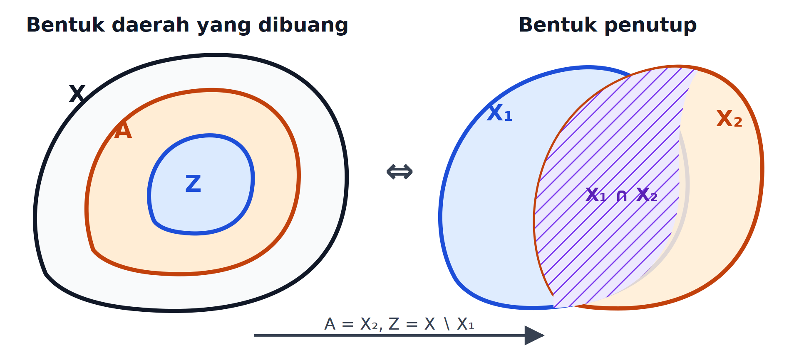
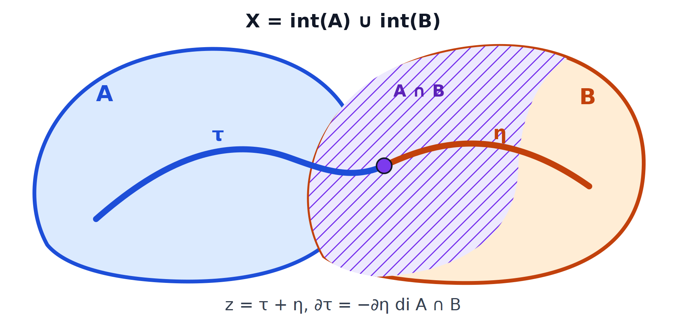
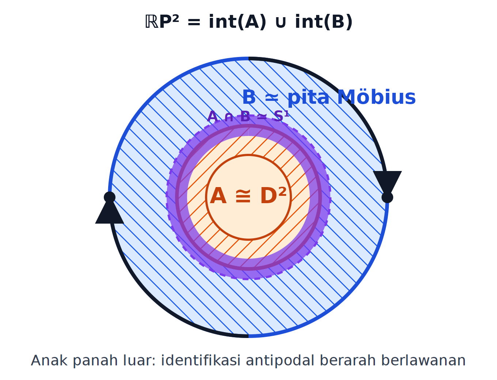

# Tentang komponen ini {.unnumbered #o012-fom-u004-notice data-course-route-unit-id="D60-R11"}

Komponen ini merupakan terjemahan dan adaptasi bahasa Indonesia atas Bagian
1.7–1.10 *Algebraic Topology* karya Yeheli Fomberg, berdasarkan kuliah Nir
Lazarovich pada musim semi 2025. Otoritas sumber dibekukan pada commit
[563194fae879178b9a6871b249513bfc27968975](https://git.sr.ht/~yp/math-notes/tree/563194fae879178b9a6871b249513bfc27968975/item/algebraic_topology.tex).
Rentang yang diterjemahkan ialah `algebraic_topology.tex` baris 1923–2846:
924 baris fisik, 38.503 byte setelah normalisasi LF dan satu LF penutup,
dengan SHA-256
`ddde995b54154623ccc565117aee63cce8361d2ada1c3c9f2852775b1aaac638`.

Catatan sumber tersedia di bawah
[Creative Commons Attribution-ShareAlike 4.0 International (CC BY-SA 4.0)](https://creativecommons.org/licenses/by-sa/4.0/).
Terjemahan, pemformatan semantik, koreksi terbatas, gambar ulang mandiri,
perbaikan bukti, dan materi penguasaan asli di bawah ini diterbitkan dengan
lisensi yang sama. Semua perbaikan FOM-PR-05 sampai FOM-PR-11 dibedakan dari
teks sumber. Tidak ada prosa dari bank soal Fomberg terpisah maupun materi
MIT yang disalin ke dalam komponen ini.

Edisi ini independen dan tidak menyiratkan dukungan, pengesahan, atau
afiliasi dengan Yeheli Fomberg, Nir Lazarovich, ataupun institusi mereka.
Produksi terjemahan, struktur semantik, dan QA dibantu oleh
**OpenAI Codex gpt-5.6-sol, Ultra** atas arahan pengguna.

# Eksisi, Mayer–Vietoris, Kealamian, dan Pembandingan Homologi {#o012-fom-u004 data-source-lines="1923-2846" data-course-route-unit-id="D60-R11"}

## Eksisi {#o012-fom-u004-s07 data-source-lines="1923-2440"}

::: {.theorem #o012-fom-u004-thm-excision-closed data-source-lines="1925-1929"}
**Teorema (eksisi).** Misalkan $Z\subseteq A\subseteq X$ dan
$\overline Z\subseteq\mathring A$. Inklusi pasangan

$$
i\colon(X\setminus Z,A\setminus Z)\hookrightarrow(X,A)
$$

menginduksi isomorfisma

$$
i_*\colon H_n(X\setminus Z,A\setminus Z)
\xrightarrow{\ \cong\ }H_n(X,A)
$$

untuk setiap $n$. Dengan kata lain,
$H_n(X,A)\cong H_n(X\setminus Z,A\setminus Z)$.
:::

::: {.source-audit #o012-fom-u004-audit-excision-direction data-origin="edition-original" data-source-lines="1925-1929"}
**Klarifikasi arah pemetaan.** Sumber menuliskan isomorfisma abstrak dengan
$H_n(X,A)$ di sebelah kiri. Karena pemetaan yang disebutkan berasal dari
inklusi $(X\setminus Z,A\setminus Z)\hookrightarrow(X,A)$, arah pemetaan
terinduksi yang kanonis adalah arah yang ditampilkan di atas. Tidak ada isi
matematis yang diubah.
:::

::: {.corollary #o012-fom-u004-cor-good-pair-quotient data-source-label="cor:cor" data-source-lines="1930-1934"}
**Akibat.** Jika $(X,A)$ pasangan baik dalam arti standar—$A$ tak kosong,
tertutup, dan merupakan retrak deformasi dari suatu lingkungannya—maka

$$
H_n(X,A)\cong\widetilde H_n(X/A).
$$

Akibat ini akan diperoleh lagi secara eksplisit dari
[teorema hasil bagi](#o012-fom-u004-thm-relative-quotient) di bawah.
:::

::: {.remark #o012-fom-u004-rem-excision-cover-form data-source-lines="1935-1989"}
**Catatan (bentuk penutup).** Rumusan ekuivalen teorema eksisi adalah sebagai
berikut. Jika $X_1,X_2\subseteq X$ dan

$$
\mathring X_1\cup\mathring X_2=X,
$$

maka inklusi

$$
i\colon(X_1,X_1\cap X_2)\hookrightarrow(X,X_2)
$$

menginduksi isomorfisma

$$
i_*\colon H_n(X_1,X_1\cap X_2)
\xrightarrow{\ \cong\ }H_n(X,X_2)
$$

untuk setiap $n$.

:::: {.figure #o012-fom-u004-fig-excision-equivalence data-source-lines="1942-1987" data-origin="edition-original-redraw"}
{.semantic-redraw width=92%}

**Diagram semantik hasil gambar ulang.** Pada rumusan pertama terdapat tiga
daerah bersarang

$$
Z\subseteq A\subseteq X,
\qquad \overline Z\subseteq\mathring A.
$$

Pada rumusan kedua, $X$ ditutup oleh bagian dalam dua daerah $X_1$ dan $X_2$;
daerah tumpang-tindihnya ialah $X_1\cap X_2$. Korespondensi antarrumusan
adalah

$$
\begin{array}{rcl}
A&=&X_2,\\
Z&=&X\setminus X_1=X_2\setminus X_1,\\
X\setminus Z&=&X_1,\\
A\setminus Z&=&X_1\cap X_2.
\end{array}
$$

Deskripsi aksesibel: menghapus daerah $Z$ yang terletak sepenuhnya di bagian
dalam $A$ menyisakan pasangan yang sama dengan mengambil daerah kiri $X_1$
beserta irisannya dengan daerah kanan $X_2$. Diagram ini disusun ulang secara
mandiri dari relasi himpunan; tidak ada ekspresi TikZ sumber yang disalin.
::::

Untuk memperoleh bentuk kedua dari bentuk pertama, ambil $A=X_2$ dan
$Z=X\setminus X_1$. Karena
$\mathring X_1\cup\mathring X_2=X$, kita mempunyai
$\overline{X\setminus X_1}\subseteq\mathring X_2$. Substitusi pada empat
identitas di atas memberi tepat inklusi pasangan dalam bentuk penutup.
Sebaliknya, untuk $Z\subseteq A\subseteq X$ dengan
$\overline Z\subseteq\mathring A$, ambil $X_1=X\setminus Z$ dan $X_2=A$.
Karena

$$
\operatorname{int}(X\setminus Z)=X\setminus\overline Z,
$$

kedua bagian dalam itu menutup $X$; keempat identitas di atas menghasilkan
pernyataan semula.
:::

::: {.definition #o012-fom-u004-def-u-chains data-source-lines="1990-1998"}
**Definisi (rantai-$\mathcal U$).** Misalkan
$\mathcal U=\{U_j\}$ suatu koleksi subhimpunan $X$ yang bagian-bagian dalamnya
membentuk penutup terbuka bagi $X$, yaitu

$$
X=\bigcup_{U\in\mathcal U}\mathring U.
$$

Kita definisikan

$$
C_n^{\mathcal U}(X)
=\operatorname{span}_{\mathbb Z}
\left\{
\sigma\colon\Delta^n\to X
\;\middle|\;
\exists U\in\mathcal U\text{ sehingga }
\sigma(\Delta^n)\subseteq U
\right\}.
$$

Generator seperti itu disebut **simpleks singular $\mathcal U$-kecil**, dan
unsur grup di atas disebut **rantai-$\mathcal U$**.
:::

::: {.remark #o012-fom-u004-rem-u-chain-complex data-source-lines="1999-2003"}
**Catatan.** Setiap sisi simpleks $\mathcal U$-kecil masih mempunyai citra di
anggota $\mathcal U$ yang sama. Karena itu

$$
\partial\bigl(C_n^{\mathcal U}(X)\bigr)
\subseteq C_{n-1}^{\mathcal U}(X),
$$

sehingga grup-grup $C_n^{\mathcal U}(X)$ membentuk kompleks rantai. Homologi
kompleks ini dinotasikan $H_n^{\mathcal U}(X)$.
:::

::: {.proposition #o012-fom-u004-prop-small-chains data-source-lines="2005-2012" data-repair-id="FOM-PR-05" data-proof-status="statement_with_complete_original_repair"}
**Proposisi (teorema rantai kecil).** Inklusi

$$
\iota\colon C_*^{\mathcal U}(X)\hookrightarrow C_*(X)
$$

merupakan ekuivalensi homotopi kompleks rantai. Jadi terdapat pemetaan rantai

$$
\rho\colon C_*(X)\longrightarrow C_*^{\mathcal U}(X)
$$

sedemikian sehingga $\iota\rho$ dan $\rho\iota$ homotopik-rantai dengan
pemetaan identitas masing-masing. Khususnya,

$$
\iota_*\colon H_n^{\mathcal U}(X)
\xrightarrow{\ \cong\ }H_n(X)
$$

untuk setiap $n$.
:::

::: {.proof #o012-fom-u004-proof-small-chains-source data-source-lines="2013-2152" data-repair-id="FOM-PR-05" data-proof-status="source_incomplete"}
**Bukti sumber, sampai bagian yang dihilangkan.** Sumber mengumumkan bukti
dalam empat langkah, tetapi hanya memulai langkah pertama.

1. **Subdivisi barisentris simpleks.** Simpleks
   $[v_0,v_1,\ldots,v_n]$ terdiri atas semua titik
   $\sum_i t_iv_i$ dengan $t_i\geq0$ dan $\sum_i t_i=1$. **Barisentrum**
   simpleks itu adalah titik berkoordinat barisentris sama besar,

   $$
   b=\sum_{i=0}^{n}\frac1{n+1}v_i.
   $$

   (Awalan *bary-* berarti massa.) Subdivisi barisentris didefinisikan secara
   induktif. Pada dimensi nol,

   $$
   BS([v_0])=\{[v_0]\}.
   $$

   Pada dimensi satu, dengan $b=(v_0+v_1)/2$,

   $$
   BS([v_0,v_1])=\{[b,v_0],[b,v_1]\}.
   $$

   Secara induktif, jika $F_i$ adalah sisi ke-$i$ dari
   $[v_0,\ldots,v_n]$, definisikan

   $$
   BS([v_0,\ldots,v_n])
   =\bigcup_{i=0}^{n}
     \bigl\{[b,s]\mid s\in BS(F_i)\bigr\}.
   $$

   Subdivisi itu terdiri atas $(n+1)!$ simpleks berdimensi $n$ yang menutup
   simpleks semula:

   $$
   \bigl|BS([v_0,\ldots,v_n])\bigr|=(n+1)!.
   $$

   Selain itu, $BS(\Delta^n)$ memberi struktur kompleks simpleks pada
   $\Delta^n$. Sumber kemudian hendak membuktikan bahwa setiap
   $[w_0,\ldots,w_n]\in BS(\Delta^n)$ memenuhi

   $$
   \operatorname{diam}[w_0,\ldots,w_n]
   \leq\frac n{n+1}\operatorname{diam}[v_0,\ldots,v_n].
   $$

   Untuk itu sumber terlebih dahulu mengamati

   $$
   \operatorname{diam}[w_0,\ldots,w_n]
   =\max_{i,j}\lVert w_i-w_j\rVert.
   $$

   Memang, untuk sebuah titik sudut $v$ dan titik
   $\sum_{i=0}^nt_iv_i$ di selubung konveks,

   $$
   \begin{aligned}
   \left\lVert v-\sum_{i=0}^{n}t_iv_i\right\rVert
   &=\left\lVert\sum_{i=0}^{n}t_i(v-v_i)\right\rVert\\
   &\leq\sum_{i=0}^{n}t_i\lVert v-v_i\rVert\\
   &\leq\sum_{i=0}^{n}t_i\max_j\lVert v-v_j\rVert\\
   &=\max_j\lVert v-v_j\rVert.
   \end{aligned}
   $$

:::: {.source-omission #o012-fom-u004-omission-pr05a data-source-lines="2050-2070" data-repair-id="FOM-PR-05" data-proof-part="diameter-and-iteration"}
**Bagian FOM-PR-05a yang dihilangkan dalam sumber.** Sesudah menuliskan batas
diameter yang diinginkan dan estimasi selubung konveks di atas, sumber hanya
menyatakan bahwa sisa argumennya bersifat geometris. Sumber lalu menyebut
konsekuensinya—setiap simpleks dapat dibagi menjadi simpleks-simpleks
berdiameter sekecil yang diinginkan—tanpa membuktikan batas diameter ataupun
iterasinya. [Perbaikan FOM-PR-05a](#o012-fom-u004-proof-pr05a) mengisi kedua
langkah tersebut.
::::

:::: {.source-omission #o012-fom-u004-omission-pr05b data-source-lines="2071-2152" data-repair-id="FOM-PR-05" data-proof-part="small-chain-and-homotopy-equivalence"}
**Bagian FOM-PR-05b yang dihilangkan dalam sumber.** Langkah kedua pada sumber
berbunyi bahwa “sisa bukti mungkin akan ditambahkan kelak”; langkah ketiga dan
keempat tidak hadir. Baris 2073–2150 hanya merupakan komentar TeX nonaktif,
bukan teks bukti yang diterbitkan. Komentar itu mencoba memperkenalkan rantai
linear $LC_n(Y)$ untuk $Y\subseteq\mathbb R^n$ konveks, operator kerucut

$$
b([w_0,\ldots,w_n])=[b,w_0,\ldots,w_n],
\qquad \partial b+b\partial=\operatorname{id},
$$

operator subdivisi $S$ melalui skema
$S(\lambda)=b_\lambda(S\partial\lambda)$, dan suatu operator $T$ yang
dimaksudkan memenuhi

$$
\partial T+T\partial=\operatorname{id}-S.
$$

Rumus rekursif $T$ dalam komentar adalah awal konstruksi standar dan suku
$S\sigma$ dapat muncul ketika identitas operator kerucut diterapkan. Namun
perhitungannya berhenti sebelum keterdefinisian, kealamian terhadap simpleks
singular, argumen bilangan Lebesgue, surjektivitas dan injektivitas homologi,
ataupun pemetaan $\rho$ dibuktikan. Karena komentar tersebut belum merupakan
bukti yang sah, edisi ini tidak mengangkatnya menjadi prosa sumber.
[Perbaikan FOM-PR-05b](#o012-fom-u004-proof-pr05b) memberi konstruksi lengkap
yang diperlukan.
::::
:::

::: {.source-audit #o012-fom-u004-audit-barycentric-face-notation data-origin="edition-original" data-source-lines="2028-2044"}
**Koreksi notasi.** Sumber memakai $\Delta^i$ untuk “sisi ke-$i$” ketika
menuliskan rekursi subdivisi. Superskrip biasanya menyatakan dimensi, bukan
nomor sisi. Edisi memakai $F_i$ untuk sisi ke-$i$ dan mempertahankan rumus
rekursif yang dimaksud.
:::

::: {.proof #o012-fom-u004-proof-pr05a data-origin="edition-original" data-source-lines="2050-2070" data-repair-id="FOM-PR-05" data-proof-status="complete_original_repair" data-repair-part="diameter-and-iteration"}
**Perbaikan bukti FOM-PR-05a (penyusutan diameter).** Setiap simpleks
berdimensi $n$ dalam subdivisi barisentris berkorespondensi dengan rantai sisi
tak kosong

$$
F_0\subsetneq F_1\subsetneq\cdots\subsetneq F_n=\Delta^n,
$$

dan titik-titik sudutnya adalah barisentrum $b_{F_0},\ldots,b_{F_n}$.
Kita lengkapi dahulu fakta diameter yang dipakai sumber. Jika
$x=\sum_i a_iw_i$ dan $y=\sum_j b_jw_j$ adalah dua titik selubung konveks
titik-titik sudut $w_0,\ldots,w_r$, maka

$$
\begin{aligned}
\lVert x-y\rVert
&=\left\lVert\sum_{i,j}a_ib_j(w_i-w_j)\right\rVert\\
&\leq\sum_{i,j}a_ib_j\lVert w_i-w_j\rVert\\
&\leq\max_{i,j}\lVert w_i-w_j\rVert.
\end{aligned}
$$

Karena titik-titik sudut sendiri termasuk dalam selubung konveks, diameter
selubung itu tepat jarak maksimum antara dua titik sudut.

Ambil dua sisi dalam rantai itu, $F\subseteq G$. Misalkan $F$ mempunyai $p$
titik sudut dan $G$ mempunyai $q$ titik sudut. Maka

$$
b_G=\frac pqb_F+\frac1q\sum_{v\in G\setminus F}v
$$

dan karena $b_F$ terletak di selubung konveks titik-titik sudut $F$,

$$
\begin{aligned}
\lVert b_G-b_F\rVert
&=\left\lVert\frac1q\sum_{v\in G\setminus F}(v-b_F)\right\rVert\\
&\leq\frac{q-p}{q}\operatorname{diam}(\Delta^n)\\
&\leq\frac n{n+1}\operatorname{diam}(\Delta^n).
\end{aligned}
$$

Kesamaan diameter selubung konveks dengan jarak maksimum antartitik sudut,
yang telah diperiksa dalam bagian sumber, sekarang memberi

$$
\operatorname{diam}(\tau)
\leq\frac n{n+1}\operatorname{diam}(\Delta^n)
$$

untuk setiap simpleks $\tau$ dalam $BS(\Delta^n)$. Sesudah $r$ iterasi,

$$
\operatorname{diam}(\tau_r)
\leq\left(\frac n{n+1}\right)^r
\operatorname{diam}(\Delta^n).
$$

Faktor $n/(n+1)$ kurang dari satu untuk $n>0$, sehingga ruas kanan menuju
nol. Untuk $n=0$ diameter sejak awal nol. Jadi subdivisi berulang menghasilkan
simpleks-simpleks berdiameter sekecil yang diinginkan. $\square$
:::

::: {.proof #o012-fom-u004-proof-pr05b data-origin="edition-original" data-source-lines="2071-2152" data-repair-id="FOM-PR-05" data-proof-status="complete_original_repair" data-repair-part="small-chain-and-homotopy-equivalence"}
**Perbaikan bukti FOM-PR-05b (operator subdivisi, rantai kecil, dan ekuivalensi
homotopi).** Beri setiap simpleks dalam subdivisi barisentris orientasi yang
diinduksi oleh orientasi $\Delta^n$. Untuk simpleks singular
$\sigma\colon\Delta^n\to X$, definisikan

$$
Sd(\sigma)=\sum_{\tau\in BS(\Delta^n)}
\varepsilon_\tau\,\sigma\circ a_\tau,
$$

di mana $a_\tau\colon\Delta^n\to\tau$ adalah isomorfisma afin berorientasi dan
$\varepsilon_\tau\in\{1,-1\}$ mencatat orientasinya. Perluas secara linear.
Pada batas subdivisi, setiap sisi internal muncul dua kali dengan orientasi
berlawanan, sedangkan sisi luar memberi subdivisi dari batas. Karena itu

$$
\partial Sd=Sd\,\partial;
$$

jadi $Sd$ adalah pemetaan rantai.

Selanjutnya kita bangun homotopi rantai $T\colon C_n(X)\to C_{n+1}(X)$ secara
induktif. Pada simpleks standar, andaikan $T$ telah didefinisikan pada semua
dimensi lebih rendah dan letakkan

$$
z_n=\operatorname{id}_{\Delta^n}
-Sd(\operatorname{id}_{\Delta^n})
-T(\partial\operatorname{id}_{\Delta^n}).
$$

Hipotesis induksi dan fakta bahwa $Sd$ pemetaan rantai memberi

$$
\begin{aligned}
\partial z_n
&=\partial\operatorname{id}_{\Delta^n}
-Sd(\partial\operatorname{id}_{\Delta^n})
-\partial T(\partial\operatorname{id}_{\Delta^n})\\
&=0.
\end{aligned}
$$

Karena $\Delta^n$ kontraktibel, siklus $z_n$ membatasi suatu rantai
$b(z_n)$; secara konkret $b$ dapat dipilih sebagai operator kerucut menuju
barisentrum. Definisikan

$$
T(\operatorname{id}_{\Delta^n})=b(z_n),
\qquad
T(\sigma)=\sigma_\#T(\operatorname{id}_{\Delta^n}).
$$

Konstruksi ini alami terhadap $\sigma$ dan menghasilkan identitas

$$
\partial T+T\partial=\operatorname{id}-Sd.
$$

Yang penting, semua simpleks yang muncul dalam $Sd(\sigma)$ dan $T(\sigma)$
mempunyai citra di dalam $\sigma(\Delta^n)$. Maka kedua operator mempertahankan
subkompleks $C_*^{\mathcal U}(X)$.

Sekarang, bagi suatu simpleks singular $\sigma$, himpunan-himpunan

$$
\left\{\sigma^{-1}(\mathring U)\mid U\in\mathcal U\right\}
$$

membentuk penutup terbuka bagi $\Delta^n$. Lemma bilangan Lebesgue memberi
$\lambda_\sigma>0$ sehingga setiap subhimpunan $\Delta^n$ berdiameter kurang
dari $\lambda_\sigma$ terkandung dalam salah satu prapeta tersebut. Menurut
FOM-PR-05a, ada $N_\sigma$ sehingga semua simpleks dalam
$Sd^{N_\sigma}(\operatorname{id}_{\Delta^n})$ berdiameter kurang dari
$\lambda_\sigma$. Jadi $Sd^{N_\sigma}(\sigma)$ merupakan rantai-$\mathcal U$.
Untuk rantai berhingga $c$, ambil maksimum eksponen bagi simpleks-simpleks yang
muncul di dalamnya; dengan demikian terdapat $N$ sehingga

$$
Sd^N(c)\in C_*^{\mathcal U}(X).
$$

Tuliskan

$$
K_N=\sum_{r=0}^{N-1}Sd^rT.
$$

Penjumlahan teleskopik memberi

$$
\partial K_N+K_N\partial=\operatorname{id}-Sd^N.
$$

Jika $z$ siklus di $C_*(X)$, pilih $N$ sehingga $Sd^Nz$ kecil. Maka
$z-Sd^Nz=\partial K_Nz$, jadi setiap kelas homologi mempunyai wakil kecil;
$\iota_*$ surjektif. Jika siklus kecil $z$ membatasi $c$ dalam $C_*(X)$,
pilih $N$ sehingga $Sd^Nc$ kecil. Karena $T$ dan $Sd$ mempertahankan rantai
kecil, $K_Nz$ juga kecil, dan

$$
z=Sd^Nz+\partial K_Nz
=\partial\bigl(Sd^Nc+K_Nz\bigr)
$$

di dalam $C_*^{\mathcal U}(X)$. Jadi $\iota_*$ injektif. Dengan demikian
$\iota$ adalah kuasi-isomorfisma.

Tersisa membangun invers homotopi rantai yang dinyatakan sumber. Singkatkan
$B_*=C_*^{\mathcal U}(X)$, $C_*=C_*(X)$, dan $Q_*=C_*/B_*$. Karena $B_n$
dibangkitkan oleh suatu subhimpunan basis simpleks singular $C_n$, setiap
$Q_n$ bebas dan barisan

$$
0\longrightarrow B_n\xrightarrow{\iota}C_n
\longrightarrow Q_n\longrightarrow0
$$

terbelah sebagai grup. Barisan eksak panjang dan fakta bahwa $\iota_*$
isomorfisma menunjukkan bahwa $Q_*$ asiklik. Setiap subgrup grup abelian bebas
kembali bebas; jadi barisan

$$
0\longrightarrow Z_n(Q)=B_n(Q)
\longrightarrow Q_n\xrightarrow{\partial_Q}B_{n-1}(Q)
\longrightarrow0
$$

terbelah pada setiap derajat. Pilihan pembelahan memberi homotopi kontraksi
$h\colon Q_n\to Q_{n+1}$ dengan

$$
\partial_Qh+h\partial_Q=\operatorname{id}_Q.
$$

Pilih pula pembelahan berderajat $C_n\cong B_n\oplus Q_n$. Dalam koordinat
ini, pemetaan batas berbentuk

$$
\partial_C(b,q)=\bigl(\partial_Bb+\tau q,\partial_Qq\bigr)
$$

untuk suatu $\tau\colon Q_n\to B_{n-1}$. Identitas $\partial_C^2=0$ memberi

$$
\partial_B\tau+\tau\partial_Q=0.
$$

Sekarang definisikan

$$
\rho(b,q)=b-\tau h(q),
\qquad
H(b,q)=(0,hq).
$$

Relasi terakhir dan identitas kontraksi menunjukkan langsung bahwa $\rho$
pemetaan rantai. Selain itu,

$$
\rho\iota=\operatorname{id}_{B_*},
\qquad
\partial_CH+H\partial_C
=\operatorname{id}_{C_*}-\iota\rho.
$$

Jadi $\rho$ benar-benar invers homotopi rantai bagi $\iota$: komposisi pada
$B_*$ adalah identitas secara ketat dan komposisi pada $C_*$ homotopik-rantai
dengan identitas. Ini menutup pernyataan penuh, bukan hanya isomorfisma
homologi. $\square$
:::

::: {.theorem #o012-fom-u004-thm-excision-cover data-source-lines="2154-2159" data-repair-id="FOM-PR-06" data-proof-status="statement_with_complete_original_repair"}
**Teorema (eksisi, bentuk penutup).** Misalkan $A,B\subseteq X$ dan

$$
\mathring A\cup\mathring B=X.
$$

Inklusi pasangan

$$
i\colon(B,A\cap B)\hookrightarrow(X,A)
$$

menginduksi isomorfisma

$$
i_*\colon H_n(B,A\cap B)
\xrightarrow{\ \cong\ }H_n(X,A)
$$

untuk setiap $n$.
:::

::: {.proof #o012-fom-u004-proof-excision-source data-source-lines="2160-2178" data-repair-id="FOM-PR-06" data-proof-status="source_omitted"}
**Bukti sumber.** Teks aktif sumber hanya mengatakan bahwa bukti bergantung
pada bukti eksisi dan akan ditambahkan kelak.

:::: {.source-omission #o012-fom-u004-omission-pr06 data-source-lines="2160-2178" data-repair-id="FOM-PR-06"}
**Bagian FOM-PR-06 yang dihilangkan dalam sumber.** Komentar TeX nonaktif
mengusulkan $\mathcal U=\{A,B\}$, lalu membandingkan

$$
C_n(X)/C_n(A)
\quad\text{dengan}\quad
C_n^{\mathcal U}(X)/C_n(A)
\cong C_n(B)/C_n(A\cap B),
$$

tetapi tidak membuktikan bahwa perbandingan hasil bagi menginduksi
isomorfisma dalam homologi. Bukti lengkap dan pengecekan aljabarnya diberikan
berikutnya.
::::
:::

::: {.proof #o012-fom-u004-proof-pr06 data-origin="edition-original" data-source-lines="2160-2178" data-repair-id="FOM-PR-06" data-proof-status="complete_original_repair"}
**Perbaikan bukti FOM-PR-06.** Ambil $\mathcal U=\{A,B\}$. Hipotesis
$\mathring A\cup\mathring B=X$ memastikan bahwa koleksi ini memenuhi syarat
teorema rantai kecil. Karena setiap simpleks $\mathcal U$-kecil mempunyai citra
di $A$ atau di $B$,

$$
C_*^{\mathcal U}(X)=C_*(A)+C_*(B).
$$

Pertimbangkan diagram barisan eksak pendek kompleks rantai

$$
\begin{array}{ccccccccc}
0&\longrightarrow&C_*(A)&\longrightarrow&C_*^{\mathcal U}(X)
&\longrightarrow&C_*^{\mathcal U}(X)/C_*(A)&\longrightarrow&0\\
&&\Vert&&\downarrow\iota&&\downarrow\bar\iota\\
0&\longrightarrow&C_*(A)&\longrightarrow&C_*(X)
&\longrightarrow&C_*(X)/C_*(A)&\longrightarrow&0.
\end{array}
$$

Baris atas dan bawah eksak, dan diagram komutatif. Pemetaan vertikal kiri
adalah identitas, sedangkan pemetaan vertikal tengah menginduksi isomorfisma
homologi menurut FOM-PR-05. Dengan menerapkan barisan eksak panjang homologi
pada kedua baris dan lemma lima, $\bar\iota$ juga menginduksi isomorfisma
homologi.

Selanjutnya, karena grup rantai singular bebas pada simpleks singular,

$$
C_*(A)\cap C_*(B)=C_*(A\cap B).
$$

Teorema isomorfisma kedua memberi isomorfisma kompleks rantai yang eksplisit,

$$
\begin{aligned}
C_*^{\mathcal U}(X)/C_*(A)
&=\bigl(C_*(A)+C_*(B)\bigr)/C_*(A)\\
&\cong C_*(B)/\bigl(C_*(A)\cap C_*(B)\bigr)\\
&=C_*(B)/C_*(A\cap B)\\
&=C_*(B,A\cap B).
\end{aligned}
$$

Di sisi lain, $C_*(X)/C_*(A)=C_*(X,A)$. Setelah mengambil homologi, pemetaan
yang dihasilkan tepat pemetaan yang diinduksi oleh inklusi pasangan
$(B,A\cap B)\hookrightarrow(X,A)$. Maka

$$
H_n(B,A\cap B)\xrightarrow{\ \cong\ }H_n(X,A)
$$

untuk setiap $n$. Melalui ekuivalensi pada
[catatan bentuk penutup](#o012-fom-u004-rem-excision-cover-form), bukti ini juga
membuktikan bentuk eksisi dengan $Z\subseteq A$. $\square$
:::

::: {.theorem #o012-fom-u004-thm-relative-quotient data-source-label="thm:reduced-and-relative-homologies" data-source-lines="2182-2188"}
**Teorema (homologi relatif sebagai homologi hasil bagi).** Misalkan $(X,A)$
pasangan baik dalam arti standar: $A$ tak kosong dan tertutup, serta $A$
merupakan retrak deformasi dari suatu lingkungan terbukanya. Pemetaan hasil
bagi

$$
q\colon(X,A)\longrightarrow(X/A,A/A)
$$

menginduksi isomorfisma

$$
q_*\colon H_n(X,A)
\xrightarrow{\ \cong\ }H_n(X/A,A/A)
\cong\widetilde H_n(X/A)
$$

untuk setiap $n$.
:::

::: {.proof #o012-fom-u004-proof-relative-quotient data-source-lines="2189-2233"}
**Bukti.** Homologi suatu ruang relatif terhadap satu titik secara alami
isomorfik dengan homologi tereduksi ruang itu. Jadi cukup dibuktikan bahwa

$$
q_*\colon H_n(X,A)\longrightarrow H_n(X/A,A/A)
$$

merupakan isomorfisma. Karena $(X,A)$ pasangan baik, terdapat lingkungan
terbuka $U$ dari $A$ di $X$ yang beretraksi deformasi ke $A$. Karena $A$
tertutup, $\overline A=A\subseteq\mathring U=U$, sehingga eksisi terhadap $A$
di dalam pasangan $(X,U)$ berlaku. Pertimbangkan
diagram komutatif berikut.

:::: {.figure #o012-fom-u004-fig-relative-quotient-square data-source-lines="2195-2206" data-origin="edition-original-redraw"}
$$
\begin{array}{ccccc}
H_n(X,A)&\longrightarrow&H_n(X,U)&\longleftarrow&H_n(X\setminus A,U\setminus A)\\
\downarrow q_*&&\downarrow q_*&&\downarrow q_*\\
H_n(X/A,A/A)&\longrightarrow&H_n(X/A,U/A)&\longleftarrow&
H_n\bigl((X/A)\setminus\{A/A\},(U/A)\setminus\{A/A\}\bigr).
\end{array}
$$

**Deskripsi aksesibel.** Kedua baris adalah zig-zag tiga grup homologi relatif.
Ketiga panah vertikal diinduksi oleh pemetaan hasil bagi. Panah mendatar kiri
memperbesar subruang relatif dari $A$ ke $U$; panah mendatar kanan adalah
inklusi pasangan komplemen. Kedua persegi berkomutasi. Diagram ini ditulis
ulang secara mandiri dan tidak menyalin ekspresi TikZ-CD sumber.
::::

Barisan eksak panjang tripel $(X,U,A)$ memuat bagian

:::: {.figure #o012-fom-u004-fig-triple-xua data-source-lines="2207-2215" data-origin="edition-original-redraw"}
$$
\cdots\longrightarrow H_n(U,A)
\longrightarrow H_n(X,A)
\longrightarrow H_n(X,U)
\longrightarrow H_{n-1}(U,A)
\longrightarrow\cdots.
$$

**Deskripsi aksesibel.** Empat suku berturutan adalah homologi pasangan
$(U,A)$, $(X,A)$, $(X,U)$, lalu pasangan $(U,A)$ satu derajat lebih rendah.
Eksakitas akan memaksa panah tengah menjadi isomorfisma ketika kedua suku
ujung nol.
::::

Retraksi deformasi $U$ ke $A$ memberi ekuivalensi homotopi pasangan
$(U,A)\simeq(A,A)$, sehingga

$$
H_k(U,A)\cong H_k(A,A)=0
$$

untuk setiap $k$. Eksakitas barisan di atas dengan demikian menunjukkan bahwa
panah mendatar kiri atas $H_n(X,A)\to H_n(X,U)$ adalah isomorfisma. Retraksi
deformasi tersebut turun menjadi retraksi deformasi $U/A$ ke $A/A$; argumen
yang sama menunjukkan bahwa panah mendatar kiri bawah juga isomorfisma.

Dua panah mendatar kanan adalah isomorfisma oleh teorema eksisi. Pemetaan
hasil bagi $q$ membatasi diri menjadi homeomorfisma pasangan

$$
(X\setminus A,U\setminus A)
\xrightarrow{\ \cong\ }
\bigl((X/A)\setminus\{A/A\},(U/A)\setminus\{A/A\}\bigr),
$$

sehingga panah vertikal kanan juga isomorfisma. Komutativitas persegi kanan
memberi bahwa panah vertikal tengah adalah isomorfisma; komutativitas persegi
kiri kemudian memberi bahwa panah vertikal kiri adalah isomorfisma. Inilah
$q_*$ pada pernyataan teorema. $\square$
:::

::: {.source-audit #o012-fom-u004-audit-relative-quotient data-origin="edition-original" data-source-lines="2197-2230"}
**Koreksi hipotesis, notasi, dan pengulangan.** Definisi “pasangan baik” sumber
pada baris 1369–1374 hanya meminta retraksi deformasi dari suatu lingkungan,
sedangkan bukti sekarang memakai $\overline A\subseteq\mathring U$, fakta
bahwa $X\setminus A$ terbuka, serta titik hasil bagi $A/A$. Konvensi standar
menambahkan bahwa $A$ tak kosong dan tertutup; edisi menyatakan syarat yang
diperlukan itu secara eksplisit. Baris 2219 sumber menulis
$H_n(U,A)\cong H_n(U,A)\cong\{0\}$; suku tengah yang dimaksud adalah
$H_n(A,A)$. Ekspresi komplemen pada baris 2198 dan 2203 juga tidak memasang
tanda kurung pada ruang hasil bagi. Edisi menuliskan
$(X/A)\setminus\{A/A\}$ dan $(U/A)\setminus\{A/A\}$ agar pasangan serta
homeomorfisma pembatasan $q$ tidak ambigu.
:::

::: {.theorem #o012-fom-u004-thm-invariance-dimension data-source-label="thm:invariance-of-dimension" data-source-lines="2237-2241"}
**Teorema (invariansi dimensi).** Misalkan $U\subseteq\mathbb R^n$ dan
$V\subseteq\mathbb R^m$ merupakan **himpunan terbuka tak kosong**. Jika $U$
dan $V$ homeomorfik, maka $m=n$.
:::

::: {.source-audit #o012-fom-u004-audit-invariance-nonempty data-origin="edition-original" data-source-lines="2237-2241"}
**Perbaikan hipotesis.** Sumber tidak menyatakan bahwa $U$ dan $V$ tak kosong.
Tanpa syarat itu, pernyataannya salah karena himpunan kosong terbuka di setiap
$\mathbb R^d$ dan semua himpunan kosong homeomorfik. Syarat tak kosong
ditambahkan agar teorema benar dan agar pemilihan $x\in U$ pada bukti sah.
:::

::: {.proof #o012-fom-u004-proof-invariance-dimension data-source-lines="2242-2287"}
**Bukti.** Pilih $x\in U$. Untuk $n\geq1$, eksisi pada suatu bola terbuka kecil
di sekitar $x$ memberi

$$
H_k(U,U\setminus\{x\})
\cong H_k(\mathbb R^n,\mathbb R^n\setminus\{x\}).
$$

Barisan eksak panjang pasangan
$(\mathbb R^n,\mathbb R^n\setminus\{x\})$ memuat

:::: {.figure #o012-fom-u004-fig-local-homology-les data-source-lines="2252-2258" data-origin="edition-original-redraw"}
$$
\widetilde H_k(\mathbb R^n)
\longrightarrow H_k(\mathbb R^n,\mathbb R^n\setminus\{x\})
\longrightarrow\widetilde H_{k-1}(\mathbb R^n\setminus\{x\})
\longrightarrow\widetilde H_{k-1}(\mathbb R^n).
$$

**Deskripsi aksesibel.** Grup relatif lokal berada di antara dua grup homologi
tereduksi ruang Euklides dan grup homologi tereduksi komplemennya. Kedua grup
ruang Euklides nol karena ruang itu kontraktibel. Diagram ditulis ulang tanpa
menyalin ekspresi TikZ-CD sumber.
::::

Karena $\mathbb R^n$ kontraktibel dan
$\mathbb R^n\setminus\{x\}\simeq S^{n-1}$, eksakitas memberi, untuk $k\geq1$,

$$
\begin{aligned}
H_k(U,U\setminus\{x\})
&\cong H_k(\mathbb R^n,\mathbb R^n\setminus\{x\})\\
&\cong\widetilde H_{k-1}(S^{n-1})\\
&\cong
\begin{cases}
\mathbb Z,&k=n,\\
0,&k\ne n.
\end{cases}
\end{aligned}
$$

Pada $k=0$, grup relatif juga nol: komplemen tak kosong dan pemetaan
$H_0(\mathbb R^n\setminus\{x\})\to H_0(\mathbb R^n)$ surjektif. Jadi rumus
per kasus di atas memang berlaku untuk semua $k\geq0$ ketika $n\geq1$.

Untuk $n=0$, satu-satunya himpunan terbuka tak kosong dalam $\mathbb R^0$
adalah satu titik; perhitungan langsung memberi
$H_k(\{x\},\varnothing)\cong\mathbb Z$ tepat pada $k=0$. Jadi rumus “satu
grup $\mathbb Z$ tepat pada derajat $n$” berlaku juga pada dimensi nol.

Misalkan $\varphi\colon U\to V$ homeomorfisma. Ia memberi homeomorfisma
pasangan

$$
(U,U\setminus\{x\})
\xrightarrow{\ \cong\ }
(V,V\setminus\{\varphi(x)\}),
$$

dan karenanya isomorfisma grup bergradasi

$$
H_k(U,U\setminus\{x\})
\cong H_k(V,V\setminus\{\varphi(x)\}).
$$

Perhitungan yang sama di $V\subseteq\mathbb R^m$ menunjukkan bahwa ruas kanan
isomorfik dengan $\mathbb Z$ tepat pada derajat $k=m$. Ruas kiri isomorfik
dengan $\mathbb Z$ tepat pada derajat $k=n$. Karena isomorfisma berlaku pada
setiap derajat, $n=m$. $\square$
:::

::: {.source-audit #o012-fom-u004-audit-local-relative-notation data-origin="edition-original" data-source-lines="2243-2280"}
**Koreksi notasi.** Baris 2245 sumber menulis $H_k(X,X\setminus\{x\})$ setelah
memilih $x\in U$; $X$ tidak didefinisikan di sana. Baris 2249–2280 memakai
tilde pada grup homologi relatif dan menjatuhkannya pada satu tempat. Konvensi
standar memakai homologi biasa untuk pasangan dan homologi tereduksi untuk
ruang komplemen. Edisi menerapkan konvensi itu secara konsisten dan menutup
kasus dimensi nol secara terpisah.
:::

::: {.remark #o012-fom-u004-rem-invariance-name data-source-lines="2288-2291"}
**Catatan.** Hasil
[teorema sebelumnya](#o012-fom-u004-thm-invariance-dimension) lazim disebut
**invariansi dimensi**.
:::

::: {.remark #o012-fom-u004-rem-local-homology data-source-lines="2292-2306"}
**Catatan (homologi lokal).** Dalam bukti invariansi dimensi muncul grup

$$
H_n(X,X\setminus\{x\}),
$$

yang disebut **homologi lokal $X$ di $x$**. Jika singleton $\{x\}$ tertutup dan
$U$ merupakan lingkungan terbuka $x$, eksisi memberi

$$
H_n(X,X\setminus\{x\})
\cong H_n(U,U\setminus\{x\}).
$$

Jadi struktur grup tersebut hanya bergantung pada topologi $X$ di sekitar
$x$. Setiap homeomorfisma $f\colon X\to Y$ menginduksi isomorfisma

$$
H_n(X,X\setminus\{x\})
\cong H_n(Y,Y\setminus\{f(x)\})
$$

untuk setiap $x$ dan $n$. Karena itu homologi lokal dapat membuktikan bahwa
dua ruang tidak homeomorfik secara lokal pada titik-titik tertentu, seperti
dalam [teorema invariansi dimensi](#o012-fom-u004-thm-invariance-dimension).
:::

::: {.remark #o012-fom-u004-rem-relative-disk-generator data-source-lines="2308-2322"}
**Catatan.** Kita telah memperoleh

$$
H_k(D^n,\partial D^n)
\cong\widetilde H_k(S^n)
\cong
\begin{cases}
\mathbb Z,&k=n,\\
0,&k\ne n.
\end{cases}
$$

Dengan mengidentifikasi
$H_n(D^n,\partial D^n)\cong H_n(\Delta^n,\partial\Delta^n)$, proposisi
berikut menentukan siklus eksplisit yang menghasilkan grup itu dan, kemudian,
$\widetilde H_n(S^n)$.
:::

::: {.proposition #o012-fom-u004-prop-simplex-generator data-source-lines="2324-2328"}
**Proposisi.** Pemetaan identitas

$$
\sigma_n\colon\Delta^n\longrightarrow\Delta^n,
\qquad \sigma_n=\operatorname{id}_{\Delta^n},
$$

dipandang sebagai simpleks singular berdimensi $n$, menghasilkan

$$
H_n(\Delta^n,\partial\Delta^n)\cong\mathbb Z.
$$
:::

::: {.proof #o012-fom-u004-proof-simplex-generator data-source-lines="2329-2413"}
**Bukti.** Karena
$\partial\sigma_n\in C_{n-1}(\partial\Delta^n)$, batas itu nol dalam kompleks
hasil bagi:

$$
\partial\sigma_n=0
\quad\text{di}\quad
C_{n-1}(\Delta^n)/C_{n-1}(\partial\Delta^n).
$$

Jadi $\sigma_n$ adalah siklus relatif dan
$[\sigma_n]\in H_n(\Delta^n,\partial\Delta^n)$. Kita berinduksi pada $n$.
Untuk $n=0$, $\partial\Delta^0=\varnothing$ dan $\sigma_0$ jelas menghasilkan

$$
H_0(\Delta^0,\partial\Delta^0)
=H_0(\{*\},\varnothing)
=H_0(\{*\})\cong\mathbb Z.
$$

Sekarang misalkan $n>0$. Pilih satu sisi $F_i\cong\Delta^{n-1}$ dari
$\Delta^n$ dan letakkan

$$
\Lambda=\partial\Delta^n\setminus\mathring F_i.
$$

(Mohon hargai kehebatan notasi ini.) Kita akan memakai dua isomorfisma

:::: {.figure #o012-fom-u004-fig-simplex-generator-isomorphisms data-source-lines="2343-2348" data-origin="edition-original-redraw"}
$$
H_n(\Delta^n,\partial\Delta^n)
\xrightarrow{\ \cong\ }
H_{n-1}(\partial\Delta^n,\Lambda)
\xleftarrow{\ \cong\ }
H_{n-1}(\Delta^{n-1},\partial\Delta^{n-1}).
$$

**Deskripsi aksesibel.** Grup relatif simpleks berdimensi $n$ dipetakan oleh
pemetaan penghubung ke grup relatif batasnya pada derajat $n-1$. Inklusi sisi
yang tidak terkandung dalam $\Lambda$ mengidentifikasi grup terakhir dengan
grup relatif simpleks berdimensi $n-1$. Diagram disusun ulang sebagai zig-zag
linear, bukan menyalin TikZ-CD sumber.
::::

Untuk isomorfisma pertama, gunakan barisan eksak panjang tripel
$(\Delta^n,\partial\Delta^n,\Lambda)$:

:::: {.figure #o012-fom-u004-fig-simplex-triple-les data-source-lines="2349-2358" data-origin="edition-original-redraw"}
$$
\cdots\longrightarrow H_n(\partial\Delta^n,\Lambda)
\longrightarrow H_n(\Delta^n,\Lambda)
\longrightarrow H_n(\Delta^n,\partial\Delta^n)
\xrightarrow{\delta}H_{n-1}(\partial\Delta^n,\Lambda)
\longrightarrow\cdots.
$$

**Deskripsi aksesibel.** Pemetaan penghubung $\delta$ keluar dari homologi
relatif $(\Delta^n,\partial\Delta^n)$ menuju homologi relatif
$(\partial\Delta^n,\Lambda)$ satu derajat lebih rendah. Suku relatif
$(\Delta^n,\Lambda)$ pada kedua sisi yang relevan akan bernilai nol.
::::

Simpleks $\Delta^n$ beretraksi deformasi ke $\Lambda$: secara simpleks,
$\Delta^n$ dapat dikolaps sepanjang sisi $F_i$ yang hilang, dengan
mempertahankan gabungan semua sisi lainnya. Maka
$(\Delta^n,\Lambda)\simeq(\Lambda,\Lambda)$ dan
$H_j(\Delta^n,\Lambda)=0$ untuk setiap $j$. Eksakitas menjadikan $\delta$
isomorfisma pertama.

Isomorfisma kedua diinduksi oleh inklusi sisi yang tidak terkandung dalam
$\Lambda$,

$$
i\colon(\Delta^{n-1},\partial\Delta^{n-1})
\hookrightarrow(\partial\Delta^n,\Lambda).
$$

Untuk $n=1$, pernyataan itu merupakan identifikasi langsung pada $H_0$.
Untuk $n>1$, kedua pasangan merupakan pasangan baik, dan $i$ menginduksi
homeomorfisma hasil bagi

$$
\Delta^{n-1}/\partial\Delta^{n-1}
\xrightarrow{\ \cong\ }
\partial\Delta^n/\Lambda.
$$

Teorema hasil bagi relatif memberi isomorfisma kedua.

Di bawah pemetaan penghubung pertama,

$$
[\sigma_n]\longmapsto[\partial\sigma_n]
=\pm[\sigma_{n-1}],
$$

karena semua sisi batas selain $F_i$ terletak di $\Lambda$ dan menjadi nol.
Menurut hipotesis induksi, $[\sigma_{n-1}]$ menghasilkan
$H_{n-1}(\Delta^{n-1},\partial\Delta^{n-1})$. Jadi
$[\partial\sigma_n]$ menghasilkan
$H_{n-1}(\partial\Delta^n,\Lambda)$, dan $[\sigma_n]$ menghasilkan
$H_n(\Delta^n,\partial\Delta^n)$.

Untuk memperoleh generator $\widetilde H_n(S^n)$, bentuk $S^n$ dari dua
salinan $\Delta_1^n$ dan $\Delta_2^n$ dengan mengidentifikasi batasnya menurut
urutan titik sudut. (Konstruksi ini sangat mirip dengan salah satu soal
pekerjaan rumah dalam kuliah sumber.) Misalkan $\sigma_1$ dan $\sigma_2$
simpleks singular yang merepresentasikan kedua salinan. Orientasi identifikasi memberi
$\partial\sigma_1=\partial\sigma_2$, sehingga

$$
\partial(\sigma_1-\sigma_2)=0.
$$

Kita klaim bahwa $[\sigma_1-\sigma_2]$ menghasilkan
$\widetilde H_n(S^n)$. Gunakan isomorfisma

:::: {.figure #o012-fom-u004-fig-sphere-generator-isomorphisms data-source-lines="2400-2405" data-origin="edition-original-redraw"}
$$
\widetilde H_n(S^n)
\xrightarrow{\ \cong\ }
H_n(S^n,\Delta_2^n)
\xleftarrow{\ \cong\ }
H_n(\Delta_1^n,\partial\Delta_1^n).
$$

**Deskripsi aksesibel.** Panah kiri berasal dari barisan eksak panjang pasangan
$(S^n,\Delta_2^n)$; panah kanan memasukkan belahan simpleks pertama dan
mengidentifikasi batasnya dengan belahan kedua. Diagram ditulis ulang secara
mandiri sebagai zig-zag.
::::

Isomorfisma pertama berasal dari barisan eksak panjang pasangan
$(S^n,\Delta_2^n)$ karena $\Delta_2^n$ kontraktibel. Untuk $n>0$,
isomorfisma kedua dapat diperoleh dengan melewati hasil bagi seperti di atas;
kasus $n=0$ diperiksa langsung. Dalam grup relatif tengah, suku $\sigma_2$
menjadi nol, sehingga $[\sigma_1-\sigma_2]$ bersesuaian dengan
$[\sigma_1]$ pada grup ketiga. Kelas terakhir adalah generator menurut bagian
pertama bukti. Jadi $[\sigma_1-\sigma_2]$ menghasilkan
$\widetilde H_n(S^n)$. $\square$
:::

::: {.source-audit #o012-fom-u004-audit-simplex-generator-degree data-origin="edition-original" data-source-lines="2379-2387"}
**Koreksi derajat.** Baris 2385 sumber menyebut
$H_n(\partial\Delta^n,\Lambda)$. Pemetaan penghubung pada diagram dan kedua
baris di sekitarnya menunjukkan bahwa grup yang dimaksud adalah
$H_{n-1}(\partial\Delta^n,\Lambda)$. Edisi memakai derajat yang benar.
:::

::: {.source-audit #o012-fom-u004-audit-simplex-sphere-notation data-origin="edition-original" data-source-lines="2308-2412"}
**Koreksi homologi dan nama siklus.** Baris 2319 sumber menulis $H_n(S^n)$
ketika grup siklik yang sedang diidentifikasi adalah
$\widetilde H_n(S^n)$; pembedaan ini menentukan pada $n=0$. Baris 2338
beralih ke $H_0(\Delta^0/\partial\Delta^0)$ di tengah argumen pasangan relatif,
sehingga edisi mempertahankan $H_0(\Delta^0,\partial\Delta^0)$. Diagram pada
baris 2402 memakai tilde pada grup homologi relatif; edisi memakai tilde hanya
pada homologi tereduksi absolut dan $H_n$ biasa pada pasangan. Terakhir, baris
2412 menyebut $\Delta_1^n-\Delta_2^n$ sebagai siklus, padahal simpleks singular
yang dapat dikurangkan di kompleks rantai adalah $\sigma_1-\sigma_2$. Semua
empat normalisasi dinyatakan eksplisit di sini; generator dan orientasinya
tidak diubah.
:::

::: {.proposition #o012-fom-u004-prop-wedge-homology data-source-lines="2415-2425"}
**Proposisi (homologi tereduksi jumlah baji).** Misalkan
$\{(X_\alpha,x_\alpha)\}_\alpha$ suatu koleksi pasangan baik dalam konvensi
standar; khususnya setiap singleton $\{x_\alpha\}$ tertutup. Inklusi

$$
i_\alpha\colon X_\alpha\hookrightarrow\bigvee_\alpha X_\alpha
$$

menginduksi isomorfisma

$$
\bigoplus_\alpha(i_\alpha)_*\colon
\bigoplus_\alpha\widetilde H_k(X_\alpha)
\xrightarrow{\ \cong\ }
\widetilde H_k\!\left(\bigvee_\alpha X_\alpha\right).
$$
:::

::: {.source-audit #o012-fom-u004-audit-wedge-arrow data-origin="edition-original" data-source-lines="2417-2424"}
**Koreksi arah pemetaan.** Sumber menampilkan
$\bigoplus_\alpha(i_\alpha)_*$ sebagai pemetaan dari homologi baji menuju
jumlah langsung. Akan tetapi setiap $(i_\alpha)_*$ berarah dari
$\widetilde H_k(X_\alpha)$ ke homologi baji; karena itu jumlah langsungnya
harus berarah seperti pada pernyataan edisi. Rumus sumber tidak bertipe dengan
arah semula.
:::

::: {.proof #o012-fom-u004-proof-wedge-homology data-source-lines="2426-2439"}
**Bukti.** Pasangan

$$
\left(\bigsqcup_\alpha X_\alpha,
\{x_\alpha\mid\alpha\}\right)
$$

merupakan pasangan baik: ambil gabungan lepas lingkungan baik pada setiap
komponen dan gabungkan retraksi deformasinya komponen demi komponen. Hasil
bagi yang meruntuhkan semua titik dasar menjadi satu titik adalah jumlah baji,

$$
\left(\bigsqcup_\alpha X_\alpha\right)
\big/\{x_\alpha\mid\alpha\}
\cong\bigvee_\alpha X_\alpha.
$$

[Teorema hasil bagi relatif](#o012-fom-u004-thm-relative-quotient) dan
dekomposisi rantai singular menurut komponen memberi

$$
\begin{aligned}
\widetilde H_k\!\left(
  \left(\bigsqcup_\alpha X_\alpha\right)
  \big/\{x_\alpha\mid\alpha\}
\right)
&\cong H_k\!\left(\bigsqcup_\alpha X_\alpha,
                   \{x_\alpha\mid\alpha\}\right)\\
&\cong\bigoplus_\alpha H_k(X_\alpha,\{x_\alpha\})\\
&\cong\bigoplus_\alpha\widetilde H_k(X_\alpha).
\end{aligned}
$$

Jika $j_\alpha\colon X_\alpha\to\bigsqcup_\beta X_\beta$ adalah inklusi
komponen dan $q$ pemetaan hasil bagi menuju baji, maka
$q\circ j_\alpha=i_\alpha$. Karena semua isomorfisma di atas bersifat alami,
invers dari isomorfisma yang ditampilkan dalam perhitungan tepat
$\bigoplus_\alpha(i_\alpha)_*$. Jadi pemetaan pada pernyataan merupakan
isomorfisma. $\square$
:::

::: {.source-audit #o012-fom-u004-audit-wedge-set-notation data-origin="edition-original" data-source-lines="2427-2437"}
**Koreksi notasi himpunan.** Baris 2435 sumber menulis
$\{x_\alpha\}_\alpha$ di dalam pasangan, sedangkan baris 2427 dan 2431 memakai
himpunan $\{x_\alpha\mid\alpha\}$. Edisi memakai bentuk terakhir secara
konsisten dan menambahkan argumen kealamian yang mengidentifikasi
isomorfisma abstrak dengan jumlah langsung pemetaan inklusi.
:::

## Mayer–Vietoris {#o012-fom-u004-s08 data-source-lines="2441-2610"}

::: {.theorem #o012-fom-u004-thm-mayer-vietoris data-source-lines="2442-2499"}
**Teorema (Mayer–Vietoris).** Misalkan $A,B\subseteq X$ dan

$$
X=\mathring A\cup\mathring B.
$$

:::: {.figure #o012-fom-u004-fig-mayer-vietoris-cover data-source-lines="2445-2483" data-origin="edition-original-redraw"}
{.semantic-redraw width=88%}

**Diagram semantik (penutup dan pemotongan rantai).** Daerah $A$ dan $B$
menutupi $X$ dengan daerah tumpang tindih $A\cap B$. Sebuah rantai kecil pada
$X$ dapat dipisahkan menjadi rantai $\tau$ di $A$ dan rantai $\eta$ di $B$.
Jika $\sigma$ berada di $A\cap B$, dua salinannya masuk ke jumlah langsung
dengan tanda berlawanan, yaitu $(\sigma,-\sigma)$. Untuk siklus
$\sigma=\tau+\eta$ di $X$, persamaan $\partial\tau=-\partial\eta$
menempatkan batas bersama itu di $A\cap B$.
::::

Terdapat barisan eksak panjang

:::: {.figure #o012-fom-u004-fig-mayer-vietoris-sequence data-source-lines="2484-2498" data-origin="edition-original-redraw"}
$$
\cdots\longrightarrow H_n(A\cap B)
\xrightarrow{(i_*,-j_*)}H_n(A)\oplus H_n(B)
\xrightarrow{k_*+\ell_*}H_n(X)
\xrightarrow{\partial}H_{n-1}(A\cap B)
\longrightarrow\cdots,
$$

dengan $i\colon A\cap B\hookrightarrow A$,
$j\colon A\cap B\hookrightarrow B$, serta $k$ dan $\ell$ inklusi ke $X$.
Pada tingkat wakil,

$$
[\sigma]\longmapsto([\sigma],-[\sigma]),
\qquad
([\tau],[\eta])\longmapsto[\tau]+[\eta].
$$

Jika $[z]\in H_n(X)$ diwakili oleh pemisahan $z=\tau+\eta$, maka pemetaan
penghubung diberikan oleh

$$
\partial[z]=[\partial\tau]=-[\partial\eta]
\in H_{n-1}(A\cap B).
$$

**Diagram semantik.** Panah pertama memasukkan satu rantai perpotongan ke
dua bagian dengan tanda berlawanan; panah kedua menjumlahkan kedua bagian di
$X$; panah penghubung mengambil batas salah satu bagian, yang kini terletak
di perpotongan.
::::
:::

::: {.source-audit #o012-fom-u004-audit-mayer-vietoris-chain-labels data-origin="edition-original" data-source-lines="2447-2497"}
**Koreksi konsistensi label rantai.** Gambar sumber menempatkan $\eta$ pada
daerah biru $A$ dan $\tau$ pada daerah jingga $B$, tetapi diagram aljabarnya
menulis $([\tau],[\eta])\in H_n(A)\oplus H_n(B)$ dan
$\partial[z]=[\partial\tau]$. Edisi mempertahankan konvensi aljabar tersebut:
$\tau$ berada di $A$, $\eta$ berada di $B$, dan gambar ulang memakai label
yang sama. Pertukaran nama tidak mengubah kelas $[\tau]+[\eta]$.
:::

::: {.proof #o012-fom-u004-proof-mayer-vietoris data-source-lines="2500-2516"}
**Bukti.** Ambil penutup $\mathcal U=\{A,B\}$. Untuk setiap $n$, barisan

$$
0\longrightarrow C_n(A\cap B)
\xrightarrow{f}C_n(A)\oplus C_n(B)
\xrightarrow{g}C_n^{\mathcal U}(X)
\longrightarrow0,
$$

dengan

$$
f(\sigma)=(\sigma,-\sigma),
\qquad
g(\tau,\eta)=\tau+\eta,
$$

merupakan barisan eksak pendek kompleks rantai. Memang, $f$ injektif,
$g$ surjektif menurut definisi rantai kecil yang subordinat terhadap
$\mathcal U$, dan

$$
\ker g=\{(c,-c):c\in C_n(A\cap B)\}=\operatorname{im}f.
$$

Teorema rantai kecil dari bagian sebelumnya memberi
$H_n^{\mathcal U}(X)\cong H_n(X)$. Barisan eksak panjang dalam homologi yang
berasal dari barisan eksak pendek di atas karena itu tepat merupakan barisan
Mayer–Vietoris pada pernyataan. $\square$
:::

::: {.remark #o012-fom-u004-rem-reduced-mayer-vietoris data-source-lines="2517-2519"}
**Catatan.** Konstruksi yang sama menghasilkan barisan Mayer–Vietoris eksak
panjang untuk homologi tereduksi. Di sini kita memakai kompleks rantai
teraugmentasi; dengan konvensi itu suku derajat rendah tetap bermakna,
termasuk $\widetilde H_{-1}(\varnothing)\cong\mathbb Z$. Semua penerapan
berikut mempunyai $A\cap B\ne\varnothing$.
:::

::: {.example #o012-fom-u004-ex-sphere-mayer-vietoris data-source-lines="2521-2549"}
**Contoh (homologi sfera).** Kita ingin menghitung
$\widetilde H_k(S^n)$ untuk $n\geq1$. Tuliskan

$$
S^n=\mathring A\cup\mathring B,
\qquad
A=S^n\setminus\{N\},
\qquad
B=S^n\setminus\{S\},
$$

dengan $N$ dan $S$ berturut-turut kutub utara dan selatan. Kita mempunyai

$$
A\cong B\cong\mathbb R^n,
\qquad
A\cap B\simeq_{\mathrm{dr}}S^{n-1},
$$

karena perpotongan tersebut meretraksi deformasi ke ekuator (khatulistiwa
sfera). Bagian
barisan Mayer–Vietoris tereduksi adalah

:::: {.figure #o012-fom-u004-fig-sphere-mayer-vietoris data-source-lines="2532-2538" data-origin="edition-original-redraw"}
$$
\widetilde H_k(A)\oplus\widetilde H_k(B)
\longrightarrow\widetilde H_k(S^n)
\longrightarrow\widetilde H_{k-1}(A\cap B)
\longrightarrow
\widetilde H_{k-1}(A)\oplus\widetilde H_{k-1}(B).
$$

**Diagram semantik.** Empat suku berturutan menghubungkan homologi kedua
bagian, homologi sfera, homologi perpotongan satu derajat lebih rendah, lalu
homologi kedua bagian pada derajat yang lebih rendah itu.
::::

Karena $A$ dan $B$ kontraktibel, barisan ini menjadi

:::: {.figure #o012-fom-u004-fig-sphere-mayer-vietoris-zero data-source-lines="2539-2545" data-origin="edition-original-redraw"}
$$
0\oplus0
\longrightarrow\widetilde H_k(S^n)
\longrightarrow\widetilde H_{k-1}(S^{n-1})
\longrightarrow0\oplus0.
$$

**Diagram semantik.** Pemetaan di tengah berada di antara grup nol pada
kedua sisi dan karena itu merupakan isomorfisma.
::::

Eksakitas memberi

$$
\widetilde H_k(S^n)\cong\widetilde H_{k-1}(S^{n-1}).
$$

Dengan kasus dasar $S^0$, rumus ini menghitung homologi sfera secara induktif,
sebagaimana pada [akibat homologi sfera
sebelumnya](#o012-fom-u003-cor-sphere-homology).
:::

::: {.source-audit #o012-fom-u004-audit-sphere-tilde data-origin="edition-original" data-source-lines="2546-2548" data-adverse-candidate-id="FOM-U004B-ADV-001"}
**Kandidat koreksi sumber (tilde yang hilang).** Seluruh contoh memakai
homologi tereduksi, tetapi baris 2546 mencetak
$H_k(S^n)\cong H_{k-1}(S^{n-1})$. Rumus itu tidak benar pada derajat nol
dengan homologi biasa. Prosa Indonesia memakai bentuk yang konsisten,
$\widetilde H_k(S^n)\cong\widetilde H_{k-1}(S^{n-1})$, sambil mempertahankan
lokus sumber ini sebagai kandidat koreksi sumber.
:::

::: {.example #o012-fom-u004-ex-rp2-mayer-vietoris data-source-lines="2551-2609"}
**Contoh ($\mathbb{RP}^2$).** Pilih $A\cong\mathbb D^2$ dan
$B\cong M$, dengan $M$ pita Möbius, sehingga keduanya menutupi
$\mathbb{RP}^2$ dan $A\cap B$ merupakan anulus (daerah berbentuk gelang) yang meretraksi deformasi ke
$S^1$.

:::: {.figure #o012-fom-u004-fig-rp2-cover data-source-lines="2555-2573" data-origin="edition-original-redraw"}
{.semantic-redraw width=70%}

**Diagram semantik (penutup $\mathbb{RP}^2$).** Bagian tengah berbentuk
cakram menyatakan $A$. Daerah berbentuk anulus di sekelilingnya menyatakan
$B$; dua arah pada batas luar diidentifikasi berlawanan sehingga daerah itu
menjadi pita Möbius. Daerah tumpang tindih adalah anulus di sekitar batas
cakram dan mempunyai tipe homotopi $S^1$.
::::

Barisan Mayer–Vietoris tereduksi memuat bagian

:::: {.figure #o012-fom-u004-fig-rp2-long-sequence data-source-lines="2574-2580" data-origin="edition-original-redraw"}
$$
\begin{aligned}
\cdots&\longrightarrow
\widetilde H_2(A)\oplus\widetilde H_2(B)
\longrightarrow\widetilde H_2(\mathbb{RP}^2)
\longrightarrow\widetilde H_1(A\cap B)\\
&\longrightarrow
\widetilde H_1(A)\oplus\widetilde H_1(B)
\longrightarrow\widetilde H_1(\mathbb{RP}^2)
\longrightarrow\widetilde H_0(A\cap B)
\longrightarrow\cdots.
\end{aligned}
$$

**Diagram semantik.** Barisan turun dari derajat dua ke derajat satu melalui
pemetaan penghubung; suku perpotongan berada di antara homologi ruang total
dan jumlah langsung homologi kedua bagian.
::::

Ruang $A$ kontraktibel, sedangkan $B$ dan $A\cap B$ masing-masing meretraksi
deformasi ke $S^1$. Karena ketiga ruang itu terhubung lintasan, potongan yang
relevan menyederhana menjadi

:::: {.figure #o012-fom-u004-fig-rp2-short-sequence data-source-lines="2581-2598" data-origin="edition-original-redraw"}
$$
0\longrightarrow\widetilde H_2(\mathbb{RP}^2)
\longrightarrow\mathbb Z
\xrightarrow{\times2}\mathbb Z
\longrightarrow\widetilde H_1(\mathbb{RP}^2)
\longrightarrow0.
$$

**Diagram semantik.** Dua salinan $\mathbb Z$ berasal dari lingkaran
perpotongan dan inti pita Möbius. Pemetaan di antara keduanya mengalikan
generator dengan dua.
::::

Pemetaan $\mathbb Z\to\mathbb Z$ mempunyai derajat $\pm2$: lingkaran batas
pita Möbius mengelilingi lingkaran intinya dua kali. Setelah generator kedua
salinan $\mathbb Z$ dipilih secara serasi, pemetaan yang ditampilkan adalah
perkalian $+2$. Karena pemetaan ini injektif
dan kokernelnya $\mathbb Z/2\mathbb Z$, eksakitas memberi

$$
\widetilde H_2(\mathbb{RP}^2)=0,
\qquad
\widetilde H_1(\mathbb{RP}^2)=\mathbb Z/2\mathbb Z.
$$

Jadi barisan teridentifikasi sepenuhnya sebagai

:::: {.figure #o012-fom-u004-fig-rp2-completed-sequence data-source-lines="2601-2608" data-origin="edition-original-redraw"}
$$
0\longrightarrow0\longrightarrow\mathbb Z
\xrightarrow{\times2}\mathbb Z
\longrightarrow\mathbb Z/2\mathbb Z
\longrightarrow0.
$$

**Diagram semantik.** Kernel perkalian dua adalah nol dan kokernelnya adalah
$\mathbb Z/2\mathbb Z$.
::::
:::

::: {.source-audit #o012-fom-u004-audit-rp2-degree data-origin="edition-original" data-source-lines="2594-2600"}
**Pelengkapan penjelasan sumber.** Sumber menyatakan bahwa generator kiri
dipetakan ke dua kali generator kanan, lalu meninggalkan komentar TeX
“give intuition to $\mathbb Z/2\mathbb Z$” dan “explain??”. Edisi ini
menjelaskan lokus tersebut melalui pemetaan batas pita Möbius ke lingkaran
inti yang berderajat dua; komentar kerja sumber tidak diperlakukan sebagai
prosa pembaca.
:::

## Kealamian {#o012-fom-u004-s09 data-source-lines="2611-2683"}

::: {.remark #o012-fom-u004-rem-naturality-etymology data-source-lines="2612-2615"}
**Catatan.** Asal istilah “kealamian” akan menjadi lebih jelas setelah
interpretasinya secara kategoris dipahami.
:::

::: {.definition #o012-fom-u004-def-naturality-pair data-source-lines="2617-2640"}
**Definisi (kealamian).** Barisan eksak panjang suatu pasangan disebut
**alami** jika untuk setiap peta pasangan
$f\colon(X,A)\to(Y,B)$, diagram berikut komutatif:

:::: {.figure #o012-fom-u004-fig-naturality-pair data-source-lines="2620-2639" data-origin="edition-original-redraw"}
$$
\begin{array}{ccccccccc}
\cdots&\longrightarrow&H_n(A)&\xrightarrow{i_*}&H_n(X)
&\xrightarrow{q_*}&H_n(X,A)&\xrightarrow{\partial}&H_{n-1}(A)
\longrightarrow\cdots\\
&&\downarrow(f|_A)_*&&\downarrow f_*&&\downarrow f_*&&
\downarrow(f|_A)_*\\
\cdots&\longrightarrow&H_n(B)&\xrightarrow{i'_*}&H_n(Y)
&\xrightarrow{q'_*}&H_n(Y,B)&\xrightarrow{\partial'}&H_{n-1}(B)
\longrightarrow\cdots.
\end{array}
$$

**Diagram semantik.** Kedua baris adalah barisan eksak panjang pasangan.
Pemetaan vertikal diinduksi oleh $f$ dan pembatasannya pada subruang. Semua
persegi berkomutasi; khususnya,
$\partial'\circ f_*= (f|_A)_*\circ\partial$.
::::
:::

::: {.remark #o012-fom-u004-rem-naturality-chain-complexes data-source-lines="2642-2682"}
**Catatan (bentuk aljabar umum).** Secara lebih umum, barisan eksak panjang
homologi yang terkait dengan barisan eksak pendek kompleks rantai bersifat
alami. Jika terdapat morfisma komutatif antara dua barisan eksak pendek yang
komponen vertikalnya adalah $\alpha$, $\beta$, dan $\gamma$, maka diagram

:::: {.figure #o012-fom-u004-fig-naturality-chain-complexes data-source-lines="2647-2665" data-origin="edition-original-redraw"}
$$
\begin{array}{ccccccccc}
\cdots&\longrightarrow&H_n(\mathcal A)&\xrightarrow{i_*}&H_n(\mathcal B)
&\xrightarrow{q_*}&H_n(\mathcal C)&\xrightarrow{\partial}&
H_{n-1}(\mathcal A)\longrightarrow\cdots\\
&&\downarrow\alpha_*&&\downarrow\beta_*&&\downarrow\gamma_*&&
\downarrow\alpha_*\\
\cdots&\longrightarrow&H_n(\mathcal A')&\xrightarrow{i'_*}&
H_n(\mathcal B')&\xrightarrow{q'_*}&H_n(\mathcal C')
&\xrightarrow{\partial'}&H_{n-1}(\mathcal A')\longrightarrow\cdots
\end{array}
$$

komutatif.

**Diagram semantik.** Tiga pemetaan rantai vertikal menginduksi pemetaan
homologi pada setiap derajat. Persegi yang melibatkan pemetaan penghubung
menyatakan identitas $\partial'\gamma_*=\alpha_*\partial$.
::::
:::

::: {.source-omission #o012-fom-u004-omission-pr09 data-source-lines="2617-2665" data-repair-id="FOM-PR-09"}
**Argumen yang tidak diberikan dalam sumber.** Sumber mendefinisikan
kealamian barisan eksak panjang pasangan dan menyatakan bentuk aljabar
umumnya, tetapi tidak membuktikan komutativitas persegi yang memuat pemetaan
penghubung. Karena kealamian itu dipakai dalam bukti pembandingan pada Bagian
1.10, verifikasi tingkat rantai berikut disusun mandiri untuk edisi ini.
:::

::: {.proof-supplement #o012-fom-u004-proof-naturality-repair data-origin="edition-original" data-source-lines="2617-2665" data-repair-id="FOM-PR-09" data-proof-status="complete_original_repair"}
**Perbaikan bukti FOM-PR-09 (kealamian pemetaan penghubung).** Misalkan ada
diagram komutatif barisan eksak pendek kompleks rantai

$$
\begin{array}{ccccccccc}
0&\to&\mathcal A&\xrightarrow{i}&\mathcal B&\xrightarrow{q}&\mathcal C&\to&0\\
&&\downarrow\alpha&&\downarrow\beta&&\downarrow\gamma\\
0&\to&\mathcal A'&\xrightarrow{i'}&\mathcal B'&\xrightarrow{q'}&\mathcal C'&\to&0.
\end{array}
$$

Ambil kelas $[c]\in H_n(\mathcal C)$ dan wakili dengan siklus $c$. Pilih
$b\in\mathcal B_n$ dengan $q(b)=c$. Karena $q(\partial b)=\partial c=0$,
eksakitas memberi $a\in\mathcal A_{n-1}$ dengan $i(a)=\partial b$. Menurut
injektivitas $i$,
$i(\partial a)=\partial i(a)=\partial^2b=0$ juga memberi $\partial a=0$.
Menurut definisi, pemetaan penghubung baris atas mengirim $[c]$ ke $[a]$.

Pada baris bawah, $\beta(b)$ merupakan pengangkatan dari $\gamma(c)$ karena
$q'\beta(b)=\gamma q(b)=\gamma(c)$, dan

$$
\partial\beta(b)=\beta(\partial b)=\beta i(a)=i'\alpha(a).
$$

Karena itu pemetaan penghubung bawah mengirim $\gamma_*[c]$ ke
$\alpha_*[a]$, sehingga

$$
\partial'\gamma_*[c]=\alpha_*\partial[c].
$$

Persegi lain berkomutasi langsung dari $\beta i=i'\alpha$ dan
$q'\beta=\gamma q$. Jadi seluruh diagram barisan eksak panjang komutatif.
Untuk barisan pasangan, ambil diagram kompleks rantai yang diinduksi oleh
$f\colon(X,A)\to(Y,B)$; identitas yang sama memberi tepat kealamian pada
definisi. $\square$
:::

::: {.source-audit #o012-fom-u004-audit-spelling data-origin="edition-original" data-source-lines="2617-2619,2642-2646,2700-2704,2721-2722,2782-2785,2818-2821,2838-2843" data-adverse-candidate-id="FOM-U004B-ADV-002"}
**Kandidat koreksi tipografis.** Sumber mencetak “he long exact sequence”,
“that that”, “idependent”, “a long exact sequences”, “Suppse”, “two exact
sequence”, “interesected”, dan “surjevtive”. Terjemahan menormalkan semua
lokus tersebut tanpa mengubah isi matematis; semuanya dipertahankan di sini
sebagai satu kandidat koreksi sumber yang terdeduplikasi.
:::

## Homologi simpleksial versus homologi singular {#o012-fom-u004-s10 data-source-lines="2684-2845"}

::: {.remark #o012-fom-u004-rem-relative-simplicial data-source-lines="2686-2689"}
**Catatan.** Homologi simpleksial relatif dapat didefinisikan dengan cara
yang analog dengan homologi singular relatif.
:::

::: {.definition #o012-fom-u004-def-skeleton data-source-lines="2691-2696"}
**Definisi ($k$-kerangka suatu kompleks simpleksial).** Misalkan $X$ suatu
kompleks-$\Delta$. **$k$-kerangka** dari $X$ adalah gabungan citra semua
simpleks-$i$ untuk $0\leq i\leq k$. Kerangka ini dinotasikan dengan
$X^{(k)}$, atau cukup $X^k$.
:::

::: {.proposition #o012-fom-u004-prop-sing-simp data-source-label="prop:sing-simp" data-source-lines="2698-2705"}
**Proposisi (perbandingan simpleksial–singular).** Pemetaan alami

$$
f\colon C_n^{\Delta}(X)\longrightarrow C_n(X),
\qquad
f(\sigma_\alpha)=\sigma_\alpha,
$$

merupakan pemetaan rantai dan menginduksi isomorfisma

$$
f_*\colon H_n^{\Delta}(X)\xrightarrow{\cong}H_n(X)
$$

untuk setiap $n$. Secara khusus, homologi simpleksial suatu ruang topologis
$X$ tidak bergantung pada pilihan struktur kompleks-$\Delta$ pada $X$.
:::

::: {.source-audit #o012-fom-u004-audit-homology-not-homotopy data-origin="edition-original" data-source-lines="2700-2704" data-adverse-candidate-id="FOM-U004B-ADV-003"}
**Kandidat koreksi substantif.** Sumber mengatakan bahwa $f_*$ adalah
“an isomorphism in homotopy”, padahal $f_*$ pada baris yang sama ialah
pemetaan antara grup homologi. Terjemahan menyatakan sasaran yang bertipe
benar: $f_*$ merupakan isomorfisma dalam homologi.
:::

::: {.proof #o012-fom-u004-proof-sing-simp-finite data-source-lines="2706-2780"}
**Bukti, mula-mula untuk kompleks berdimensi hingga.** Andaikan
$X=X^{(N)}$ untuk suatu $N\geq0$. Kita membuktikan pernyataan dengan induksi
pada $k$-kerangka dari struktur kompleks-$\Delta$ yang diberikan.

Untuk $k=0$, kerangka $X^0$ merupakan gabungan lepas titik-titik, dan

$$
H_n^{\Delta}(X^0)\cong H_n(X^0)\cong
\begin{cases}
0,&n>0,\\
\displaystyle\bigoplus_{x\in X^0}\mathbb Z[x],&n=0.
\end{cases}
$$

Untuk langkah induksi, ambil $1\leq k\leq N$ dan andaikan
$H_n^{\Delta}(X^{k-1})\cong H_n(X^{k-1})$ untuk setiap $n$. Kita akan
membuktikan hasil yang sama untuk $X^k$. Pasangan
$(X^k,X^{k-1})$ merupakan pasangan baik. Kealamian menghubungkan barisan
eksak panjang simpleksial dan singular melalui pemetaan yang diinduksi oleh
$f$:

:::: {.figure #o012-fom-u004-fig-sing-simp-five-term data-source-lines="2721-2741" data-origin="edition-original-redraw"}
$$
\begin{array}{ccccccccc}
H_{n+1}^{\Delta}(X^k,X^{k-1})&\longrightarrow&
H_n^{\Delta}(X^{k-1})&\longrightarrow&H_n^{\Delta}(X^k)&\longrightarrow&
H_n^{\Delta}(X^k,X^{k-1})&\longrightarrow&H_{n-1}^{\Delta}(X^{k-1})\\
\downarrow f_*&&\downarrow f_*&&\downarrow f_*&&\downarrow f_*&&\downarrow f_*\\
H_{n+1}(X^k,X^{k-1})&\longrightarrow&
H_n(X^{k-1})&\longrightarrow&H_n(X^k)&\longrightarrow&
H_n(X^k,X^{k-1})&\longrightarrow&H_{n-1}(X^{k-1}).
\end{array}
$$

**Diagram semantik.** Kedua baris eksak mempunyai lima suku. Hipotesis
induksi mengendalikan panah vertikal kedua dan kelima; perhitungan relatif
berikut mengendalikan panah pertama dan keempat. Lemma lima lalu mengendalikan
panah vertikal tengah.
::::

Mulai sekarang, “panah pertama”, “panah kedua”, dan seterusnya berarti panah
vertikal dari kiri ke kanan. Hipotesis induksi menyatakan bahwa panah kedua
dan kelima adalah isomorfisma. Untuk panah pertama dan keempat, cukup
diperlihatkan bahwa

$$
H_n^{\Delta}(X^k,X^{k-1})\cong H_n(X^k,X^{k-1})
$$

melalui pemetaan yang diinduksi $f$, untuk semua $n$ dan $k$.

Kompleks rantai simpleksial relatif
$C_n^{\Delta}(X^k,X^{k-1})$ bernilai nol jika $n\ne k$, dan pada $n=k$
merupakan grup abelian bebas dengan basis semua simpleks-$k$ dari $X$.
Karena suku relatif pada derajat $k-1$ dan $k+1$ juga nol pada tempat yang
menentukan homologi ini,

$$
H_n^{\Delta}(X^k,X^{k-1})\cong
\begin{cases}
\displaystyle\bigoplus_{\alpha:\,n_\alpha=k}
\mathbb Z[\sigma_\alpha],&n=k,\\
0,&n\ne k.
\end{cases}
$$

Di sisi singular, $X^{k-1}$ merupakan retrak deformasi kuat dari suatu
lingkungannya di $X^k$. Teorema hasil bagi untuk pasangan baik dan
identifikasi ruang hasil bagi memberi

$$
\begin{aligned}
H_n(X^k,X^{k-1})
&\cong\widetilde H_n(X^k/X^{k-1})\\
&\cong\widetilde H_n\!\left(\bigvee_{s_k}S^k\right)\\
&\cong
\begin{cases}
\displaystyle\bigoplus_{\alpha:\,n_\alpha=k}
\mathbb Z[\sigma_\alpha],&n=k,\\
0,&n\ne k,
\end{cases}
\end{aligned}
$$

dengan $s_k$ banyaknya simpleks berdimensi $k$. Kompatibilitas pemetaan pada
tingkat generator dibuktikan dalam
[perbaikan FOM-PR-10](#o012-fom-u004-proof-relative-generator-repair) di
bawah: pemetaan relatif yang diinduksi $f$ adalah jumlah langsung unit pada
setiap komponen baji. Jadi pemetaan itu sendiri—bukan sekadar kedua grup
abstraknya—adalah isomorfisma. Panah pertama dan keempat pada diagram karena
itu isomorfisma.
Dengan [lemma lima](#o012-fom-u004-lem-five), panah ketiga juga isomorfisma.
Induksi pada $k$ menyelesaikan kasus berdimensi hingga. $\square$
:::

::: {.source-omission #o012-fom-u004-omission-pr10 data-source-lines="2747-2778" data-repair-id="FOM-PR-10"}
**Argumen yang tidak diberikan dalam sumber.** Sumber menghitung kedua grup
relatif secara abstrak, lalu langsung memakai lemma lima. Kesamaan tipe grup
tidak dengan sendirinya membuktikan bahwa **pemetaan pembandingan yang
sebenarnya** adalah isomorfisma. Verifikasi generator berikut menutup
ketergantungan tersebut.
:::

::: {.proof-supplement #o012-fom-u004-proof-relative-generator-repair data-origin="edition-original" data-source-lines="2747-2778" data-repair-id="FOM-PR-10" data-proof-status="complete_original_repair"}
**Perbaikan bukti FOM-PR-10 (kompatibilitas generator relatif).** Pada
derajat $k$, basis $C_k^\Delta(X^k,X^{k-1})$ terdiri atas simpleks berorientasi
$\sigma_\alpha\colon\Delta^k\to X^k$. Pemetaan pembandingan mengirim
$[\sigma_\alpha]$ ke **simpleks singular yang sama**, dipandang relatif
terhadap $X^{k-1}$.

Sesudah ruang bawah diruntuhkan, pemetaan karakteristik itu turun menjadi

$$
\Delta^k/\partial\Delta^k\cong S^k
\longrightarrow X^k/X^{k-1}\cong\bigvee_{\beta}S^k_\beta.
$$

Proyeksi ke komponen $S^k_\alpha$ mempunyai derajat $+1$ setelah orientasi
komponen dipilih sesuai orientasi $\sigma_\alpha$, sedangkan proyeksi ke
setiap komponen $S^k_\beta$ dengan $\beta\ne\alpha$ adalah konstan. Menurut
[proposisi generator simpleks](#o012-fom-u004-prop-simplex-generator) dan
[proposisi jumlah baji](#o012-fom-u004-prop-wedge-homology), pemetaan relatif
pada derajat $k$ karena itu adalah jumlah langsung pemetaan identitas

$$
\bigoplus_\alpha\mathbb Z[\sigma_\alpha]
\xrightarrow{\ \cong\ }
\bigoplus_\alpha\mathbb Z[S^k_\alpha].
$$

Pada setiap derajat $n\ne k$, kedua grup relatif bernilai nol, sehingga
pemetaan juga isomorfisma. Ini membuktikan kompatibilitas yang diperlukan
dalam langkah induksi, bukan hanya isomorfisma abstrak kedua ruas. $\square$
:::

::: {.source-audit #o012-fom-u004-audit-relative-case-indices data-origin="edition-original" data-source-lines="2751-2773" data-adverse-candidate-id="FOM-U004B-ADV-004"}
**Kandidat koreksi indeks pada rumus kasus.** Pada rumus simpleksial, sumber
mencetak syarat kedua $n_\alpha\ne0$; pada rumus singular, sumber mencetak
$n\ne0$. Kedua rumus sedang membandingkan derajat homologi $n$ dengan derajat
kerangka $k$, sehingga cabang nol yang bertipe dan sesuai dengan prosa adalah
$n\ne k$. Terjemahan juga menempatkan syarat $n_\alpha=k$ pada indeks jumlah
langsung, bukan sebagai syarat cabang yang menggantikan $n=k$.
:::

::: {.source-audit #o012-fom-u004-audit-finite-dimension-symbol data-origin="edition-original" data-source-lines="2707-2708" data-adverse-candidate-id="FOM-U004B-ADV-005"}
**Klarifikasi variabel.** Sumber memakai $n$ sekaligus untuk batas dimensi
dalam $X=X^{(n)}$ dan untuk derajat homologi. Terjemahan menamai batas dimensi
$N$ agar induksi kerangka dan derajat homologi tidak tercampur.
:::

::: {.lemma #o012-fom-u004-lem-five data-source-label="lem:five-lemma" data-source-lines="2782-2806"}
**Lemma (lemma lima).** Andaikan terdapat diagram komutatif grup abelian
dengan dua baris eksak,

:::: {.figure #o012-fom-u004-fig-five-lemma data-source-lines="2786-2803" data-origin="edition-original-redraw"}
$$
\begin{array}{ccccccccc}
A&\longrightarrow&B&\longrightarrow&C&\longrightarrow&D&\longrightarrow&E\\
\downarrow\alpha&&\downarrow\beta&&\downarrow\gamma&&
\downarrow\delta&&\downarrow\epsilon\\
A'&\longrightarrow&B'&\longrightarrow&C'&\longrightarrow&D'&\longrightarrow&E'.
\end{array}
$$

**Diagram semantik.** Dua baris berisi lima objek dan empat panah mendatar.
Lima panah vertikal $\alpha,\beta,\gamma,\delta,\epsilon$ membuat keempat
persegi komutatif.
::::

Jika $\alpha$, $\beta$, $\delta$, dan $\epsilon$ isomorfisma, maka
$\gamma$ isomorfisma.
:::

::: {.source-omission #o012-fom-u004-omission-pr07 data-source-lines="2807-2810" data-repair-id="FOM-PR-07"}
**Bagian yang dihilangkan dalam sumber.** Bukti sumber hanya berbunyi
“diagram chasing. to be added.” Tidak ada pembuktian injektivitas ataupun
surjektivitas panah tengah. Perbaikan lengkap berikut disusun mandiri untuk
edisi ini.
:::

::: {.proof #o012-fom-u004-proof-five-lemma-repair data-origin="edition-original" data-source-lines="2782-2810" data-repair-id="FOM-PR-07" data-proof-status="complete_original_repair"}
**Perbaikan bukti FOM-PR-07 (lemma lima).** Namai panah mendatar baris atas

$$
A\xrightarrow{p}B\xrightarrow{q}C\xrightarrow{r}D\xrightarrow{s}E
$$

dan panah baris bawah $p',q',r',s'$. Semua persegi komutatif.

Untuk membuktikan bahwa $\gamma$ injektif, ambil $c\in C$ dengan
$\gamma(c)=0$. Komutativitas memberi

$$
\delta(r(c))=r'(\gamma(c))=0.
$$

Karena $\delta$ injektif, $r(c)=0$. Eksakitas baris atas memberi
$b\in B$ dengan $q(b)=c$. Selanjutnya,

$$
q'(\beta(b))=\gamma(q(b))=\gamma(c)=0.
$$

Eksakitas baris bawah memberi $a'\in A'$ dengan
$p'(a')=\beta(b)$. Karena $\alpha$ surjektif, pilih $a\in A$ dengan
$\alpha(a)=a'$. Komutativitas lalu memberi

$$
\beta(p(a))=p'(\alpha(a))=p'(a')=\beta(b).
$$

Karena $\beta$ injektif, $p(a)=b$. Maka
$c=q(b)=q(p(a))=0$. Jadi $\gamma$ injektif.

Untuk membuktikan bahwa $\gamma$ surjektif, ambil $c'\in C'$ dan tuliskan
$d'=r'(c')$. Karena $\delta$ surjektif, pilih $d\in D$ dengan
$\delta(d)=d'$. Jika $e=s(d)$, maka

$$
\epsilon(e)=s'(\delta(d))=s'(d')=s'(r'(c'))=0.
$$

Karena $\epsilon$ injektif, $e=0$. Eksakitas baris atas memberi
$c\in C$ dengan $r(c)=d$. Sekarang

$$
r'(\gamma(c)-c')
=\delta(r(c))-r'(c')
=d'-d'=0.
$$

Eksakitas baris bawah memberi $b'\in B'$ dengan
$q'(b')=\gamma(c)-c'$. Karena $\beta$ surjektif, pilih $b\in B$ dengan
$\beta(b)=b'$. Letakkan $c_0=q(b)$. Komutativitas memberi

$$
\gamma(c_0)=q'(\beta(b))=q'(b')=\gamma(c)-c'.
$$

Dengan demikian $\gamma(c-c_0)=c'$, sehingga $\gamma$ surjektif. Jadi
$\gamma$ bijektif dan, sebagai homomorfisma grup abelian, merupakan
isomorfisma. $\square$
:::

::: {.lemma #o012-fom-u004-lem-compact-finite-simplices data-source-label="lem:sing-simp" data-source-lines="2812-2817"}
**Lemma.** Jika $C\subseteq X$ kompak, maka $C$ berpotongan dengan hanya
berhingga banyak simpleks $X$ pada interior masing-masing. Secara khusus,
$C\subseteq X^{(k)}$ untuk suatu $k$.
:::

::: {.proof #o012-fom-u004-proof-compact-finite-simplices-source data-source-lines="2818-2827" data-proof-status="source_incomplete"}
**Bukti sumber, sampai langkah yang belum dibuktikan.** Andaikan $C$
berpotongan dengan tak berhingga banyak simpleks terbuka. Pilih barisan tak
hingga titik $x_i\in C$, dengan setiap $x_i$ terletak pada simpleks terbuka
yang berbeda, dan definisikan

$$
U_i=X\setminus\bigcup_{j\ne i}\{x_j\}.
$$

Sumber kemudian menyatakan bahwa $\{U_i\}$ adalah penutup terbuka tanpa
subpenutup berhingga, tetapi tidak membuktikan bahwa setiap $U_i$ terbuka.
:::

::: {.source-omission #o012-fom-u004-omission-pr11 data-source-lines="2818-2827" data-repair-id="FOM-PR-11"}
**Argumen yang tidak diberikan dalam sumber.** Keterbukaan $U_i$ bergantung
pada topologi lemah dan sifat bahwa penutupan setiap simpleks hanya memuat
berhingga banyak muka; tanpa langkah
itu, kontradiksi kekompakan belum sah. Perbaikan berikut menyatakan dan
membuktikan langkah tersebut.
:::

::: {.proof-supplement #o012-fom-u004-proof-compact-finite-simplices-repair data-origin="edition-original" data-source-lines="2818-2827" data-repair-id="FOM-PR-11" data-proof-status="complete_original_repair"}
**Perbaikan bukti FOM-PR-11.** Andaikan $C$ berpotongan dengan tak berhingga
banyak simpleks terbuka. Pilih barisan tak hingga titik $x_i\in C$, dengan
setiap $x_i$ terletak pada simpleks terbuka yang berbeda. Definisikan

$$
U_i=X\setminus\bigcup_{j\ne i}\{x_j\}.
$$

Penutupan setiap simpleks hanya memuat berhingga banyak muka terbuka. Karena
dipilih paling banyak satu $x_j$ pada setiap simpleks terbuka, himpunan yang
dibuang berpotongan dengan setiap simpleks tertutup dalam himpunan berhingga,
dan karenanya tertutup. Menurut topologi lemah kompleks-$\Delta$, himpunan
yang dibuang itu tertutup di $X$. Karena itu setiap $U_i$ terbuka. Keluarga
$\{U_i\}$ menutupi $C$: titik yang bukan salah satu $x_j$ berada di setiap
$U_i$, sedangkan $x_i\in U_i$. Namun, gabungan berhingga
$U_{i_1}\cup\cdots\cup U_{i_m}$ tidak memuat
$x_j$ untuk $j\notin\{i_1,\ldots,i_m\}$. Jadi penutup tersebut tidak
mempunyai subpenutup berhingga, bertentangan dengan kekompakan $C$. Maka
$C$ hanya bertemu berhingga banyak simpleks terbuka. Maksimum dimensinya
memberi $k$ dengan $C\subseteq X^{(k)}$. $\square$
:::

::: {.remark #o012-fom-u004-rem-remove-finite-dimension data-source-lines="2829-2845"}
**Catatan (menghapus asumsi berdimensi hingga).** Lemma sebelumnya
memungkinkan kita membuktikan
[proposisi perbandingan](#o012-fom-u004-prop-sing-simp) tanpa asumsi
$X=X^{(N)}$.

Untuk surjektivitas, ambil kelas dalam $H_n(X)$ dan wakili dengan siklus
singular $z$. Dukungan $z$ adalah citra kontinu dari gabungan berhingga
simpleks kompak, sehingga kompak. Menurut
[lemma kekompakan](#o012-fom-u004-lem-compact-finite-simplices), dukungan itu
termuat dalam suatu $X^{(k)}$. Isomorfisma pada kerangka berdimensi hingga,

$$
H_n^{\Delta}(X^{(k)})\xrightarrow{\cong}H_n(X^{(k)}),
$$

memberi siklus simpleksial pada $X^{(k)}$ yang citra singularnya mewakili
$[z]$. Setelah dimasukkan ke $X$, siklus yang sama menunjukkan bahwa
$H_n^{\Delta}(X)\to H_n(X)$ surjektif.
:::

::: {.source-audit #o012-fom-u004-audit-surjectivity-class-type data-origin="edition-original" data-source-lines="2832-2841"}
**Koreksi tipe objek.** Sumber menyebut “an element in $X^{(k)}$” sebagai
prapeta suatu kelas homologi. Objek yang bertipe benar adalah kelas dalam
$H_n^\Delta(X^{(k)})$, diwakili oleh siklus simpleksial. Edisi menuliskan
kelas dan wakilnya secara eksplisit.
:::

::: {.source-omission #o012-fom-u004-omission-pr08 data-source-lines="2838-2844" data-repair-id="FOM-PR-08"}
**Bagian yang dihilangkan dalam sumber.** Sesudah argumen surjektivitas,
sumber hanya mengatakan bahwa injektivitas dapat diperlihatkan “secara
serupa”, lalu meninggalkan komentar “to be added”. Pernyataan itu belum
menangani rantai singular yang membatasi suatu siklus simpleksial. Perbaikan
lengkap berikut disusun mandiri untuk edisi ini.
:::

::: {.proof #o012-fom-u004-proof-injectivity-comparison-repair data-origin="edition-original" data-source-lines="2829-2845" data-repair-id="FOM-PR-08" data-proof-status="complete_original_repair"}
**Perbaikan bukti FOM-PR-08 (injektivitas untuk kompleks tak hingga).** Ambil
kelas $[z]\in H_n^{\Delta}(X)$ yang dipetakan ke nol dalam $H_n(X)$. Rantai
simpleksial $z$ adalah jumlah berhingga simpleks, sehingga terdapat $k$ dengan
$z\in C_n^{\Delta}(X^{(k)})$. Karena citra singularnya nol dalam homologi,
ada rantai singular berhingga $c\in C_{n+1}(X)$ dengan

$$
\partial c=f(z).
$$

Dukungan $c$ merupakan gabungan berhingga citra simpleks kompak, maka kompak.
Lemma sebelumnya memberi $m\geq k$ sehingga dukungan $c$ dan $z$ keduanya
termuat dalam $X^{(m)}$. Di dalam kerangka ini,

$$
f_*\colon H_n^{\Delta}(X^{(m)})
\xrightarrow{\cong}H_n(X^{(m)})
$$

adalah isomorfisma menurut kasus berdimensi hingga. Persamaan
$\partial c=f(z)$ menunjukkan bahwa $f_*[z]=0$ sudah di
$H_n(X^{(m)})$. Injektivitas isomorfisma tersebut memberi
$[z]=0$ di $H_n^{\Delta}(X^{(m)})$. Jadi terdapat rantai simpleksial
$w\in C_{n+1}^{\Delta}(X^{(m)})$ dengan

$$
\partial w=z.
$$

Inklusi $X^{(m)}\hookrightarrow X$ mempertahankan persamaan ini, sehingga
$[z]=0$ juga dalam $H_n^{\Delta}(X)$. Kernel pemetaan perbandingan trivial;
bersama surjektivitas di atas, pemetaan tersebut adalah isomorfisma untuk
setiap kompleks-$\Delta$, tanpa asumsi dimensi hingga. $\square$
:::

## Pemeriksaan penguasaan {#o012-fom-u004-mastery data-origin="edition-original" data-course-route-unit-id="D60-R11"}

Tujuh pemeriksaan berikut membentuk lapisan penguasaan asli edisi. Setiap
soal mempunyai petunjuk dan solusi lengkap; soal-soal ini tidak berasal dari
bank soal Fomberg yang tidak dipilih.

::: {.exercise #o012-fom-u004-mcheck-001 data-origin="edition-original" data-course-route-unit-id="D60-R11" data-repair-id="FOM-PR-05"}
**Pemeriksaan Penguasaan F4.1 (subdivisi dan rantai kecil).** Misalkan
$\sigma\colon\Delta^2\to X$ simpleks singular dan
$\mathcal U=\{U_j\}$ memenuhi syarat definisi rantai-$\mathcal U$.

1. Berapa banyak segitiga yang muncul setelah $r$ subdivisi barisentris?
2. Berikan batas atas diameter setiap segitiga sesudah $r$ subdivisi.
3. Gunakan lemma bilangan Lebesgue pada penutup
   $\{\sigma^{-1}(\mathring U_j)\}_j$ untuk membuktikan bahwa
   $Sd^r(\sigma)$ merupakan rantai-$\mathcal U$ untuk $r$ cukup besar.
4. Jelaskan mengapa argumen yang sama berlaku serentak untuk setiap rantai
   singular berhingga.
:::

::: {.hint #o012-fom-u004-hint-001 data-origin="edition-original"}
**Petunjuk.** Setiap subdivisi segitiga menghasilkan $3!=6$ segitiga, dan
faktor penyusutan diameter untuk $n=2$ adalah $2/3$. Pilih $r$ sehingga
$(2/3)^r\operatorname{diam}(\Delta^2)$ lebih kecil daripada bilangan Lebesgue.
Untuk rantai berhingga, ambil maksimum dari sejumlah berhingga eksponen.
:::

::: {.solution #o012-fom-u004-sol-001 data-origin="edition-original" data-repair-id="FOM-PR-05"}
**Solusi Pemeriksaan F4.1.** Satu subdivisi memberi enam segitiga; menerapkan
aturan itu pada setiap segitiga secara berulang memberi $6^r$ segitiga.
Menurut estimasi FOM-PR-05a, diameter masing-masing paling besar

$$
\left(\frac23\right)^r\operatorname{diam}(\Delta^2).
$$

Prapeta bagian-bagian dalam $U_j$ membentuk penutup terbuka bagi ruang kompak
$\Delta^2$, sehingga mempunyai bilangan Lebesgue $\lambda>0$. Pilih $r$ dengan

$$
\left(\frac23\right)^r\operatorname{diam}(\Delta^2)<\lambda.
$$

Setiap segitiga hasil subdivisi lalu terkandung dalam suatu
$\sigma^{-1}(\mathring U_j)$; citranya di bawah $\sigma$ terkandung dalam
$U_j$. Maka semua generator yang muncul dalam $Sd^r(\sigma)$ bersifat
$\mathcal U$-kecil. Jika
$c=\sum_{\ell=1}^N a_\ell\sigma_\ell$, lakukan konstruksi ini pada setiap
$\sigma_\ell$ dan ambil maksimum $r_1,\ldots,r_N$. Subdivisi tambahan tidak
merusak kekecilan, sehingga satu eksponen bersama membuat $Sd^r(c)$ kecil.
:::

::: {.exercise #o012-fom-u004-mcheck-002 data-origin="edition-original" data-course-route-unit-id="D60-R11" data-repair-id="FOM-PR-06"}
**Pemeriksaan Penguasaan F4.2 (inti aljabar eksisi).** Misalkan
$\mathring A\cup\mathring B=X$ dan $\mathcal U=\{A,B\}$.

1. Buktikan bahwa
   $C_*^{\mathcal U}(X)=C_*(A)+C_*(B)$ dan
   $C_*(A)\cap C_*(B)=C_*(A\cap B)$.
2. Bangun isomorfisma kompleks rantai

   $$
   C_*^{\mathcal U}(X)/C_*(A)
   \cong C_*(B)/C_*(A\cap B).
   $$

3. Jelaskan, dengan barisan eksak pendek dan lemma lima, mengapa inklusi ke
   $C_*(X)/C_*(A)$ menginduksi isomorfisma homologi.
:::

::: {.hint #o012-fom-u004-hint-002 data-origin="edition-original"}
**Petunjuk.** Basis grup rantai singular terdiri atas semua simpleks singular.
Bandingkan dua barisan eksak pendek dengan suku kiri $C_*(A)$ dan suku tengah
berturut-turut $C_*^{\mathcal U}(X)$ dan $C_*(X)$. Gunakan FOM-PR-05 pada
pemetaan tengah.
:::

::: {.solution #o012-fom-u004-sol-002 data-origin="edition-original" data-repair-id="FOM-PR-06"}
**Solusi Pemeriksaan F4.2.** Sebuah generator $\mathcal U$-kecil mempunyai
citra seluruhnya di $A$ atau seluruhnya di $B$, sehingga grup yang dibangkitkan
semua generator itu tepat $C_*(A)+C_*(B)$. Sebuah simpleks singular menjadi
generator baik bagi $C_*(A)$ maupun $C_*(B)$ tepat ketika citranya terkandung
dalam $A\cap B$. Karena grup rantai bebas pada basis simpleks singular,

$$
C_*(A)\cap C_*(B)=C_*(A\cap B).
$$

Pemetaan yang mengirim kelas $b+C_*(A\cap B)$ ke $b+C_*(A)$ terdefinisi baik
dan memberi

$$
C_*(B)/C_*(A\cap B)
\xrightarrow{\ \cong\ }
\bigl(C_*(A)+C_*(B)\bigr)/C_*(A).
$$

Untuk langkah terakhir, pakai diagram

$$
\begin{array}{ccccccccc}
0&\to&C_*(A)&\to&C_*^{\mathcal U}(X)&\to&C_*^{\mathcal U}(X)/C_*(A)&\to&0\\
&&\Vert&&\downarrow&&\downarrow\\
0&\to&C_*(A)&\to&C_*(X)&\to&C_*(X)/C_*(A)&\to&0.
\end{array}
$$

Diagram barisan eksak panjang dalam homologi yang diinduksi kedua barisan
eksak pendek itu komutatif. Pemetaan kiri adalah
identitas dan pemetaan tengah menginduksi isomorfisma menurut FOM-PR-05; lemma
lima memberi isomorfisma pada suku hasil bagi. Setelah identifikasi di atas,
inilah isomorfisma eksisi
$H_*(B,A\cap B)\cong H_*(X,A)$.
:::

::: {.exercise #o012-fom-u004-mcheck-003 data-origin="edition-original" data-course-route-unit-id="D60-R11"}
**Pemeriksaan Penguasaan F4.3 (homologi lokal dan dimensi).** Untuk
$x\in\mathbb R^n$, hitung

$$
H_k(\mathbb R^n,\mathbb R^n\setminus\{x\})
$$

pada setiap $k\geq0$, termasuk $n=0$. Lalu tunjukkan bahwa tidak ada
homeomorfisma antara dua himpunan terbuka tak kosong di $\mathbb R^n$ dan
$\mathbb R^m$ bila $n\ne m$. Terakhir, jelaskan mengapa syarat “tak kosong”
tidak boleh dihapus.
:::

::: {.hint #o012-fom-u004-hint-003 data-origin="edition-original"}
**Petunjuk.** Untuk $n\geq1$, gunakan kontraktibilitas $\mathbb R^n$ dan
$\mathbb R^n\setminus\{x\}\simeq S^{n-1}$ dalam barisan eksak panjang
pasangan. Untuk $n=0$, hitung pasangan $(\{x\},\varnothing)$ langsung. Ingat
bahwa himpunan kosong terbuka di setiap ruang Euklides.
:::

::: {.solution #o012-fom-u004-sol-003 data-origin="edition-original"}
**Solusi Pemeriksaan F4.3.** Untuk $n\geq1$, barisan eksak panjang dan
kontraktibilitas ruang Euklides memberi, untuk $k\geq1$,

$$
H_k(\mathbb R^n,\mathbb R^n\setminus\{x\})
\cong\widetilde H_{k-1}(S^{n-1})
\cong
\begin{cases}
\mathbb Z,&k=n,\\
0,&k\ne n.
\end{cases}
$$

Pada $k=0$, pemetaan
$H_0(\mathbb R^n\setminus\{x\})\to H_0(\mathbb R^n)$ surjektif karena
komplemen tak kosong dan ruang Euklides terhubung lintasan. Eksakitas memberi
$H_0(\mathbb R^n,\mathbb R^n\setminus\{x\})=0$, sesuai dengan rumus per kasus.

Pada $n=0$, $\mathbb R^0=\{x\}$ dan komplemennya kosong, jadi
$H_0(\{x\},\varnothing)\cong\mathbb Z$ serta grup derajat lain nol; rumus yang
sama tetap berlaku. Jika $U\subseteq\mathbb R^n$ dan
$V\subseteq\mathbb R^m$ terbuka tak kosong serta $f\colon U\to V$
homeomorfisma, pilih $x\in U$. Eksisi dan $f$ memberi

$$
H_k(\mathbb R^n,\mathbb R^n\setminus\{x\})
\cong H_k(U,U\setminus\{x\})
\cong H_k(V,V\setminus\{f(x)\})
\cong H_k(\mathbb R^m,\mathbb R^m\setminus\{f(x)\}).
$$

Derajat tunggal tempat grup ini $\mathbb Z$ harus sama, sehingga $n=m$.
Tanpa syarat tak kosong, $U=V=\varnothing$ memberi homeomorfisma untuk setiap
pasangan $n,m$ dan membantah kesimpulan.
:::

::: {.exercise #o012-fom-u004-mcheck-004 data-origin="edition-original" data-course-route-unit-id="D60-R11"}
**Pemeriksaan Penguasaan F4.4 (generator sfera dan jumlah baji).** Bentuk
$S^n$ dari dua simpleks $\Delta_1^n$ dan $\Delta_2^n$ dengan batas yang
diidentifikasi menurut urutan titik sudut.

1. Buktikan bahwa $\sigma_1-\sigma_2$ merupakan siklus singular.
2. Gunakan pasangan $(S^n,\Delta_2^n)$ untuk membuktikan bahwa kelasnya
   menghasilkan $\widetilde H_n(S^n)$.
3. Untuk koleksi pasangan baik $(X_\alpha,x_\alpha)$, tentukan arah yang benar
   bagi $\bigoplus_\alpha(i_\alpha)_*$ dan jelaskan mengapa pemetaan itu
   isomorfisma.
:::

::: {.hint #o012-fom-u004-hint-004 data-origin="edition-original"}
**Petunjuk.** Dua batas berorientasi sama setelah identifikasi, sehingga saling
menghapus dalam selisih. Dalam homologi relatif terhadap $\Delta_2^n$, suku
$\sigma_2$ menjadi nol. Untuk jumlah baji, mulai dari gabungan lepas dan
runtuhkan semua titik dasar menjadi satu titik.
:::

::: {.solution #o012-fom-u004-sol-004 data-origin="edition-original"}
**Solusi Pemeriksaan F4.4.** Identifikasi batas yang mempertahankan urutan
titik sudut memberi $\partial\sigma_1=\partial\sigma_2$, maka

$$
\partial(\sigma_1-\sigma_2)=0.
$$

Karena $\Delta_2^n$ kontraktibel, barisan eksak panjang pasangan memberi

$$
\widetilde H_n(S^n)\cong H_n(S^n,\Delta_2^n).
$$

Eksisi atau teorema hasil bagi kemudian memberi

$$
H_n(S^n,\Delta_2^n)
\cong H_n(\Delta_1^n,\partial\Delta_1^n).
$$

Di bawah kedua isomorfisma, $[\sigma_1-\sigma_2]$ dipetakan ke
$[\sigma_1]$, yang menghasilkan grup terakhir. Jadi kelas semula menghasilkan
$\widetilde H_n(S^n)$.

Setiap inklusi $i_\alpha$ berarah dari $X_\alpha$ menuju baji; karena itu
pemetaan yang bertipe benar adalah

$$
\bigoplus_\alpha(i_\alpha)_*\colon
\bigoplus_\alpha\widetilde H_k(X_\alpha)
\longrightarrow\widetilde H_k\!\left(\bigvee_\alpha X_\alpha\right).
$$

Pasangan gabungan lepas dan himpunan semua titik dasar merupakan pasangan
baik. Meruntuhkan titik-titik dasar menghasilkan baji, sedangkan kompleks
rantai gabungan lepas terurai sebagai jumlah langsung kompleks rantai
komponennya. Jika
$j_\alpha\colon X_\alpha\to\bigsqcup_\beta X_\beta$ adalah inklusi komponen
dan $q$ pemetaan hasil bagi menuju baji, maka
$q\circ j_\alpha=i_\alpha$. Karena isomorfisma hasil bagi relatif dan
dekomposisi menurut komponen bersifat alami, invers dari isomorfisma

$$
\widetilde H_k\!\left(\bigvee_\alpha X_\alpha\right)
\cong\bigoplus_\alpha\widetilde H_k(X_\alpha)
$$

tepat $\bigoplus_\alpha(i_\alpha)_*$. Jadi pemetaan yang ditampilkan pada
pernyataan memang isomorfisma.
:::

::: {.exercise #o012-fom-u004-mcheck-005 data-origin="edition-original" data-course-route-unit-id="D60-R11"}
**Pemeriksaan Penguasaan F4.5 (penutup kontraktibel dengan perpotongan tak
terhubung).** Misalkan $X=\mathring A\cup\mathring B$, dengan $A$ dan $B$
kontraktibel, sedangkan $A\cap B$ mempunyai tepat $r\geq1$ komponen lintasan
dan tidak mempunyai homologi tereduksi positif. Hitung
$\widetilde H_n(X)$ untuk semua $n\geq0$.
:::

::: {.hint #o012-fom-u004-hint-005 data-origin="edition-original"}
**Petunjuk.** Gunakan barisan Mayer–Vietoris tereduksi. Ingat bahwa
$\widetilde H_0(A\cap B)\cong\mathbb Z^{r-1}$ dan bahwa $X$ terhubung
lintasan karena kedua bagian terhubung serta berpotongan.
:::

::: {.solution #o012-fom-u004-sol-005 data-origin="edition-original"}
**Solusi Pemeriksaan F4.5.** Karena $A$ dan $B$ kontraktibel,
$\widetilde H_n(A)=\widetilde H_n(B)=0$ untuk semua $n$. Untuk $n\geq1$,
potongan eksak memberi isomorfisma

$$
\widetilde H_n(X)\cong\widetilde H_{n-1}(A\cap B).
$$

Hipotesis pada perpotongan menunjukkan bahwa ruas kanan nol untuk $n\geq2$
dan bernilai $\mathbb Z^{r-1}$ untuk $n=1$. Karena $A$ dan $B$ terhubung
lintasan serta $A\cap B\ne\varnothing$, setiap titik $X$ dapat dihubungkan
ke titik perpotongan; jadi $X$ terhubung lintasan dan
$\widetilde H_0(X)=0$. Dengan demikian,

$$
\widetilde H_n(X)\cong
\begin{cases}
\mathbb Z^{r-1},&n=1,\\
0,&n\ne1.
\end{cases}
$$
:::

::: {.exercise #o012-fom-u004-mcheck-006 data-origin="edition-original" data-course-route-unit-id="D60-R11" data-repair-id="FOM-PR-09"}
**Pemeriksaan Penguasaan F4.6 (kealamian pemetaan penghubung).** Misalkan
$f\colon(X,A)\to(Y,B)$ peta pasangan. Jika kelas relatif
$[c]\in H_n(X,A)$ diwakili rantai $c\in C_n(X)$ dengan
$\partial c\in C_{n-1}(A)$, buktikan langsung dari wakil rantai bahwa

$$
\partial'\bigl(f_*[c]\bigr)
=(f|_A)_*\bigl(\partial[c]\bigr).
$$
:::

::: {.hint #o012-fom-u004-hint-006 data-origin="edition-original"}
**Petunjuk.** Pemetaan penghubung mengirim $[c]$ ke kelas
$[\partial c]\in H_{n-1}(A)$. Gunakan identitas pemetaan rantai
$\partial f_\#=f_\#\partial$.
:::

::: {.solution #o012-fom-u004-sol-006 data-origin="edition-original" data-repair-id="FOM-PR-09"}
**Solusi Pemeriksaan F4.6.** Karena $f$ peta pasangan,
$f_\#(C_*(A))\subseteq C_*(B)$, sehingga
$f_*[c]=[f_\#c]\in H_n(Y,B)$ terdefinisi. Definisi pemetaan penghubung untuk
pasangan memberi

$$
\partial'\bigl(f_*[c]\bigr)
=[\partial f_\#c].
$$

Karena $f_\#$ pemetaan rantai,

$$
[\partial f_\#c]
=[f_\#(\partial c)]
=(f|_A)_*[\partial c].
$$

Di sisi lain, $\partial[c]=[\partial c]$ dalam $H_{n-1}(A)$. Maka

$$
\partial' f_*[c]=(f|_A)_*\partial[c],
$$

yang membuktikan komutativitas persegi pemetaan penghubung pada tingkat wakil.
:::

::: {.exercise #o012-fom-u004-mcheck-007 data-origin="edition-original" data-course-route-unit-id="D60-R11" data-repair-id="FOM-PR-08"}
**Pemeriksaan Penguasaan F4.7 (dukungan hingga dan injektivitas
perbandingan).** Misalkan $z$ suatu siklus simpleksial berhingga pada
kompleks-$\Delta$ $X$, dan andaikan citranya merupakan batas singular,
$f(z)=\partial c$. Susun argumen lengkap bahwa $z$ merupakan batas
simpleksial, tanpa mengasumsikan $X$ berdimensi hingga.
:::

::: {.hint #o012-fom-u004-hint-007 data-origin="edition-original"}
**Petunjuk.** Tempatkan dukungan $z$ dan rantai singular berhingga $c$ dalam
satu kerangka berdimensi hingga $X^{(m)}$, lalu gunakan isomorfisma
pembandingan yang
sudah dibuktikan pada kerangka itu.
:::

::: {.solution #o012-fom-u004-sol-007 data-origin="edition-original" data-repair-id="FOM-PR-08"}
**Solusi Pemeriksaan F4.7.** Karena $z$ merupakan jumlah berhingga
simpleks, ia termuat dalam $X^{(k)}$ untuk suatu $k$. Dukungan rantai singular
$c$ adalah gabungan berhingga citra simpleks kompak, sehingga kompak. Lemma
kekompakan menempatkannya dalam $X^{(m)}$ untuk suatu $m\geq k$. Dengan
demikian, persamaan

$$
f(z)=\partial c
$$

sudah berlaku di kompleks singular $X^{(m)}$. Pemetaan

$$
f_*\colon H_n^{\Delta}(X^{(m)})\longrightarrow H_n(X^{(m)})
$$

adalah isomorfisma karena $X^{(m)}$ berdimensi hingga. Citra kelas $[z]$ di
ruas kanan nol, maka injektivitas $f_*$ memberi $[z]=0$ di ruas kiri. Jadi
ada $w\in C_{n+1}^{\Delta}(X^{(m)})$ dengan $\partial w=z$. Rantai $w$ juga
merupakan rantai simpleksial di $X$, sehingga $z$ batas simpleksial dalam
$X$. Ini membuktikan bahwa kernel pemetaan perbandingan global adalah nol.
:::

::: {.boundary #o012-fom-u004-boundary-001}
**Batas sumber komponen.** Unit ini menerjemahkan
`algebraic_topology.tex` baris 1923–2846 secara kontigu, mencakup Bagian
1.7–1.10 tentang eksisi, Mayer–Vietoris, kealamian, serta pembandingan
homologi simpleksial dan singular. Unit ini menutup FOM-PR-05 sampai
FOM-PR-11 dan menyediakan tujuh soal penguasaan dengan petunjuk serta solusi
lengkap. Kursor komponen berikutnya adalah baris 2847,
`\subsection{Degree maps}`, awal Bagian 1.11.
:::
