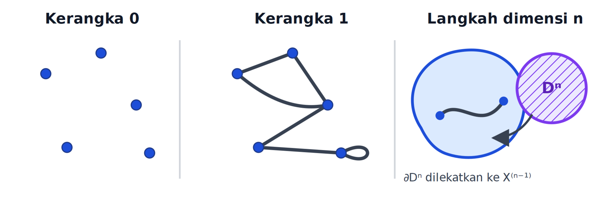
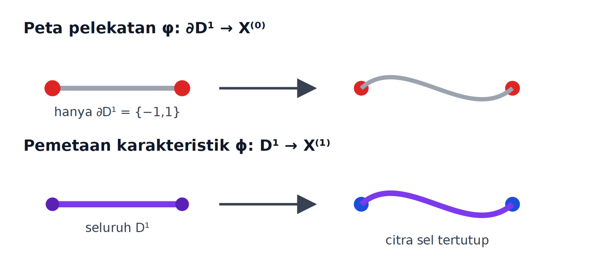
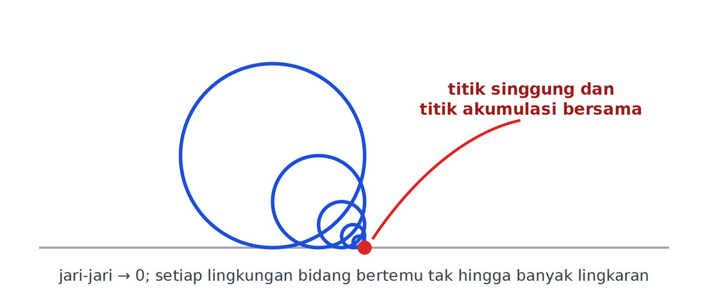
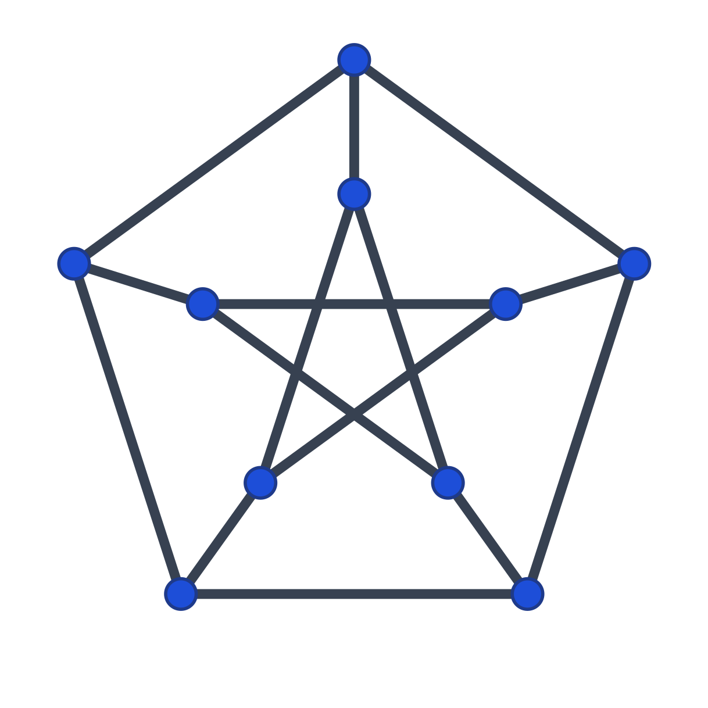
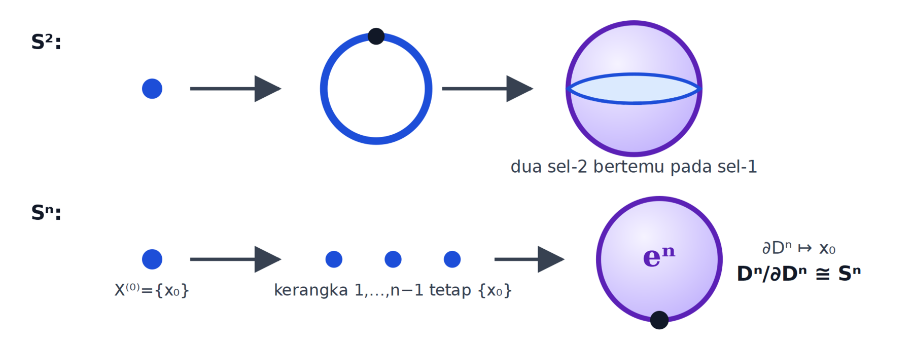
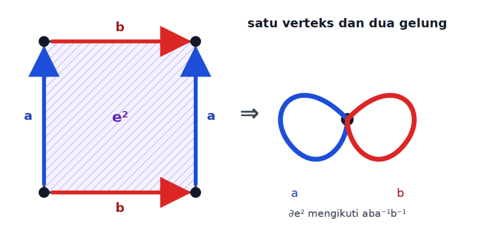
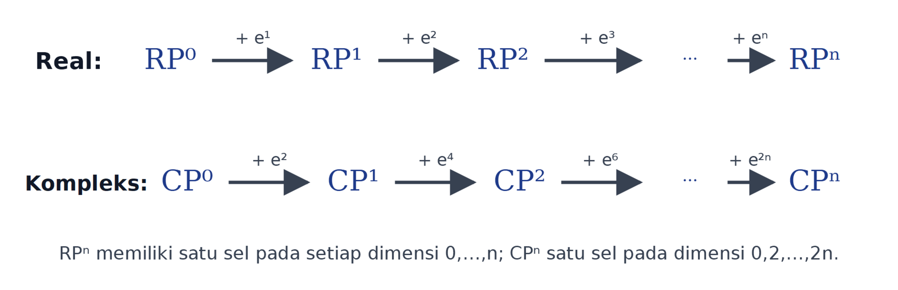

# Tentang komponen ini {.unnumbered #o012-fom-u006-notice data-course-route-unit-id="D60-R12"}

Komponen ini merupakan terjemahan dan adaptasi bahasa Indonesia atas Bagian
1.12 *Algebraic Topology* karya Yeheli Fomberg, berdasarkan kuliah Nir
Lazarovich pada musim semi 2025. Otoritas sumber dibekukan pada commit
[563194fae879178b9a6871b249513bfc27968975](https://git.sr.ht/~yp/math-notes/tree/563194fae879178b9a6871b249513bfc27968975/item/algebraic_topology.tex).
Rentang yang diterjemahkan ialah algebraic_topology.tex baris 3123–3517:
395 baris fisik, 15.540 byte setelah normalisasi LF dan satu LF penutup,
dengan SHA-256
c16d595b8f8c4c67ea5f0f58c1ad7de83ac94efae509d3a8d3bef28da2522f19.

Catatan sumber tersedia di bawah
[Creative Commons Attribution-ShareAlike 4.0 International (CC BY-SA 4.0)](https://creativecommons.org/licenses/by-sa/4.0/).
Terjemahan, pemformatan semantik, koreksi terbatas, tujuh gambar ulang
aksesibel, serta materi penguasaan asli di bawah ini diterbitkan dengan
lisensi yang sama. Pembaca memakai tepat satu PNG untuk setiap gambar ulang;
master SVG berpasangan dipertahankan di sampingnya untuk rekam asal-usul,
aksesibilitas, dan penggunaan ulang tanpa rugi. Semua perbaikan dibedakan
dari teks sumber. Tidak ada prosa dari bank soal Fomberg terpisah maupun
materi MIT yang disalin ke dalam komponen ini.

Tujuh pasangan gambar ulang aksesibel—PNG untuk pembaca dan SVG sebagai
master—menggantikan kode TikZ mentah sambil mempertahankan kesebelas fungsi
diagram sumber: (1) himpunan simpul diskret,
(2) contoh $1$-kerangka, (3) pemetaan karakteristik,
(4) peta pelekatan, (5) anting-anting Hawaii, (6) graf Petersen,
(7) konstruksi $S^2$, (8) struktur dua-sel pada $S^n$,
(9) struktur CW torus, (10) kuosien antipodal untuk
$\mathbb{RP}^1$, dan (11) model belahan sfera untuk
$\mathbb{RP}^2$. Setiap gambar disertai uraian semantik yang tidak
bergantung pada warna atau tata letak.

Edisi ini independen dan tidak menyiratkan dukungan, pengesahan, atau
afiliasi dengan Yeheli Fomberg, Nir Lazarovich, ataupun institusi mereka.
Produksi terjemahan, struktur semantik, gambar ulang, dan QA dibantu oleh
**OpenAI Codex gpt-5.6-sol, Ultra** atas arahan pengguna.

# Kompleks Seluler {#o012-fom-u006 data-source-lines="3123-3517" data-course-route-unit-id="D60-R12"}

::: {.remark #o012-fom-u006-rem-intro data-origin="source-derived" data-source-lines="3125-3132"}
**Catatan.** Dalam topologi kita dapat membangun ruang yang berperilaku sangat
buruk. Struktur sederhana seperti kompleks-$\Delta$ memungkinkan kita
menghitung homologi bagi suatu keluarga ruang. Sekarang kita memperkenalkan
kembali kompleks sel atau kompleks CW. Struktur ini memperumum
kompleks-$\Delta$ dan memungkinkan homologi lebih banyak ruang dihitung dengan
lebih mudah.
:::

## Kerangka, sel, dan dua jenis peta {#o012-fom-u006-s12a data-origin="source-derived" data-source-lines="3134-3248"}

::: {.definition #o012-fom-u006-def-cw-finite-stage data-origin="source-derived" data-source-lines="3134-3248"}
**Definisi (pembangunan seluler).** Mulailah dengan $0$-kerangka

$$
X^{(0)}=\text{suatu himpunan simpul diskret}.
$$

Untuk setiap $n\geq1$, andaikan $X^{(n-1)}$ telah dibangun. Pilih sebuah
keluarga cakram-$n$ dan peta pelekatan

$$
\left\{
  \left(D^n_\alpha,\varphi_\alpha\right)
\right\}_{\alpha\in A_n},
\qquad
\varphi_\alpha\colon
\partial D^n_\alpha\longrightarrow X^{(n-1)}.
$$

Kerangka berikutnya adalah ruang kuosien

$$
X^{(n)}
=
\left(
X^{(n-1)}\sqcup\bigsqcup_{\alpha\in A_n}D^n_\alpha
\right)
\Big/
\left(x\sim\varphi_\alpha(x)
\text{ untuk }x\in\partial D^n_\alpha\right).
$$

Restriksi peta kuosien pada cakram ke-$\alpha$ ialah **pemetaan
karakteristik**

$$
\phi_\alpha\colon D^n_\alpha\longrightarrow X^{(n)}.
$$

Peta $\varphi_\alpha$ hanya menentukan tempat batas cakram dilekatkan pada
kerangka sebelumnya. Sebaliknya, $\phi_\alpha$ memetakan seluruh cakram ke
sel tertutup di dalam kerangka baru. **Sel-$n$ terbuka** yang terkait ialah

$$
e^n_\alpha
:=
\phi_\alpha\!\left(\operatorname{Int}D^n_\alpha\right).
$$

Pemetaan karakteristik membatasi menjadi homeomorfisma
$\operatorname{Int}D^n_\alpha\cong e^n_\alpha$, tetapi pada batasnya ia
boleh mengidentifikasi titik-titik.

:::: {.figure #o012-fom-u006-fig-cw-skeleta data-origin="edition-original-redraw" data-source-lines="3138-3177,3236-3247"}
{.semantic-redraw width=96%}

**Diagram semantik (fungsi sumber 1 dan 2).** Panel kiri merepresentasikan
$X^{(0)}$ sebagai lima simpul yang saling terpisah. Panel tengah
merepresentasikan contoh $X^{(1)}$: simpul-simpul itu dihubungkan oleh
sel-$1$, termasuk satu sel yang kedua ujungnya melekat pada simpul yang sama
dan menjadi gelung. Dua panel ini menggambar ulang dua TikZ pertama sumber.

Panel kanan menambahkan ringkasan langkah induktif: batas
$\partial D^n_\alpha$ dipetakan ke $X^{(n-1)}$, kemudian seluruh
$D^n_\alpha$ masuk ke ruang kuosien $X^{(n)}$. Ringkasan tambahan ini
membuat tipe peta dan dimensi cakram terbaca tanpa mengubah data sumber.
::::

Dalam dimensi satu, pasangan
$(D^1_\alpha,\varphi_\alpha)$ mempunyai

$$
\varphi_\alpha\colon\partial D^1_\alpha\longrightarrow X^{(0)},
\qquad
\phi_\alpha\colon D^1_\alpha\longrightarrow X^{(1)}.
$$

:::: {.figure #o012-fom-u006-fig-attaching-characteristic data-origin="edition-original-redraw" data-source-lines="3178-3233"}
{.semantic-redraw width=92%}

**Diagram semantik (fungsi sumber 3 dan 4).** Baris atas mewakili peta
pelekatan: domainnya hanya
$\partial D^1_\alpha=\{-1,1\}$, dan kedua titik ujung itu dikirim ke dua
simpul di $X^{(0)}$. Bagian dalam interval tidak berada dalam domain
$\varphi_\alpha$.

Baris bawah mewakili pemetaan karakteristik: seluruh interval
$D^1_\alpha$, termasuk bagian dalam dan batasnya, dikirim ke citra satu
sel-$1$ tertutup di $X^{(1)}$. Bagian dalam interval memparametrisasi
sel terbuka $e^1_\alpha$; kedua titik batas dapat diidentifikasi oleh
peta kuosien. Dua baris ini menggambar ulang dua diagram TikZ sumber yang
semula terpisah.
::::
:::

::: {.source-audit #o012-fom-u006-audit-open-cell data-origin="edition-original" data-source-lines="3233-3234" data-adverse-candidate-id="FOM-U006A-ADV-001"}
**Koreksi notasi sel terbuka.** Sumber menyebut

$$
\operatorname{Int}\!\left(\phi_\alpha(D^1_\alpha)\right)
$$

sebagai sel-$1$. Interior citra tertutup di dalam ruang sekitar dapat kosong
dan bukan definisi yang tepat. Edisi memakai

$$
e^1_\alpha=\phi_\alpha(\operatorname{Int}D^1_\alpha),
$$

yaitu citra bagian dalam cakram di bawah pemetaan karakteristik.
:::

::: {.source-audit #o012-fom-u006-audit-disk-dimension-and-map-types data-origin="edition-original" data-source-lines="3178-3182,3208-3247" data-adverse-candidate-id="FOM-U006A-ADV-002"}
**Koreksi dimensi cakram dan tipe peta.** Baris 3245 sumber memakai
$D^1_\alpha$ pada langkah berdimensi $n$, walaupun baris 3240–3241 baru saja
memperkenalkan $D^n_\alpha$. Edisi memakai $D^n_\alpha$ dan menyatakan
kedua tipe secara eksplisit:

$$
\varphi_\alpha\colon\partial D^n_\alpha\to X^{(n-1)},
\qquad
\phi_\alpha\colon D^n_\alpha\to X^{(n)}.
$$

Edisi juga menormalkan kalimat salah tik pada baris 3180 tanpa mengubah
isinya. Pada panel peta pelekatan di baris 3208–3232, sumber mewarnai seluruh
interval meskipun domain $\varphi_\alpha$ hanya $\partial D^1_\alpha$.
Gambar ulang edisi menandai hanya kedua titik batas sebagai domain peta
pelekatan; seluruh interval baru muncul sebagai domain pemetaan karakteristik.
:::

## Kompleks CW berdimensi rendah dan tak berhingga {#o012-fom-u006-s12b data-origin="source-derived" data-source-lines="3250-3266"}

::: {.remark #o012-fom-u006-rem-one-dimensional-delta data-origin="source-derived" data-source-lines="3250-3253"}
**Catatan (dimensi nol dan satu).** Setiap kompleks CW berdimensi paling
tinggi satu dapat diberi struktur kompleks-$\Delta$ berdimensi paling tinggi
satu yang realisasinya homeomorfik dengan ruang semula, setelah sel-$1$
disubdivisi bila diperlukan. Sebaliknya, realisasi setiap
kompleks-$\Delta$ berdimensi paling tinggi satu mempunyai struktur CW alami.
Pernyataan ini tentang homeomorfisma realisasi, bukan sekadar ekuivalensi
homotopi dan bukan identitas struktur sel.
:::

::: {.source-audit #o012-fom-u006-audit-delta-equivalence data-origin="edition-original" data-source-lines="3250-3253" data-adverse-candidate-id="FOM-U006A-ADV-003"}
**Penajaman jenis ekuivalensi.** Sumber hanya menulis “equivalent” tanpa
menentukan apakah yang dimaksud homeomorfisma, ekuivalensi homotopi, atau
kesamaan struktur. Edisi menyatakan klaim yang diperlukan secara tepat:
realisasinya homeomorfik setelah subdivisi seperlunya; struktur selnya tidak
harus identik.
:::

::: {.remark #o012-fom-u006-rem-delta-characteristic data-origin="source-derived" data-source-lines="3255-3259"}
**Catatan.** Dalam struktur kompleks-$\Delta$, peta

$$
\sigma_\alpha\colon\Delta^{n_\alpha}\longrightarrow X
$$

memainkan peran pemetaan karakteristik: bagian dalam simpleks dipetakan
secara homeomorfik ke satu sel, sedangkan muka-mukanya dilekatkan ke
kerangka berdimensi lebih rendah.
:::

::: {.remark #o012-fom-u006-rem-weak-topology data-origin="source-derived" data-source-lines="3261-3266"}
**Catatan (kompleks tak berhingga dan topologi lemah).** Untuk pembangunan
yang tidak berhenti pada suatu dimensi hingga, tetapkan

$$
X=\mathop{\mathrm{colim}}\limits_n X^{(n)}
=\bigcup_{n\geq0}X^{(n)}
$$

dan beri $X$ **topologi lemah** (*weak topology*), yakni topologi final
terhadap inklusi semua sel tertutup. Secara ekuivalen, $A\subseteq X$
tertutup jika dan hanya jika

$$
A\cap\phi_\alpha(D^n_\alpha)
$$

tertutup di $\phi_\alpha(D^n_\alpha)$ untuk setiap sel. Dalam situasi
filtrasi yang memenuhi syarat CW, ini juga dinyatakan melalui kerangka:
$U\subseteq X$ terbuka jika dan hanya jika $U\cap X^{(n)}$ terbuka di
$X^{(n)}$ untuk setiap $n$.

Dalam konvensi standar, huruf **C** pada CW juga mencatat syarat
*closure-finite*: penutupan setiap sel berpotongan dengan hanya berhingga
banyak sel. Huruf **W** mencatat topologi lemah di atas.
:::

::: {.source-audit #o012-fom-u006-audit-weak-topology data-origin="edition-original" data-source-lines="3134-3266" data-adverse-candidate-id="FOM-U006A-ADV-004"}
**Penajaman topologi limit langsung dan syarat CW.** Sumber menulis limit
sebagai gabungan kerangka dan memberi uji keterbukaan per kerangka, tetapi
tidak menjelaskan bahwa topologi tersebut ialah topologi final/lemah dan
tidak menyatakan syarat *closure-finite*. Edisi membuat kedua syarat standar
itu eksplisit. Simbol $\mathop{\mathrm{colim}}\limits_n$ di sini berarti
kolimit topologis dengan
topologi tersebut, bukan asumsi bahwa suatu topologi subruang ambien
otomatis memberikan kolimit yang sama.
:::

## Contoh dan noncontoh {#o012-fom-u006-s12c data-origin="source-derived" data-source-lines="3268-3509"}

::: {.example #o012-fom-u006-ex-hawaiian-earring data-origin="source-derived" data-source-lines="3268-3295"}
**Contoh (anting-anting Hawaii sebagai noncontoh).** Di dalam
$\mathbb R^2$, ambil lingkaran $C_n$ berjari-jari $1/n$ dan berpusat di
$(0,1/n)$. Semua lingkaran menyinggung titik asal, dan

$$
H=\bigcup_{n\geq1}C_n
$$

diberi topologi subruang dari bidang. Ruang $H$ disebut
**anting-anting Hawaii**.

:::: {.figure #o012-fom-u006-fig-hawaiian-earring data-origin="edition-original-redraw" data-source-lines="3268-3295"}
{.semantic-redraw width=82%}

**Diagram semantik (fungsi sumber 5).** Lingkaran
$C_n$ berpusat di $(0,1/n)$, berjari-jari $1/n$, dan semuanya melalui
$0=(0,0)$. Diameternya menuju nol, sehingga setiap lingkungan bidang dari
titik asal bertemu tak hingga banyak lingkaran. Titik asal adalah titik
akumulasi bersama; pusat-pusat lingkaran bukan simpul tambahan dalam
dekomposisi baji yang wajar.
::::

Sebagai himpunan, $H$ tampak seperti baji terhitung lingkaran. Namun topologi
subruang bidangnya bukan topologi lemah baji CW. Pilih satu titik
$p_n\in C_n\setminus\{0\}$ dengan $p_n\to0$, dan tetapkan

$$
U=H\setminus\{p_1,p_2,\ldots\}.
$$

Irisan $U\cap C_n$ terbuka di setiap lingkaran $C_n$, tetapi $U$ tidak
terbuka di $H$: tidak ada lingkungan bidang dari $0$ yang menghindari semua
$p_n$. Jadi topologi subruang gagal memenuhi uji lemah per sel tertutup yang
dimiliki baji CW. Baji abstrak $\bigvee_{n\geq1}S^1$ tetap merupakan
kompleks CW bila diberi topologi lemahnya; ruang itu tidak homeomorfik dengan
anting-anting Hawaii. Secara intrinsik, baji CW terhitung itu tidak kompak
dan semilokal terhubung sederhana, sedangkan anting-anting Hawaii kompak,
tidak semilokal terhubung sederhana, dan tidak kontraktibel secara lokal di titik
asal; lihat juga
[pembandingan topologis pada Unit Roberts 13](#o012-rbt-l13-s05).

Argumen lokalnya juga menutup kemungkinan bahwa $H$ mempunyai suatu
struktur CW lain. Setiap lingkungan $0$ di $H$ memuat seluruh $C_m$ untuk
semua $m$ yang cukup besar, sebab diameter $C_m$ adalah $2/m$. Untuk setiap
$m$ terdapat retraksi kontinu $r_m\colon H\to C_m$ yang bertindak sebagai
identitas pada $C_m$ dan meruntuhkan semua lingkaran lain ke $0$. Jadi gelung
$C_m$ tidak nulhomotop di $H$. Akibatnya setiap lingkungan $0$ memuat gelung
yang tetap esensial di $H$; $H$ tidak semilokal terhubung sederhana dan
tidak kontraktibel secara lokal pada $0$. Karena setiap kompleks CW
kontraktibel secara lokal, $H$ tidak homeomorfik dengan kompleks CW mana pun.
:::

::: {.source-audit #o012-fom-u006-audit-hawaiian-earring data-origin="edition-original" data-source-lines="3268-3295" data-adverse-candidate-id="FOM-U006A-ADV-005"}
**Koreksi kontradiksi dan alasan topologis.** Baris 3269 menyebut contoh ini
noncontoh, baris 3272 menyebutnya kompleks CW, lalu baris 3288–3291 kembali
menyatakan bahwa ia bukan kompleks CW. Alasan sumber tentang titik
$(0,1/n)$ juga tidak tepat: titik-titik itu adalah pusat lingkaran dan tidak
perlu dipilih sebagai $0$-sel; dekomposisi baji yang wajar hanya memakai
titik singgung bersama sebagai $0$-sel.

Edisi menghapus kontradiksi itu dan memakai kegagalan topologi lemah sebagai
alasan yang benar. Klaim tambahan sumber bahwa pusat $(0,n)$ dengan
jari-jari $n$ otomatis memperbaiki keadaan juga tidak dipertahankan:
sekadar mengubah gambar planar tidak menetapkan topologi lemah. Cara yang
tepat memperoleh kompleks CW ialah membentuk baji abstrak dan memberinya
topologi lemah.
:::

::: {.example #o012-fom-u006-ex-topological-graph data-origin="source-derived" data-source-lines="3297-3333"}
**Contoh (graf topologis).** Setiap graf abstrak mempunyai struktur CW
berdimensi satu: simpul-simpulnya adalah sel-$0$ dan bagian dalam
sisi-sisinya adalah sel-$1$. Graf Petersen, misalnya, mempunyai sepuluh
sel-$0$ dan lima belas sel-$1$.

:::: {.figure #o012-fom-u006-fig-petersen-graph data-origin="edition-original-redraw" data-source-lines="3297-3333"}
{.semantic-redraw width=64%}

**Diagram semantik (fungsi sumber 6).** Lima simpul luar membentuk sebuah
siklus panjang lima, lima simpul dalam dihubungkan menurut urutan bintang,
dan masing-masing simpul luar dihubungkan ke tepat satu simpul dalam.
Kesepuluh simpul adalah sel-$0$ dan kelima belas sisi abstrak adalah
sel-$1$. Perpotongan guratan pada suatu gambar tidak otomatis menjadi simpul
graf.
::::

Graf Petersen tidak planar, jadi tidak ada pembenaman graf itu ke
$\mathbb R^2$ yang mempertahankan sisi-sisi sebagai busur yang hanya bertemu
di simpul bersama. Hal ini sama sekali tidak menghalangi graf abstraknya
menjadi kompleks CW. Ia dapat dibenamkan ke $\mathbb R^3$, tetapi
pembenaman ruang ambien juga bukan syarat bagi struktur CW intrinsiknya.
:::

::: {.source-audit #o012-fom-u006-audit-petersen-planarity data-origin="edition-original" data-source-lines="3297-3333" data-adverse-candidate-id="FOM-U006A-ADV-006"}
**Koreksi perancuan planarity dengan struktur CW.** Sumber menyimpulkan
bahwa graf Petersen “bukan kompleks CW” di bidang karena sisi harus
berpotongan. Yang gagal ialah pembenaman planar dari graf abstrak, bukan
struktur CW graf tersebut. Edisi memisahkan tiga hal: graf abstrak selalu
memberi kompleks CW satu-dimensi; gambar bidang yang bersilangan bukan
pembenaman; dan setiap graf hingga dapat dibenamkan ke ruang tiga-dimensi.
:::

::: {.example #o012-fom-u006-ex-sphere-two data-origin="source-derived" data-source-lines="3335-3365"}
**Contoh (struktur seluler pada $S^2$).** Tetapkan
$X^{(0)}=\{v\}$ dan lekatkan satu sel-$1$ melalui peta konstan

$$
\varphi_1\colon\partial D^1\longrightarrow\{v\}.
$$

Kerangka $X^{(1)}$ yang dihasilkan adalah satu lingkaran. Lekatkan dua
sel-$2$, masing-masing sepanjang homeomorfisma batasnya ke lingkaran itu.
Kedua cakram bertemu pada batas bersama dan membentuk $S^2$.

:::: {.figure #o012-fom-u006-fig-sphere-cell-structures data-origin="edition-original-redraw" data-source-lines="3335-3389"}
{.semantic-redraw width=94%}

**Diagram semantik (fungsi sumber 7 dan 8).** Baris atas memperlihatkan tiga
tahap untuk $S^2$: satu simpul $v$; satu sel-$1$ yang kedua ujungnya
dilekatkan ke $v$ dan membentuk lingkaran; lalu dua sel-$2$ yang mengisi
kedua sisi lingkaran. Ini menggambar ulang konstruksi pertama sumber.

Baris bawah memperlihatkan struktur minimal pada $S^n$ untuk $n\geq1$:
kerangka dimensi $0,\ldots,n-1$ tetap berupa satu titik $x_0$, lalu satu
sel-$n$ dilekatkan dengan seluruh $\partial D^n$ dikirim ke $x_0$.
Kuosiennya ialah $D^n/\partial D^n\cong S^n$. Ini menggambar ulang
konstruksi sfera kedua sumber.
::::

Struktur empat-sel pada $S^2$ ini bukan struktur kompleks-$\Delta$ dengan
sel yang sama.
:::

::: {.example #o012-fom-u006-ex-sphere-n data-origin="source-derived" data-source-label="exmp:cw-for-sn-one-n-cell" data-source-lines="3367-3389"}
**Contoh (struktur minimal pada $S^n$).** Untuk $n\geq1$, tetapkan

$$
X^{(0)}=\{x_0\},
\qquad
X^{(i)}=X^{(0)}
\quad(1\leq i<n),
$$

lalu lekatkan satu sel-$n$ melalui peta konstan

$$
\varphi\colon\partial D^n\longrightarrow X^{(n-1)},
\qquad
\varphi(x)=x_0.
$$

Hasilnya

$$
X^{(n)}\cong D^n/\partial D^n\cong S^n.
$$

Jadi struktur itu mempunyai tepat satu sel-$0$ dan satu sel-$n$, tanpa sel
pada dimensi di antaranya.
:::

::: {.source-audit #o012-fom-u006-audit-sphere-index data-origin="edition-original" data-source-lines="3367-3375" data-adverse-candidate-id="FOM-U006A-ADV-007"}
**Koreksi indeks kerangka sfera.** Baris 3371 sumber menulis
$1\leq i<k$, tetapi $k$ tidak didefinisikan dan sel yang kemudian dilekatkan
berdimensi $n$. Edisi memakai rentang yang bertipe benar,
$1\leq i<n$, dan menyatakan $n\geq1$.
:::

::: {.remark #o012-fom-u006-rem-many-sphere-cells data-origin="source-derived" data-source-lines="3391-3397"}
**Catatan.** Kita juga dapat memberi $S^2$ struktur CW dengan banyak sel,
misalnya pola seperti bola basket atau bola sepak, atau mentriangulasinya
sebagai kompleks-$\Delta$. Struktur minimal sering lebih efisien untuk
perhitungan homologi seluler karena jumlah pembangkit rantainya jauh lebih
sedikit.
:::

::: {.example #o012-fom-u006-ex-torus data-origin="source-derived" data-source-label="exmp:cw-for-torus" data-source-lines="3399-3441"}
**Contoh (torus).** Persegi fundamental torus mengidentifikasi pasangan sisi
yang berhadapan dengan orientasi yang sesuai. Keempat sudut menjadi satu
sel-$0$ $e^0$; kedua pasangan sisi menjadi dua sel-$1$,
$e^1_a$ dan $e^1_b$; dan bagian dalam persegi menjadi satu sel-$2$ $e^2$.

:::: {.figure #o012-fom-u006-fig-torus-cw data-origin="edition-original-redraw" data-source-lines="3399-3441"}
{.semantic-redraw width=90%}

**Diagram semantik (fungsi sumber 9).** Sisi tegak persegi diberi label
$a$ dengan orientasi yang berpasangan, dan sisi mendatar diberi label $b$
dengan orientasi yang berpasangan. Setelah identifikasi, keempat sudut
menjadi satu simpul dan pasangan sisi menjadi dua gelung berarah $a$ dan
$b$. Ketika batas persegi dibaca sekali dengan orientasi positif, peta
pelekatan sel-$2$ menelusuri kata

$$
aba^{-1}b^{-1}.
$$

Arsiran bagian dalam mewakili satu sel-$2$, bukan dua cakram terpisah.
::::

Jadi

$$
T^2
\cong
e^0\cup e^1_a\cup e^1_b\cup e^2,
$$

dan peta pelekatan sel-$2$ merepresentasikan komutator
$aba^{-1}b^{-1}$ pada baji dua lingkaran.
:::

::: {.example #o012-fom-u006-ex-real-projective-space data-origin="source-derived" data-source-lines="3443-3501"}
**Contoh (ruang projektif real).** Ruang $\mathbb{RP}^n$ adalah ruang
garis satu-dimensi di $\mathbb R^{n+1}$ yang melalui titik asal:

$$
\mathbb{RP}^n
=
\left(\mathbb R^{n+1}\setminus\{0\}\right)
\Big/
\left(x\sim\lambda x,\ \lambda\in\mathbb R^\times\right).
$$

Dengan memilih vektor satuan pada setiap garis, kita juga memperoleh model

$$
\mathbb{RP}^n\cong S^n/(x\sim-x).
$$

Dalam dimensi nol, $\mathbb{RP}^0$ adalah satu titik. Dalam dimensi satu,
kuosien antipodal $S^1/(x\sim-x)$ kembali homeomorfik dengan $S^1$.
Karena itu $\mathbb{RP}^1$ diperoleh dari $\mathbb{RP}^0$ dengan
melekatkan satu sel-$1$.

Untuk dimensi dua, ambil belahan sfera tertutup sebagai cakram $D^2$.
Bagian dalamnya memberi sel-$2$ terbuka, sedangkan pada batas
$S^1=\partial D^2$ titik-titik antipodal diidentifikasi. Kuosien batas itu
ialah $\mathbb{RP}^1$, sehingga

$$
\mathbb{RP}^2
\cong
\mathbb{RP}^1\cup_{q_2}D^2,
\qquad
q_2\colon S^1\longrightarrow\mathbb{RP}^1
$$

adalah peta kuosien antipodal.

:::: {.figure #o012-fom-u006-fig-projective-filtration data-origin="edition-original-redraw" data-source-lines="3443-3516"}
{.semantic-redraw width=96%}

**Diagram semantik (fungsi sumber 10 dan 11).** Fungsi diagram
$\mathbb{RP}^1$ pada sumber adalah menunjukkan bahwa kuosien lingkaran oleh
identifikasi antipodal tetap sebuah lingkaran, sehingga satu sel-$1$
dilekatkan pada satu titik. Fungsi diagram $\mathbb{RP}^2$ adalah
menunjukkan bahwa satu belahan sfera menjadi cakram $D^2$ dan lingkaran
batasnya dikuosienkan secara antipodal menjadi $\mathbb{RP}^1$.

Gambar ulang merangkum kedua langkah itu sebagai filtrasi

$$
\mathbb{RP}^0\subset\mathbb{RP}^1\subset\cdots
\subset\mathbb{RP}^n,
$$

dengan tepat satu sel baru $e^k$ pada langkah dari
$\mathbb{RP}^{k-1}$ ke $\mathbb{RP}^k$. Baris kedua menampilkan pola
analog untuk $\mathbb{CP}^n$, tetapi hanya pada dimensi genap
$0,2,\ldots,2n$.
::::
:::

::: {.remark #o012-fom-u006-rem-projective-induction data-origin="source-derived" data-source-lines="3503-3509"}
**Catatan (pembangunan induktif ruang projektif real).**
Secara umum, inklusi ruang projektif
$\mathbb{RP}^{n-1}\subset\mathbb{RP}^n$ adalah subruang yang diwakili oleh
garis-garis di hiperbidang koordinat terakhir nol. Sel komplemennya
berdimensi $n$, dan konstruksi induktif yang bertipe benar ialah

$$
\mathbb{RP}^n
\cong
\mathbb{RP}^{n-1}\cup_{q_n}D^n,
\qquad
q_n\colon S^{n-1}=\partial D^n
\longrightarrow\mathbb{RP}^{n-1},
$$

dengan $q_n(x)=[x]$, yakni peta kuosien antipodal. Jadi
$\mathbb{RP}^n$ mempunyai tepat satu sel-$i$ untuk setiap
$0\leq i\leq n$.
:::

::: {.source-audit #o012-fom-u006-audit-projective-quotient data-origin="edition-original" data-source-lines="3443-3448" data-adverse-candidate-id="FOM-U006A-ADV-008"}
**Koreksi relasi kuosien projektif.** Sumber menulis
$x\sim\lambda x$ tanpa menyatakan bahwa skalar harus taknol. Jika
$\lambda=0$ diizinkan, ruas kanan keluar dari
$\mathbb R^{n+1}\setminus\{0\}$ dan relasinya tidak bertipe. Edisi memakai
$\lambda\in\mathbb R^\times$ serta mempertahankan model ekuivalen
$S^n/(x\sim-x)$.
:::

::: {.source-audit #o012-fom-u006-audit-projective-attaching data-origin="edition-original" data-source-lines="3472-3508" data-adverse-candidate-id="FOM-U006A-ADV-009"}
**Koreksi subruang dan notasi pelekatan projektif.** Sumber menyebut
“khatulistiwa $\mathbb{RP}^2$” sebagai $\mathbb{RP}^1$ dan menulis
$\bigsqcup D^n$ tanpa indeks, lalu beralih ke
$\varphi_\alpha$ dan $D^n_\alpha$. Untuk dekomposisi yang sedang dibahas,
hanya satu sel-$n$ diperlukan. Edisi memakai subruang projektif kanonik
$\mathbb{RP}^{n-1}$ dan peta tunggal yang bertipe lengkap,

$$
q_n\colon\partial D^n=S^{n-1}\to\mathbb{RP}^{n-1},
\qquad x\longmapsto[x].
$$
:::

::: {.source-audit #o012-fom-u006-audit-grouped-typography data-origin="edition-original" data-source-lines="3130-3131,3180-3181,3292-3294,3391-3396,3447,3506-3508" data-adverse-candidate-id="FOM-U006A-ADV-010"}
**Normalisasi tata bahasa dan salah tik sumber.** Edisi menormalkan
kesesuaian subjek–verba pada baris 3130–3131, “this maps” pada baris
3180, bentuk tunggal/jamak yang rusak pada baris 3292–3294,
“triangulize” dan kalimat janggal pada baris 3394–3396,
“homeomorohic” pada baris 3447, serta ketidakkonsistenan indeks pada baris
3506–3508. Perubahan ini tidak menambah klaim matematis baru; koreksi
matematis yang substantif dicatat terpisah pada audit-audit di atas.
:::

## Pemeriksaan penguasaan {#o012-fom-u006-mastery data-origin="edition-original" data-course-route-unit-id="D60-R12"}

Enam pemeriksaan berikut membentuk lapisan penguasaan unit. Latihan pertama
berasal dari baris 3511–3516 sumber dan dilengkapi petunjuk serta solusi
asli edisi. Lima latihan lainnya ditulis khusus untuk edisi ini. Tidak ada
soal yang disalin dari bank soal Fomberg terpisah.

::: {.exercise #o012-fom-u006-mcheck-001 data-origin="source-derived" data-source-label="ex:cw-for-cp" data-source-lines="3511-3516" data-course-route-unit-id="D60-R12" data-adaptation="source-prompt-expanded-into-checked-subquestions"}
**Pemeriksaan Penguasaan F6.1 (struktur CW pada
$\mathbb{CP}^n$).** Latihan sumber meminta suatu kompleks CW bagi
$\mathbb{CP}^n$ dengan satu sel pada setiap dimensi genap dan meminta
kesimpulan $\mathbb{CP}^1\cong S^2$. Berikut penjabarannya menjadi langkah
yang dapat diperiksa.

Masukkan

$$
\mathbb{CP}^{n-1}
=
\{[z_0:\cdots:z_n]\in\mathbb{CP}^n:z_n=0\}
$$

ke dalam $\mathbb{CP}^n$. Tetapkan

$$
D^{2n}=\{w\in\mathbb C^n:\lVert w\rVert\leq1\}
$$

dan

$$
\Phi_n(w)
=
\left[
w_0:\cdots:w_{n-1}:
\sqrt{1-\lVert w\rVert^2}
\right].
$$

1. Buktikan bahwa $\Phi_n$ membatasi menjadi homeomorfisma
   $\operatorname{Int}D^{2n}\to
   \mathbb{CP}^n\setminus\mathbb{CP}^{n-1}$.
2. Identifikasi restriksi $\Phi_n|_{S^{2n-1}}$.
3. Simpulkan
   $\mathbb{CP}^n\cong
   \mathbb{CP}^{n-1}\cup_{h_n}D^{2n}$, lalu cacah sel-selnya.
4. Deduksi bahwa $\mathbb{CP}^1\cong S^2$.
:::

::: {.hint #o012-fom-u006-hint-001 data-origin="edition-original"}
**Petunjuk.** Setiap titik projektif di luar $\mathbb{CP}^{n-1}$ mempunyai
satu-satunya wakil satuan yang koordinat terakhirnya berupa bilangan real
positif. Pada batas $D^{2n}$, koordinat terakhir dalam rumus $\Phi_n$
menjadi nol. Ingat bahwa dua vektor satuan kompleks menentukan garis yang
sama tepat ketika keduanya berbeda melalui perkalian suatu bilangan kompleks
bermodulus satu.
:::

::: {.solution #o012-fom-u006-sol-001 data-origin="edition-original"}
**Solusi Pemeriksaan F6.1.** Ambil
$[z_0:\cdots:z_n]\notin\mathbb{CP}^{n-1}$, sehingga $z_n\neq0$.
Kalikan wakilnya dengan suatu skalar kompleks agar koordinat terakhir positif
real, kemudian normalkan panjang seluruh vektor menjadi satu. Hasilnya unik
dan berbentuk

$$
(w,t),
\qquad
t>0,
\qquad
\lVert w\rVert^2+t^2=1.
$$

Jadi $t=\sqrt{1-\lVert w\rVert^2}$ dan $\lVert w\rVert<1$. Prosedur ini
memberi invers kontinu bagi restriksi $\Phi_n$ pada bagian dalam cakram;
karena itu restriksi tersebut merupakan homeomorfisma.

Jika $\lVert w\rVert=1$, maka

$$
\Phi_n(w)=[w_0:\cdots:w_{n-1}:0].
$$

Dengan identifikasi subruang terakhir itu dengan
$\mathbb{CP}^{n-1}$, restriksi batas adalah peta Hopf

$$
h_n\colon S^{2n-1}\longrightarrow\mathbb{CP}^{n-1},
\qquad
h_n(w)=[w].
$$

Seratnya adalah orbit perkalian $w\mapsto\lambda w$ untuk
$\lambda\in S^1$. Maka $\Phi_n$ merupakan pemetaan karakteristik bagi satu
sel-$2n$ yang dilekatkan pada $\mathbb{CP}^{n-1}$ melalui $h_n$:

$$
\mathbb{CP}^n
\cong
\mathbb{CP}^{n-1}\cup_{h_n}D^{2n}.
$$

Induksi dari $\mathbb{CP}^0=\{*\}$ memberi tepat satu sel dalam setiap
dimensi $0,2,\ldots,2n$ dan tidak memberi sel berdimensi ganjil. Untuk
$n=1$, peta
$h_1\colon S^1\to\mathbb{CP}^0$ konstan, sehingga

$$
\mathbb{CP}^1
\cong D^2/\partial D^2
\cong S^2.
$$
:::

::: {.exercise #o012-fom-u006-mcheck-002 data-origin="edition-original" data-course-route-unit-id="D60-R12"}
**Pemeriksaan Penguasaan F6.2 (peta pelekatan versus pemetaan
karakteristik).** Dalam

$$
X^{(n)}
=
\left(
X^{(n-1)}\sqcup\bigsqcup_\alpha D^n_\alpha
\right)
\Big/
\left(x\sim\varphi_\alpha(x),\
x\in\partial D^n_\alpha\right),
$$

misalkan $q$ adalah peta kuosien dan
$j\colon X^{(n-1)}\to X^{(n)}$ adalah inklusi kanonik. Untuk satu indeks
$\alpha$:

1. nyatakan domain dan kodomain $\varphi_\alpha$ serta $\phi_\alpha$;
2. buktikan
   $\phi_\alpha|_{\partial D^n_\alpha}=j\circ\varphi_\alpha$;
3. buktikan bahwa restriksi $\phi_\alpha$ pada bagian dalam cakram merupakan
   homeomorfisma ke sel terbuka $e^n_\alpha$;
4. jelaskan mengapa citra sel tertutup
   $\phi_\alpha(D^n_\alpha)$ tidak harus homeomorfik dengan $D^n_\alpha$.
:::

::: {.hint #o012-fom-u006-hint-002 data-origin="edition-original"}
**Petunjuk.** Jika
$\iota_\alpha\colon D^n_\alpha\hookrightarrow
X^{(n-1)}\sqcup\bigsqcup_\beta D^n_\beta$ adalah inklusi suku, maka
$\phi_\alpha=q\circ\iota_\alpha$. Relasi kuosien bekerja pada titik batas,
bukan di bagian dalam. Injektivitas pada batas tidak disyaratkan.
:::

::: {.solution #o012-fom-u006-sol-002 data-origin="edition-original"}
**Solusi Pemeriksaan F6.2.** Peta pelekatan dan pemetaan karakteristik
berturut-turut bertipe

$$
\varphi_\alpha\colon
\partial D^n_\alpha=S^{n-1}\longrightarrow X^{(n-1)}
$$

dan

$$
\phi_\alpha=q\circ\iota_\alpha\colon
D^n_\alpha\longrightarrow X^{(n)}.
$$

Untuk $x\in\partial D^n_\alpha$, relasi pembentuk kuosien memberi

$$
\phi_\alpha(x)=q(x)
=q(\varphi_\alpha(x))
=j(\varphi_\alpha(x)).
$$

Inilah identitas restriksi pada butir kedua.

Tidak ada dua titik bagian dalam cakram ke-$\alpha$ yang diidentifikasi satu
sama lain atau dengan kerangka lama. Karena topologi pada citranya adalah
topologi kuosien sel, restriksi

$$
\phi_\alpha|_{\operatorname{Int}D^n_\alpha}\colon
\operatorname{Int}D^n_\alpha
\xrightarrow{\ \cong\ }e^n_\alpha
$$

merupakan homeomorfisma. Namun titik-titik batas boleh mempunyai citra yang
sama. Karena itu $\phi_\alpha$ tidak harus injektif pada seluruh cakram dan
citra tertutupnya tidak harus berupa cakram. Pada torus, misalnya, batas satu
sel-$2$ dilipat ke baji dua lingkaran sepanjang
$aba^{-1}b^{-1}$.
:::

::: {.exercise #o012-fom-u006-mcheck-003 data-origin="edition-original" data-course-route-unit-id="D60-R12"}
**Pemeriksaan Penguasaan F6.3 (struktur minimal pada $S^n$).**
Untuk $n\geq1$, mulailah dengan $X^{(0)}=\{v\}$, tetapkan
$X^{(i)}=\{v\}$ untuk $1\leq i<n$, lalu lekatkan satu cakram-$n$ melalui
peta konstan

$$
\varphi\colon S^{n-1}=\partial D^n\longrightarrow\{v\}.
$$

1. Identifikasi $X^{(n)}$.
2. Daftarkan semua sel terbukanya dan berikan pemetaan karakteristiknya.
3. Untuk $n=2$, bandingkan struktur ini dengan struktur satu simpul, satu
   sisi, dan dua muka pada contoh sumber.
:::

::: {.hint #o012-fom-u006-hint-003 data-origin="edition-original"}
**Petunjuk.** Meruntuhkan seluruh batas cakram tertutup berdimensi $n$ ke
satu titik menghasilkan kompaktifikasi satu-titik bagian dalam cakram.
:::

::: {.solution #o012-fom-u006-sol-003 data-origin="edition-original"}
**Solusi Pemeriksaan F6.3.** Definisi kuosien langsung memberi

$$
X^{(n)}
=
\left(\{v\}\sqcup D^n\right)
\Big/
\left(x\sim v\text{ untuk semua }x\in\partial D^n\right)
\cong
D^n/\partial D^n
\cong S^n.
$$

Sel-selnya hanya

$$
e^0=\{v\},
\qquad
e^n=q(\operatorname{Int}D^n);
$$

tidak ada sel pada dimensi $1,\ldots,n-1$. Pemetaan karakteristiknya ialah
peta kuosien

$$
q\colon D^n\longrightarrow D^n/\partial D^n.
$$

Untuk $n=1$, ini adalah interval yang kedua ujungnya diidentifikasi. Untuk
$n=2$, ini memberi struktur CW dua-sel pada $S^2$. Struktur tersebut berbeda
dari, dan lebih kecil daripada, struktur empat-sel yang juga sah pada contoh
sumber: pada struktur sumber, satu gelung dibentuk lebih dahulu, kemudian
dua cakram dilekatkan sepanjang homeomorfisma batas untuk menjadi dua
belahan sfera. Yang mungkin gagal menjadi struktur kompleks-$\Delta$ dengan
sel yang sama adalah struktur sel tertentu itu, bukan ruang $S^2$ sendiri.
:::

::: {.exercise #o012-fom-u006-mcheck-004 data-origin="edition-original" data-course-route-unit-id="D60-R12"}
**Pemeriksaan Penguasaan F6.4 (kata pelekatan torus).** Identifikasi sisi
berhadapan dari persegi berorientasi untuk membentuk $T^2$. Sebut simpul
tunggalnya $v$, sel-$1$ tegak $a$, dan sel-$1$ mendatar $b$.

1. Telusuri batas berorientasi persegi satu kali dan dapatkan kata pelekatan
   sel-$2$.
2. Nyatakan cacah sel CW.
3. Gunakan teorema Seifert–van Kampen untuk menghitung $\pi_1(T^2,v)$.
4. Jelaskan akibat mengubah titik awal penelusuran atau membalik orientasi
   batas.
:::

::: {.hint #o012-fom-u006-hint-004 data-origin="edition-original"}
**Petunjuk.** Mulai dari salah satu sudut dan telusuri batas positif. Empat
sisinya dilalui berturut-turut sebagai $a$, $b$, $a^{-1}$, dan $b^{-1}$.
Mengubah titik awal menggeser kata secara siklik; membalik orientasi
membalik kata itu.
:::

::: {.solution #o012-fom-u006-sol-004 data-origin="edition-original"}
**Solusi Pemeriksaan F6.4.** Keempat sudut teridentifikasi menjadi $v$.
Kedua sisi mendatar membentuk satu gelung dan kedua sisi tegak membentuk
gelung lainnya, sehingga

$$
X^{(1)}=S^1_a\vee S^1_b.
$$

Penelusuran batas positif memberi

$$
aba^{-1}b^{-1}=[a,b].
$$

Dengan demikian

$$
T^2
=
\left(S^1_a\vee S^1_b\right)\cup_{[a,b]}D^2.
$$

Cacah selnya ialah satu sel-$0$, dua sel-$1$, dan satu sel-$2$.
Teorema Seifert–van Kampen memberi

$$
\pi_1(T^2,v)
\cong
\langle a,b\mid aba^{-1}b^{-1}=1\rangle
\cong\mathbb Z^2.
$$

Mengubah titik awal menghasilkan konjugasi siklik kata, sedangkan membalik
orientasi menghasilkan inversnya. Kedua operasi menghasilkan penutupan normal
relator yang sama dan hanya memparametrisasi ulang peta pelekatan; ruang
kuosien CW tidak berubah.
:::

::: {.exercise #o012-fom-u006-mcheck-005 data-origin="edition-original" data-course-route-unit-id="D60-R12"}
**Pemeriksaan Penguasaan F6.5 (filtrasi $\mathbb{RP}^n$).**
Pandang

$$
\mathbb{RP}^n
=
\left(\mathbb R^{n+1}\setminus\{0\}\right)
\Big/
\left(x\sim\lambda x,\ \lambda\in\mathbb R^\times\right)
$$

dan masukkan

$$
\mathbb{RP}^{n-1}
=
\{[x_0:\cdots:x_n]:x_n=0\}.
$$

1. Tunjukkan
   $\mathbb{RP}^n\setminus\mathbb{RP}^{n-1}\cong\mathbb R^n$.
2. Pakai belahan sfera atas tertutup $D^n\subset S^n$ untuk memperoleh
   $\mathbb{RP}^n\cong\mathbb{RP}^{n-1}\cup_{q_n}D^n$ dan identifikasi
   $q_n$.
3. Deduksi cacah selnya.
4. Jelaskan secara khusus kasus $n=1$ dan $n=2$.
:::

::: {.hint #o012-fom-u006-hint-005 data-origin="edition-original"}
**Petunjuk.** Pada chart $x_n\neq0$, pilih wakil unik yang koordinat
terakhirnya $1$. Untuk model $S^n/(x\sim-x)$, setiap orbit antipodal bertemu
belahan atas; titik bagian dalam bertemu sekali dan titik khatulistiwa
berpasangan.
:::

::: {.solution #o012-fom-u006-sol-005 data-origin="edition-original"}
**Solusi Pemeriksaan F6.5.** Setiap titik pada chart $x_n\neq0$ mempunyai
wakil unik

$$
[y_0:\cdots:y_{n-1}:1],
$$

sehingga chart itu homeomorfik dengan $\mathbb R^n$. Dalam model sfera,
setiap orbit antipodal bertemu belahan atas tertutup. Orbit dari titik bagian
dalam bertemu tepat sekali, sedangkan pada khatulistiwa titik $x$ dan $-x$
masih dipasangkan. Karena itu bagian dalam belahan menjadi satu sel-$n$ dan
peta batasnya ialah

$$
q_n\colon S^{n-1}\longrightarrow\mathbb{RP}^{n-1},
\qquad
x\longmapsto[x].
$$

Peta ini adalah peta kuosien atau penutup ganda antipodal. Jadi

$$
\mathbb{RP}^n
\cong
\mathbb{RP}^{n-1}\cup_{q_n}D^n.
$$

Induksi dari $\mathbb{RP}^0=\{*\}$ memberi tepat satu sel-$i$ untuk setiap
$0\leq i\leq n$. Pada $n=1$, kedua ujung $D^1$ dilekatkan ke
$\mathbb{RP}^0$, sehingga hasilnya $S^1$. Pada $n=2$, peta batas

$$
q_2\colon S^1\longrightarrow
\mathbb{RP}^1\cong S^1
$$

berderajat $2$ hingga pilihan orientasi, dan pelekatan cakram menghasilkan
$\mathbb{RP}^2$. Subruang $\mathbb{RP}^{n-1}$ adalah subruang projektif
kanonik; tidak diperlukan identifikasi antipodal kedua setelah kuosien
terbentuk.
:::

::: {.exercise #o012-fom-u006-mcheck-006 data-origin="edition-original" data-course-route-unit-id="D60-R12"}
**Pemeriksaan Penguasaan F6.6 (topologi lemah, anting-anting Hawaii, dan
graf Petersen).** Misalkan $W$ adalah baji CW terhitung lingkaran
$C_m$ pada simpul $v$, dengan satu sel-$0$ dan satu sel-$1$ untuk setiap
lingkaran. Misalkan $H\subset\mathbb R^2$ adalah anting-anting Hawaii yang
lingkaran ke-$m$-nya berjari-jari $1/m$ dan berpusat di $(0,1/m)$, dengan
topologi subruang bidang.

1. Tunjukkan bahwa bijeksi himpunan alami $W\to H$ bukan homeomorfisma
   dengan membangun lingkungan lemah-terbuka dari $v$ yang citranya tidak
   terbuka di $H$.
2. Jelaskan secara topologis mengapa $H$ bukan kompleks CW.
3. Jelaskan mengapa graf Petersen tetap merupakan kompleks CW berdimensi
   satu walaupun tidak planar.
:::

::: {.hint #o012-fom-u006-hint-006 data-origin="edition-original"}
**Petunjuk.** Pada lingkaran ke-$m$, pilih busur terbuka di sekitar $v$ yang
hanya memuat titik-titik berjarak kurang dari $1/m^2$ dari $v$, dan ambil
gabungannya sebagai $U\subset W$. Dalam $H$, setiap bola Euklides kecil
memuat seluruh lingkaran $C_m$ untuk semua $m$ yang cukup besar. Struktur CW
suatu graf tidak mensyaratkan pembenaman planar.
:::

::: {.solution #o012-fom-u006-sol-006 data-origin="edition-original"}
**Solusi Pemeriksaan F6.6.** Tetapkan $U\cap C_m$ sebagai busur terbuka pada
$C_m$ yang terdiri atas titik-titik berjarak kurang dari $1/m^2$ dari
$v$. Setiap irisan dengan sel tertutup terbuka relatif, sehingga $U$ terbuka
menurut topologi lemah baji CW.

Andaikan citranya terbuka di $H$. Maka suatu bola
$B_\delta(0)$ mempunyai
$H\cap B_\delta(0)\subseteq U$. Pilih $m$ cukup besar sehingga
$2/m<\delta$. Titik teratas lingkaran ke-$m$ adalah $(0,2/m)$, sehingga
titik itu berada dalam $H\cap B_\delta(0)$, tetapi jaraknya dari titik asal
$2/m>1/m^2$ dan karena itu tidak berada dalam $U$. Ini kontradiksi. Jadi
bijeksi alami bukan homeomorfisma.

Lebih lanjut, setiap lingkungan titik asal di $H$ memuat seluruh
$C_m$ untuk semua $m$ yang cukup besar. Ada retraksi
$H\to C_m$ yang meruntuhkan semua lingkaran lain ke titik asal, sehingga
gelung $C_m$ tidak nulhomotop di $H$. Jadi $H$ tidak semilokal terhubung
sederhana, dan juga tidak kontraktibel secara lokal, di titik asal. Kompleks
CW kontraktibel secara lokal; maka $H$ bukan kompleks CW.

Sebaliknya, graf Petersen adalah kuosien abstrak dari sepuluh simpul dan
lima belas interval yang batasnya dilekatkan pada simpul-simpul tersebut.
Itu tepat sebuah kompleks CW hingga berdimensi satu. Ketakplanaran hanya
menyatakan bahwa graf itu tidak dapat dibenamkan ke $\mathbb R^2$. Gambar
bersilangan bukan pembenaman; jika titik silang dinyatakan sebagai simpul,
grafnya berubah. Jika representasi geometris diperlukan, graf Petersen dapat
dibenamkan ke $\mathbb R^3$.
:::

::: {.boundary #o012-fom-u006-boundary-001}
**Batas sumber komponen.** Unit ini menerjemahkan
algebraic_topology.tex baris 3123–3517 secara kontigu, yaitu seluruh Bagian
1.12 tentang kompleks seluler. Kesebelas fungsi diagram sumber dipertahankan
dalam tujuh gambar ulang aksesibel; sepuluh kelompok koreksi sumber dicatat
secara terpisah; dan enam soal penguasaan mempunyai petunjuk serta solusi
lengkap.

Baris sumber berikutnya tepat baris **3518** dan memulai subseksi
*Cellular homology*, awal Bagian 1.13. Kursor berikutnya karena itu adalah
**3518**; tidak ada baris Bagian 1.13 yang diterjemahkan dalam unit ini.
:::
