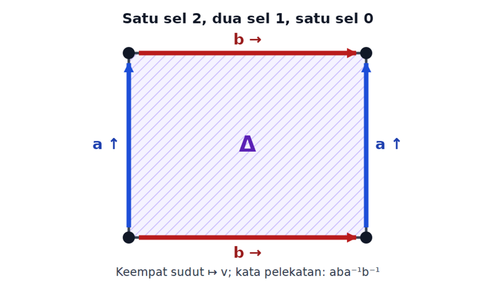
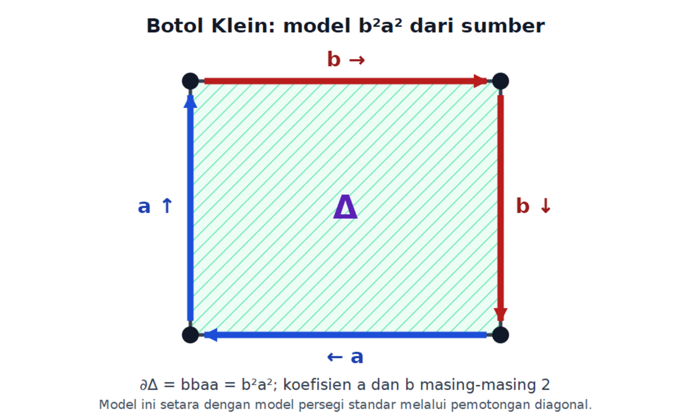

# Tentang komponen ini {.unnumbered #o012-fom-u007-notice data-course-route-unit-id="D60-R12"}

Komponen ini merupakan terjemahan dan adaptasi bahasa Indonesia atas Bagian
1.13 *Algebraic Topology* karya Yeheli Fomberg, berdasarkan kuliah Nir
Lazarovich pada musim semi 2025. Otoritas sumber dibekukan pada commit
[563194fae879178b9a6871b249513bfc27968975](https://git.sr.ht/~yp/math-notes/tree/563194fae879178b9a6871b249513bfc27968975/item/algebraic_topology.tex).
Tree sumber tepatnya adalah
fb678966d1533d529bdd72f49d8496a3bdc14a9b.
Rentang yang diterjemahkan ialah algebraic_topology.tex baris 3518–4185:
668 baris fisik dan 26.533 byte, dengan SHA-256
a22afacfdbecdfad48942421412c4cff1c0f317eb77f18253578125a5d0d7ce2.

Catatan sumber tersedia di bawah
[Creative Commons Attribution-ShareAlike 4.0 International (CC BY-SA 4.0)](https://creativecommons.org/licenses/by-sa/4.0/).
Terjemahan, pemformatan semantik, koreksi terbatas, tiga gambar ulang
aksesibel, tiga perbaikan bukti, serta materi penguasaan asli di bawah ini
diterbitkan dengan lisensi yang sama. Pembaca memakai satu PNG untuk setiap
gambar geometris; master SVG berpasangan dipertahankan di sampingnya untuk
rekam asal-usul, aksesibilitas, dan penggunaan ulang tanpa rugi. Empat belas
diagram aljabar lainnya dipertahankan sebagai matematika semantik yang dapat
dipilih dan dibaca mesin. Semua perbaikan dibedakan dari teks sumber. Tidak
ada prosa dari bank soal Fomberg terpisah maupun materi MIT yang disalin ke
dalam komponen ini.

Ketujuh belas fungsi diagram sumber dipertahankan: tiga sebagai gambar ulang
poligon seluler dan empat belas sebagai barisan eksak, kompleks rantai,
komposit proyeksi, atau perhitungan homotopi yang ditata ulang secara semantik.
Uraian di sekitar setiap diagram menyatakan simpul, panah, pembangkit, dan
maknanya tanpa bergantung pada warna atau tata letak.

Edisi ini independen dan tidak menyiratkan dukungan, pengesahan, atau
afiliasi dengan Yeheli Fomberg, Nir Lazarovich, ataupun institusi mereka.
Produksi terjemahan, struktur semantik, gambar ulang, materi asli, dan QA
dibantu oleh **OpenAI Codex gpt-5.6-sol, Ultra** atas arahan pengguna.

# Homologi Seluler {#o012-fom-u007 data-origin="source-derived" data-source-lines="3518-4185" data-course-route-unit-id="D60-R12"}

::: {.remark #o012-fom-u007-rem-good-pair data-origin="source-derived" data-source-lines="3520-3523"}
**Catatan.** Bagi setiap subkompleks $A\subseteq X$, pasangan $(X,A)$
merupakan pasangan baik.
:::

::: {.lemma #o012-fom-u007-lem-cellular-skeleta-homology data-origin="source-derived" data-source-lines="3525-3540" data-repair-id="FOM-PR-13"}
**Lema.** Misalkan $X$ suatu kompleks CW dengan
$X=\bigcup_n X^{(n)}$.

1. Kita mempunyai

   $$
   H_k\!\left(X^{(n)},X^{(n-1)}\right)
   \cong
   \begin{cases}
   \displaystyle\bigoplus_\alpha\mathbb Z[\phi_\alpha],&n=k,\\
   0,&n\ne k.
   \end{cases}
   $$

   Di sini $\phi_\alpha$ adalah pemetaan karakteristik sel-$n$.

2. Kita mempunyai $H_k(X^{(n)})\cong\{0\}$ untuk $k>n$.

3. Kita mempunyai $H_k(X^{(n)})\cong H_k(X)$ untuk $n>k$.
:::

::: {.proof #o012-fom-u007-proof-cellular-skeleta-homology data-origin="source-derived" data-source-lines="3541-3594" data-proof-status="source-incomplete-for-general-part-3" data-repair-id="FOM-PR-13"}
**Bukti sumber.**

1. Pernyataan pertama mengikuti dari fakta bahwa
   $(X^{(n)},X^{(n-1)})$ merupakan pasangan baik dan
   $X^{(n)}/X^{(n-1)}$ adalah baji sfera-$n$. Karena itu homologi relatif
   hanya tak nol pada derajat $n$, dengan satu pembangkit
   $[\phi_\alpha]$ bagi setiap sel-$n$.

2. Perhatikan potongan barisan eksak panjang pasangan
   $(X^{(n)},X^{(n-1)})$ berikut.

   :::: {.figure #o012-fom-u007-fig-les-vanishing data-origin="source-derived" data-source-lines="3571-3576" data-rendering="semantic-reflow"}
   $$
   H_{k+1}\!\left(X^{(n)},X^{(n-1)}\right)
   \longrightarrow H_k\!\left(X^{(n-1)}\right)
   \longrightarrow H_k\!\left(X^{(n)}\right)
   \longrightarrow H_k\!\left(X^{(n)},X^{(n-1)}\right).
   $$

   **Diagram semantik.** Keempat simpul terletak pada satu baris dan ketiga
   panah mengarah dari kiri ke kanan. Kedua grup relatif mengapit peta yang
   diinduksi inklusi
   $H_k(X^{(n-1)})\to H_k(X^{(n)})$.
   ::::

   Karena $k>n$, baik $k$ maupun $k+1$ berbeda dari $n$. Oleh bagian (1),

   $$
   H_{k+1}\!\left(X^{(n)},X^{(n-1)}\right)
   \cong
   H_k\!\left(X^{(n)},X^{(n-1)}\right)
   \cong\{0\}.
   $$

   Eksakitas memberi
   $H_k(X^{(n-1)})\cong H_k(X^{(n)})$. Jadi, untuk $k>n$,

   $$
   H_k(X^{(n)})
   \cong H_k(X^{(n-1)})
   \cong\cdots\cong H_k(X^{(0)})
   =\{0\}.
   $$

3. Untuk $X$ berdimensi hingga, yakni $X=X^{(m)}$ bagi suatu $m$, klaim
   mengikuti dari barisan eksak panjang yang sama. Bukti aktif dalam sumber
   berhenti pada kasus berdimensi hingga ini.
:::

::: {.source-audit #o012-fom-u007-audit-src-001 data-origin="edition-original" data-source-lines="3571-3589" data-source-correction-id="FOM-U007-SRC-001"}
**Koreksi grup relatif dan indeks kerangka.** Pada baris 3572, sumber
mengetik grup kiri sebagai
$(H_{k+1}X^{(n)},X^{(n-1)})$; edisi memakai grup relatif bertipe benar
$H_{k+1}(X^{(n)},X^{(n-1)})$. Baris 3582 menyimpulkan
$H_k(X^{(n-1)})\cong H_k(X^{(k)})$, sedangkan eksakitas membandingkan dua
kerangka bertetangga:
$H_k(X^{(n-1)})\cong H_k(X^{(n)})$. Kedua bentuk yang dikoreksi dipakai
di atas. Komentar TeX nonaktif tidak dipromosikan menjadi teks sumber.
:::

::: {.proof-repair #o012-fom-u007-repair-pr13 data-origin="edition-original" data-source-lines="3525-3594" data-repair-id="FOM-PR-13" data-proof-status="complete_original_repair"}
## Perbaikan FOM-PR-13: stabilisasi untuk kompleks CW sebarang

:::: {.theorem #o012-fom-u007-thm-skeleton-stabilization data-origin="edition-original" data-source-lines="3525-3594" data-repair-id="FOM-PR-13"}
**Teorema (stabilisasi kerangka).** Misalkan $X$ suatu kompleks CW, tanpa
asumsi berdimensi hingga atau mempunyai berhingga banyak sel. Untuk
$k\geq0$ dan $n>k$, inklusi

$$
\iota_n\colon X^{(n)}\hookrightarrow X
$$

menginduksi isomorfisma kanonik

$$
(\iota_n)_*\colon H_k(X^{(n)})\xrightarrow{\cong}H_k(X).
$$
::::

:::: {.proof #o012-fom-u007-proof-pr13 data-origin="edition-original" data-source-lines="3525-3594" data-repair-id="FOM-PR-13" data-proof-status="complete_original_repair"}
**Bukti.**

**Langkah satu kerangka.** Untuk setiap $r$,
$X^{(r)}/X^{(r-1)}$ adalah baji satu sfera $S^r$ bagi setiap sel-$r$.
Teorema hasil bagi relatif dan aditivitas homologi tereduksi memberi

$$
H_j(X^{(r)},X^{(r-1)})
\cong
\begin{cases}
\displaystyle\bigoplus_{\alpha\in I_r}\mathbb Z[\phi_\alpha],&j=r,\\
0,&j\ne r.
\end{cases}
$$

Jika $r\geq n+1$ dan $n>k$, maka $r>k+1$. Kedua suku relatif yang mengapit
peta inklusi dalam barisan eksak panjang,

$$
H_{k+1}(X^{(r)},X^{(r-1)})
\longrightarrow H_k(X^{(r-1)})
\longrightarrow H_k(X^{(r)})
\longrightarrow H_k(X^{(r)},X^{(r-1)}),
$$

bernilai nol. Jadi

$$
H_k(X^{(r-1)})\xrightarrow{\cong}H_k(X^{(r)})
\qquad(r\geq n+1).
\tag{13.1}
$$

Khususnya, jika $K$ subkompleks berdimensi hingga, penyusunan isomorfisma
(13.1) memberi

$$
H_k(K^{(n)})\xrightarrow{\cong}H_k(K).
\tag{13.2}
$$

**Dukungan kompak.** Setiap himpunan kompak $A\subseteq X$ termuat dalam
suatu subkompleks hingga. Andaikan sebaliknya bahwa $A$ bertemu tak
berhingga banyak sel terbuka berbeda, dan pilih $x_i\in A$ pada sel terbuka
ke-$i$. Untuk setiap $i$, tetapkan

$$
U_i=X\setminus\{x_j:j\ne i\}.
$$

Karena penutupan setiap sel CW bertemu hanya berhingga banyak sel, himpunan
yang dibuang beririsan dengan setiap sel tertutup dalam himpunan hingga dan
karena itu tertutup menurut topologi lemah. Maka $U_i$ terbuka. Keluarga
$\{U_i\}$ menutupi $A$, tetapi setiap gabungan berhingga anggotanya
kehilangan suatu $x_j$ yang indeksnya tidak terpilih. Ini bertentangan
dengan kekompakan $A$. Jadi $A$ hanya bertemu berhingga banyak sel terbuka;
gabungan penutupan sel-sel itu adalah subkompleks hingga yang memuat $A$.

Setiap rantai singular adalah jumlah berhingga simpleks singular. Dukungannya
merupakan gabungan berhingga citra simpleks standar yang kompak, sehingga
termuat dalam suatu subkompleks hingga.

**Surjektivitas.** Ambil $[z]\in H_k(X)$ dan wakili dengan siklus singular
$z$. Ada subkompleks hingga $K\subseteq X$ yang memuat dukungan $z$.
Isomorfisma (13.2) memberi kelas di $H_k(K^{(n)})$ yang citranya adalah
$[z]$ di $H_k(K)$. Karena $K^{(n)}\subseteq X^{(n)}$, kelas itu memberi
prapeta bagi $[z]$ di $H_k(X^{(n)})$.

**Injektivitas.** Ambil siklus $c$ dalam $X^{(n)}$ dan andaikan
$c=\partial b$ untuk suatu rantai singular $b$ dalam $X$. Pilih subkompleks
hingga $K$ yang memuat dukungan $c$ dan $b$. Karena
$c\subseteq X^{(n)}$, ia berada dalam
$K\cap X^{(n)}=K^{(n)}$. Kelasnya nol di $H_k(K)$; injektivitas (13.2)
memaksa kelasnya nol di $H_k(K^{(n)})$. Jadi $c$ sudah membatasi dalam
$K^{(n)}\subseteq X^{(n)}$. Peta $(\iota_n)_*$ karena itu bijektif.
$\square$
::::

**Pemeriksaan perbaikan.** Syarat $r>k+1$ mematikan tepat dua suku relatif
yang diperlukan; dukungan siklus dan rantai pembatas sama-sama dimasukkan
ke subkompleks hingga; dan isomorfisma yang diperoleh adalah peta yang
diinduksi inklusi, bukan hanya isomorfisma abstrak.
:::

::: {.definition #o012-fom-u007-def-cellular-chains data-origin="source-derived" data-source-lines="3596-3610" data-repair-id="FOM-PR-14"}
**Definisi (rantai seluler).** Kita mendefinisikan

$$
C_n^{\mathrm{CW}}(X)
:=H_n\!\left(X^{(n)},X^{(n-1)}\right).
$$

Dengan demikian,

$$
C_n^{\mathrm{CW}}(X)
\cong\bigoplus_\alpha\mathbb Z[\phi_\alpha],
$$

dengan $\phi_\alpha$ pemetaan karakteristik sel-$n$. Grup-grup
$C_n^{\mathrm{CW}}(X)$ membentuk kompleks rantai seluler

:::: {.figure #o012-fom-u007-fig-cellular-chain-complex data-origin="source-derived" data-source-lines="3603-3609" data-rendering="semantic-reflow"}
$$
\cdots\longrightarrow
H_{n+1}\!\left(X^{(n+1)},X^{(n)}\right)
\xrightarrow{d_{n+1}}
H_n\!\left(X^{(n)},X^{(n-1)}\right)
\xrightarrow{d_n}
H_{n-1}\!\left(X^{(n-1)},X^{(n-2)}\right)
\longrightarrow\cdots.
$$

**Diagram semantik.** Setiap panah menurunkan derajat satu; tiga grup yang
ditampilkan berturut-turut ialah
$C_{n+1}^{\mathrm{CW}}(X)$, $C_n^{\mathrm{CW}}(X)$, dan
$C_{n-1}^{\mathrm{CW}}(X)$.
::::
:::

::: {.source-audit #o012-fom-u007-audit-src-002 data-origin="edition-original" data-source-lines="3596-3602" data-source-correction-id="FOM-U007-SRC-002"}
**Koreksi argumen grup rantai.** Baris 3602 sumber tiba-tiba menulis
$C_n^{\mathrm{CW}}(W)$, padahal hanya $X$ yang diperkenalkan. Edisi memakai
$C_n^{\mathrm{CW}}(X)$ secara konsisten.
:::

::: {.definition #o012-fom-u007-def-cellular-boundary data-origin="source-derived" data-source-lines="3612-3640" data-repair-id="FOM-PR-14"}
**Definisi (pemetaan batas seluler).** Gabungkan barisan eksak panjang dua
pasangan kerangka bertetangga. Bagian diagram yang menentukan kedua
diferensial dapat ditata ulang secara semantik sebagai berikut.

:::: {.figure #o012-fom-u007-fig-cellular-boundary-diagram data-origin="source-derived" data-source-lines="3618-3635" data-rendering="semantic-reflow"}
$$
\begin{aligned}
H_{n+1}\!\left(X^{(n+1)},X^{(n)}\right)
&\xrightarrow{\partial_{n+1}}H_n(X^{(n)})
\xrightarrow{q_n}H_n\!\left(X^{(n)},X^{(n-1)}\right),\\
H_n\!\left(X^{(n)},X^{(n-1)}\right)
&\xrightarrow{\partial_n}H_{n-1}(X^{(n-1)})
\xrightarrow{q_{n-1}}
H_{n-1}\!\left(X^{(n-1)},X^{(n-2)}\right).
\end{aligned}
$$

Dengan kata lain,

$$
d_{n+1}=q_n\circ\partial_{n+1},
\qquad
d_n=q_{n-1}\circ\partial_n.
$$

**Diagram semantik.** Diagram sumber juga memuat panah inklusi dan suku nol
yang berasal dari barisan eksak panjang. Dua lintasan komposit di atas
adalah panah diagonal $d_{n+1}$ dan $d_n$ pada kompleks seluler.
::::

Kita mendefinisikan

$$
\partial_n^{\mathrm{CW}}:=d_n=q_{n-1}\circ\partial_n.
$$

Memang,

$$
d_{n-1}\circ d_n
=q_{n-2}\circ\partial_{n-1}\circ q_{n-1}\circ\partial_n
=0,
$$

karena eksakitas memberi
$\partial_{n-1}\circ q_{n-1}=0$.
:::

::: {.proof-repair #o012-fom-u007-repair-pr14 data-origin="edition-original" data-source-lines="3596-3640,3684-4184" data-repair-id="FOM-PR-14" data-proof-status="complete_original_repair"}
## Perbaikan FOM-PR-14: teorema homologi seluler

:::: {.theorem #o012-fom-u007-thm-cellular-homology data-origin="edition-original" data-source-lines="3596-3640,3684-4184" data-repair-id="FOM-PR-14"}
**Teorema (homologi seluler).** Misalkan $X$ suatu kompleks CW sebarang dan
$X^{(-1)}=\varnothing$. Tuliskan

$$
\delta_n\colon
H_n(X^{(n)},X^{(n-1)})\longrightarrow H_{n-1}(X^{(n-1)})
$$

untuk pemetaan penghubung dan

$$
\rho_{n-1}\colon
H_{n-1}(X^{(n-1)})\longrightarrow
H_{n-1}(X^{(n-1)},X^{(n-2)})
$$

untuk pemetaan pasangan. Tetapkan

$$
d_n=\rho_{n-1}\circ\delta_n\quad(n\geq1),
\qquad d_0=0.
\tag{14.1}
$$

Maka $d_{n-1}d_n=0$, dan terdapat isomorfisma natural

$$
\Theta_{X,n}\colon
H_n(C_*^{\mathrm{CW}}(X),d)\xrightarrow{\cong}H_n(X).
\tag{14.2}
$$

Kealamian berlaku langsung bagi pemetaan seluler. Bagi pemetaan kontinu
sebarang antarkompleks CW, ambil pendekatan seluler; pemetaan pada homologi
seluler tidak bergantung pada pilihan setelah diidentifikasi melalui
$\Theta$, dan sama dengan pemetaan homologi singular.
::::

:::: {.proof #o012-fom-u007-proof-pr14 data-origin="edition-original" data-source-lines="3596-3640,3684-4184" data-repair-id="FOM-PR-14" data-proof-status="complete_original_repair"}
**Bukti.**

**Grup relatif dan kompleks rantai.** Untuk setiap $p$, pasangan
$(X^{(p)},X^{(p-1)})$ adalah pasangan baik. Dengan meruntuhkan kerangka
sebelumnya dan memilih orientasi pada setiap sel-$p$,

$$
\begin{aligned}
H_m(X^{(p)},X^{(p-1)})
&\cong\widetilde H_m(X^{(p)}/X^{(p-1)})\\
&\cong\widetilde H_m\!\left(\bigvee_{\alpha\in I_p}S^p_\alpha\right)\\
&\cong
\begin{cases}
\displaystyle\bigoplus_{\alpha\in I_p}\mathbb Z[\phi_\alpha],&m=p,\\
0,&m\ne p.
\end{cases}
\end{aligned}
\tag{14.3}
$$

Untuk $p=0$, rumus itu dibaca sebagai
$H_0(X^{(0)})\cong\bigoplus_{\alpha\in I_0}\mathbb Z[\phi_\alpha]$.
Eksakitas barisan pasangan $(X^{(n-1)},X^{(n-2)})$ memberi
$\delta_{n-1}\rho_{n-1}=0$. Karena itu, untuk $n\geq2$,

$$
d_{n-1}d_n
=\rho_{n-2}\delta_{n-1}\rho_{n-1}\delta_n
=0.
$$

Untuk $n=1$, persamaan yang diperlukan langsung mengikuti dari $d_0=0$.

**Filtrasi kerangka.** Barisan eksak panjang semua pasangan kerangka
membentuk kopel eksak

$$
D^1_{p,q}=H_{p+q}(X^{(p)}),
\qquad
E^1_{p,q}=H_{p+q}(X^{(p)},X^{(p-1)}).
$$

Diferensial turunannya ialah

$$
d^1\colon E^1_{p,q}\longrightarrow E^1_{p-1,q}.
$$

Menurut (14.3), $E^1_{p,q}=0$ untuk $q\ne0$, sedangkan pada baris $q=0$,

$$
E^1_{p,0}=C_p^{\mathrm{CW}}(X),
\qquad d^1=d_p.
$$

Jadi $E^2_{p,0}=H_p(C_*^{\mathrm{CW}}(X))$, dan tidak ada diferensial lebih
tinggi yang dapat masuk atau keluar dari satu-satunya baris tak nol.
Filtrasi menyapu habis rantai singular karena dukungan setiap rantai termuat
dalam subkompleks hingga; perbaikan FOM-PR-13 memberi stabilisasi pada
setiap derajat.

**Identifikasi tepi secara eksplisit.** Tuliskan

$$
\rho_n\colon H_n(X^{(n)})\longrightarrow
H_n(X^{(n)},X^{(n-1)})=C_n^{\mathrm{CW}}(X).
$$

Untuk $n\geq1$, $H_n(X^{(n-1)})=0$, sehingga $\rho_n$ injektif. Selain itu,
$H_{n-1}(X^{(n-2)})=0$, sehingga $\rho_{n-1}$ injektif. Eksakitas memberi

$$
\ker d_n
=\ker(\rho_{n-1}\delta_n)
=\ker\delta_n
=\operatorname{im}\rho_n.
\tag{14.4}
$$

Untuk $n=0$, rumus yang sama berlaku dengan $d_0=0$ dan $\rho_0$ identitas.
Karena itu setiap siklus seluler $c$ mempunyai tepat satu
$a\in H_n(X^{(n)})$ dengan $\rho_n(a)=c$.

Bagian relevan dari barisan eksak panjang pasangan
$(X^{(n+1)},X^{(n)})$ ialah

$$
C_{n+1}^{\mathrm{CW}}(X)
\xrightarrow{\delta_{n+1}}H_n(X^{(n)})
\longrightarrow H_n(X^{(n+1)})
\longrightarrow H_n(X^{(n+1)},X^{(n)}).
$$

Suku terakhir nol menurut (14.3). Karena
$d_{n+1}=\rho_n\delta_{n+1}$, persamaan (14.4) mengidentifikasi batas
seluler dengan $\rho_n(\operatorname{im}\delta_{n+1})$. Maka

$$
\begin{aligned}
H_n(C_*^{\mathrm{CW}}(X))
&=\frac{\ker d_n}{\operatorname{im}d_{n+1}}\\
&\cong
\frac{H_n(X^{(n)})}{\operatorname{im}\delta_{n+1}}\\
&\cong H_n(X^{(n+1)})
\cong H_n(X).
\end{aligned}
\tag{14.5}
$$

Isomorfisma terakhir adalah FOM-PR-13 karena $n+1>n$. Secara konkret,
jika $[c]$ adalah kelas homologi seluler dan $c=\rho_n(a)$, maka

$$
\Theta_{X,n}([c])=(X^{(n)}\hookrightarrow X)_*(a).
\tag{14.6}
$$

Jika $c$ berubah sebesar $d_{n+1}(e)$, kelas $a$ berubah sebesar
$\delta_{n+1}(e)$, yang mati setelah dimasukkan ke $X^{(n+1)}$ lalu ke
$X$. Eksakitas (14.5) menunjukkan bahwa hanya perubahan semacam itu yang
mati. Jadi (14.6) terdefinisi dengan baik dan bijektif.

**Kealamian.** Jika $f\colon X\to Y$ seluler, maka peta pasangan memberi

$$
f_p^{\mathrm{CW}}\colon
H_p(X^{(p)},X^{(p-1)})
\longrightarrow H_p(Y^{(p)},Y^{(p-1)}).
$$

Kealamian pemetaan penghubung dan pemetaan pasangan menghasilkan diagram

$$
\begin{array}{ccc}
C_p^{\mathrm{CW}}(X)&\xrightarrow{d_p^X}&C_{p-1}^{\mathrm{CW}}(X)\\
\downarrow f_p^{\mathrm{CW}}&&\downarrow f_{p-1}^{\mathrm{CW}}\\
C_p^{\mathrm{CW}}(Y)&\xrightarrow{d_p^Y}&C_{p-1}^{\mathrm{CW}}(Y)
\end{array}
$$

yang komutatif. Jadi $f_*^{\mathrm{CW}}$ adalah peta rantai, dan (14.6)
langsung memberi kealamian $\Theta$. Jika $f$ hanya kontinu, teorema
pendekatan seluler memberi $f_{\mathrm{sel}}\simeq f$. Dua pilihan
pendekatan memberi peta homologi yang sama karena keduanya diidentifikasi
dengan $H_n(f)$ melalui $\Theta$. $\square$
::::

**Pemeriksaan perbaikan.** Semua domain dan kodomain pada
$d_n=\rho_{n-1}\delta_n$ cocok; persamaan $d^2=0$ berasal dari dua panah
berurutan dalam barisan eksak; kasus derajat nol ditangani; dan identifikasi
eksplisit (14.4)–(14.6) membuktikan konvergensi serta kealamian tanpa
menyembunyikan asumsi keterhinggaan.
:::

::: {.remark #o012-fom-u007-rem-cellular-incidence-formula data-origin="source-derived" data-source-lines="3642-3664" data-repair-id="FOM-PR-15"}
**Catatan (rumus praktis untuk batas seluler).** Misalkan

$$
\varphi_\alpha\colon\partial D^n_\alpha\longrightarrow X^{(n-1)}
$$

adalah peta pelekatan suatu sel-$n$. Untuk setiap sel-$(n-1)$ berindeks
$\beta$, perhatikan komposit

$$
\begin{aligned}
S^{n-1}_\alpha
&\cong\partial D^n_\alpha
\xrightarrow{\ \varphi_\alpha\ }
X^{(n-1)}
\xrightarrow{\ q\ }
X^{(n-1)}/X^{(n-2)}\\
&\cong\bigvee_\delta S^{n-1}_\delta
\xrightarrow{\ p_\beta\ }
\left(\bigvee_\delta S^{n-1}_\delta\right)
\Big/
\left(\bigvee_{\delta\ne\beta}S^{n-1}_\delta\right)
\cong S^{n-1}_\beta.
\end{aligned}
$$

Definisikan

$$
\varphi_{\alpha\beta}\colon
S^{n-1}_\alpha\longrightarrow S^{n-1}_\beta
$$

sebagai komposit tersebut. Maka

$$
\partial^{\mathrm{CW}}\!\left([\phi_\alpha]\right)
=\sum_\beta\deg(\varphi_{\alpha\beta})[\phi_\beta].
$$
:::

::: {.source-audit #o012-fom-u007-audit-src-003 data-origin="edition-original" data-source-lines="3647-3658,4117-4124" data-source-correction-id="FOM-U007-SRC-003"}
**Koreksi indeks hasil bagi dan dimensi komposit.** Pada baris 3653–3654,
sumber mengulang $S^{n-1}_\beta$ pada semua suku yang diruntuhkan; suku
yang benar adalah $S^{n-1}_\delta$ untuk $\delta\ne\beta$. Baris 3657
mengetik $\varphi_{\alpha\beta}$ sebagai peta
$S^n_\alpha\to S^n_\beta$, padahal semua peta dalam komposit berdimensi
$n-1$. Edisi memakai
$\varphi_{\alpha\beta}\colon S^{n-1}_\alpha\to S^{n-1}_\beta$.
Pola salah indeks yang sama muncul lagi pada baris 4117–4124 dan diperbaiki
dengan cara yang sama.
:::

::: {.proof-repair #o012-fom-u007-repair-pr15 data-origin="edition-original" data-source-lines="3642-3664" data-repair-id="FOM-PR-15" data-proof-status="complete_original_repair"}
## Perbaikan FOM-PR-15: rumus bilangan insidensi

:::: {.theorem #o012-fom-u007-thm-cellular-incidence data-origin="edition-original" data-source-lines="3642-3664" data-repair-id="FOM-PR-15"}
**Teorema (rumus bilangan insidensi).** Pilih orientasi pada setiap sel CW.
Untuk $n\geq1$ dan sel-$n$ $e^n_\alpha$, tuliskan

$$
\Phi_\alpha\colon(D^n_\alpha,S^{n-1}_\alpha)
\longrightarrow(X^{(n)},X^{(n-1)})
$$

untuk pemetaan karakteristik dan
$\varphi_\alpha=\Phi_\alpha|_{S^{n-1}_\alpha}$ untuk peta pelekatannya.
Bagi setiap sel-$(n-1)$ $e^{n-1}_\beta$, bentuk

$$
\varphi_{\alpha\beta}\colon
S^{n-1}_\alpha
\xrightarrow{\ \varphi_\alpha\ }X^{(n-1)}
\xrightarrow{\ Q\ }X^{(n-1)}/X^{(n-2)}
\cong\bigvee_{\delta\in I_{n-1}}S^{n-1}_\delta
\xrightarrow{\ P_\beta\ }S^{n-1}_\beta,
\tag{15.1}
$$

dengan $P_\beta$ meruntuhkan semua suku berindeks $\delta\ne\beta$.
Untuk $n=1$, hasil bagi pada (15.1) dibaca sebagai $X^{(0)}_+$, yakni
$X^{(0)}$ dengan satu titik pangkal terpisah; derajat peta
$S^0\to S^0$ dibaca pada $\widetilde H_0(S^0)$.
Jika $[\Phi_\alpha]$ dan $[\Phi_\beta]$ adalah pembangkit yang ditentukan
oleh orientasi, maka

$$
d_n[\Phi_\alpha]
=\sum_{\beta\in I_{n-1}}
\deg(\varphi_{\alpha\beta})[\Phi_\beta].
\tag{15.2}
$$

Hanya berhingga banyak suku pada (15.2) yang tak nol.
::::

:::: {.proof #o012-fom-u007-proof-pr15 data-origin="edition-original" data-source-lines="3642-3664" data-repair-id="FOM-PR-15" data-proof-status="complete_original_repair"}
**Bukti.** Orientasikan
$S^{n-1}_\alpha=\partial D^n_\alpha$ dengan konvensi normal-ke-luar lebih
dahulu. Pembangkit yang bersesuaian adalah

$$
[\Phi_\alpha]
=(\Phi_\alpha)_*[D^n_\alpha,S^{n-1}_\alpha]
\in H_n(X^{(n)},X^{(n-1)}).
$$

Kealamian pemetaan penghubung bagi pemetaan pasangan $\Phi_\alpha$ memberi

$$
\delta_n[\Phi_\alpha]
=(\varphi_\alpha)_*[S^{n-1}_\alpha]
\in H_{n-1}(X^{(n-1)}).
\tag{15.3}
$$

Tidak ada tanda tambahan karena orientasi batas sudah memakai konvensi
tersebut. Terapkan

$$
\rho_{n-1}\colon H_{n-1}(X^{(n-1)})
\longrightarrow H_{n-1}(X^{(n-1)},X^{(n-2)}).
$$

Di bawah isomorfisma hasil bagi dan pemisahan menurut suku baji,

$$
\kappa\colon
H_{n-1}(X^{(n-1)},X^{(n-2)})
\xrightarrow{\cong}
\bigoplus_{\beta\in I_{n-1}}
\widetilde H_{n-1}(S^{n-1}_\beta),
\tag{15.4}
$$

pemetaan $\rho_{n-1}$ menjadi pemetaan yang diinduksi $Q$. Pilih orientasi
sel-$(n-1)$ ke-$\beta$ sehingga
$\kappa([\Phi_\beta])=[S^{n-1}_\beta]$ pada komponen ke-$\beta$.
Proyeksi koordinat ke-$\beta$ memberi

$$
\begin{aligned}
\operatorname{pr}_\beta\!\left(
\kappa\rho_{n-1}\delta_n[\Phi_\alpha]\right)
&=(P_\beta Q\varphi_\alpha)_*[S^{n-1}_\alpha]\\
&=(\varphi_{\alpha\beta})_*[S^{n-1}_\alpha]\\
&=\deg(\varphi_{\alpha\beta})[S^{n-1}_\beta].
\end{aligned}
\tag{15.5}
$$

Karena $d_n=\rho_{n-1}\delta_n$, penggabungan semua koordinat pada (15.5)
memberi tepat (15.2).

Untuk $n=1$, kelas fundamental tereduksi
$S^0=\partial D^1$ adalah selisih titik ujung positif dan negatif.
Meruntuhkan semua simpul selain $\beta$ mengirim selisih itu ke
$\deg(\varphi_{\alpha\beta})$ kali pembangkit
$\widetilde H_0(S^0)$, sehingga rumus yang sama memberi koefisien insidensi
bertanda.

Citra kompak $\varphi_\alpha(S^{n-1}_\alpha)$ termuat dalam suatu
subkompleks hingga. Di luar subkompleks itu, komposit
$P_\beta Q\varphi_\alpha$ konstan dan berderajat nol. Jadi jumlah (15.2)
mempunyai dukungan hingga. $\square$
::::

**Pemeriksaan perbaikan.** Domain dan kodomain (15.1) sama-sama sfera
berdimensi $n-1$; koefisien diturunkan dari pemetaan penghubung, proyeksi
hasil bagi, dan pilihan orientasi; kasus $n=1$ serta keterhinggaan jumlah
diperiksa tersendiri.
:::

::: {.remark #o012-fom-u007-rem-boundary-notation data-origin="source-derived" data-source-lines="3666-3670"}
**Catatan (notasi batas).** Sebelumnya kita memakai $d_n$ dan
$\partial_n^{\mathrm{CW}}$ secara bergantian untuk menyatakan pemetaan
batas kompleks rantai seluler. Mulai sekarang, demi singkatnya, kita hanya
memakai $d_n$.
:::

::: {.remark #o012-fom-u007-rem-computation-summary data-origin="source-derived" data-source-lines="3672-3682" data-repair-id="FOM-PR-15"}
**Catatan (ringkasan perhitungan).** Untuk menghitung homologi seluler suatu
ruang, fakta yang perlu diingat adalah

$$
C_n^{\mathrm{CW}}(X)
=\bigoplus_\alpha\mathbb Z[\phi_\alpha],
$$

dengan $\phi_\alpha$ pemetaan karakteristik sel-$n$, dan pemetaan batas
diberikan oleh

$$
d_n\!\left([\phi_\alpha]\right)
=\sum_\beta\deg(\varphi_{\alpha\beta})[\phi_\beta].
$$
:::

::: {.example #o012-fom-u007-ex-sphere-homology data-origin="source-derived" data-source-lines="3684-3710"}
**Contoh (homologi sfera).** Misalkan $X=S^n$ dengan $n\geq2$. Seperti
pada
[struktur CW sfera dengan satu sel-$n$](fomberg-unit-006-cellular-complexes.md#o012-fom-u006-ex-sphere-n),
kita dapat membangun $X$ hanya dengan satu sel-$0$ dan satu sel-$n$.
Kompleks rantai selulernya berbentuk

:::: {.figure #o012-fom-u007-fig-sphere-chain-complex data-origin="source-derived" data-source-lines="3690-3699" data-rendering="semantic-reflow"}
$$
\cdots\longrightarrow0
\xrightarrow{d_{n+1}}\mathbb Z
\xrightarrow{d_n}0
\xrightarrow{d_{n-1}}\cdots
\xrightarrow{d_2}0
\xrightarrow{d_1}\mathbb Z
\xrightarrow{d_0}0.
$$

**Diagram semantik.** Satu salinan $\mathbb Z$ berada pada derajat $n$ dan
satu lagi pada derajat $0$; semua grup pada derajat lain adalah nol.
::::

Kita bahkan tidak perlu menghitung pemetaan batas, sebab semuanya merupakan
homomorfisma nol. Teorema homologi seluler memberi

$$
H_k(S^n)
\cong
\begin{cases}
\mathbb Z,&k=0\ \text{atau}\ k=n,\\
0,&\text{selain itu}.
\end{cases}
$$
:::

::: {.example #o012-fom-u007-ex-complex-projective-homology data-origin="source-derived" data-source-lines="3712-3738"}
**Contoh (homologi ruang projektif kompleks).** Misalkan

$$
X=\mathbb{CP}^n
=\left(\mathbb C^{n+1}\setminus\{0\}\right)
\Big/
\left(x\sim\lambda x\right),
\qquad0\ne\lambda\in\mathbb C.
$$

Dari
[struktur CW ruang projektif kompleks](fomberg-unit-006-cellular-complexes.md#o012-fom-u006-mcheck-001),
kita mengetahui bahwa $X$ mempunyai satu sel-$i$ untuk setiap $i=2k$
dengan $0\leq k\leq n$. Kompleks rantai selulernya ialah

:::: {.figure #o012-fom-u007-fig-complex-projective-chain-complex data-origin="source-derived" data-source-lines="3719-3729" data-rendering="semantic-reflow"}
$$
\cdots\longrightarrow0
\xrightarrow{d_{2n+1}}\mathbb Z
\xrightarrow{d_{2n}}0
\xrightarrow{d_{2n-1}}\cdots
\xrightarrow{d_3}\mathbb Z
\xrightarrow{d_2}0
\xrightarrow{d_1}\mathbb Z
\xrightarrow{d_0}0.
$$

**Diagram semantik.** Ada satu salinan $\mathbb Z$ tepat pada setiap derajat
genap $0,2,\ldots,2n$ dan grup nol pada setiap derajat ganjil.
::::

Karena itu

$$
H_t(\mathbb{CP}^n)
\cong
\begin{cases}
\mathbb Z,&t\leq2n\ \text{dan }t\text{ genap},\\
\{0\},&\text{selain itu}.
\end{cases}
$$
:::

::: {.example #o012-fom-u007-ex-torus-homology data-origin="source-derived" data-source-label="exmp:cw-for-torus-homology" data-source-lines="3740-3845"}
**Contoh (homologi torus).** Perhatikan
[struktur CW torus $T^2$](fomberg-unit-006-cellular-complexes.md#o012-fom-u006-ex-torus)
yang telah kita lihat sebelumnya.

:::: {.figure #o012-fom-u007-fig-torus-polygon data-origin="edition-original-redraw" data-source-lines="3743-3761" data-rendering="accessible-png-with-svg-master"}
{.semantic-redraw width=88%}

**Diagram semantik.** Persegi fundamental mempunyai satu sel-$2$ terbuka
$\Delta$, dua sel-$1$ $a,b$, dan satu sel-$0$ $v$. Jika batas ditelusuri
dengan orientasi positif, kata pelekatannya

$$
aba^{-1}b^{-1}.
$$

Label dan panah memuat seluruh informasi matematis; warna hanya membantu
membedakan pasangan sisi. Master SVG aksesibel dipertahankan bersama PNG.
::::

Kompleks rantai selulernya berbentuk

:::: {.figure #o012-fom-u007-fig-torus-chain-complex data-origin="source-derived" data-source-lines="3763-3770" data-rendering="semantic-reflow"}
$$
\cdots\xrightarrow{d_4}0
\xrightarrow{d_3}\mathbb Z\Delta
\xrightarrow{d_2}\mathbb Za\oplus\mathbb Zb
\xrightarrow{d_1}\mathbb Zv
\xrightarrow{d_0}0.
$$

**Diagram semantik.** Pembangkit $\Delta$, $a,b$, dan $v$ masing-masing
berada pada derajat $2$, $1$, dan $0$.
::::

Kedua sel-$1$ $a$ dan $b$ adalah gelung yang kedua titik ujungnya melekat
pada simpul tunggal $v$. Definisi batas sel-$1$ karena itu langsung memberi

$$
d_1(a)=v-v=0,
\qquad
d_1(b)=v-v=0.
$$

Jadi satu-satunya homomorfisma yang mungkin bukan nol adalah $d_2$. Rumus
batas memberi

$$
d_2(\Delta)
=\deg(\varphi_{\Delta a})a
+\deg(\varphi_{\Delta b})b.
$$

Untuk koefisien pertama, perhatikan komposit

:::: {.figure #o012-fom-u007-fig-torus-attaching-projection data-origin="source-derived" data-source-lines="3783-3803" data-rendering="semantic-reflow"}
$$
\varphi_{\Delta a}\colon
\partial D^2_\Delta
\xrightarrow{\ \varphi_\Delta\ }
X^{(1)}\cong S_a^1\vee S_b^1
\xrightarrow{\ p_a\ }S_a^1.
$$

**Diagram semantik.** Peta pelekatan membaca
$aba^{-1}b^{-1}$ pada baji dua lingkaran. Proyeksi $p_a$ meruntuhkan
lingkaran $b$ ke titik baji, sehingga lintasan hasilnya membaca
$aa^{-1}$ pada $S_a^1$.
::::

Peta $\varphi_{\Delta a}\colon S^1\to S^1$ mengirim batas
$D^2_\Delta$ ke gelung yang homotopik dengan gelung konstan:

:::: {.figure #o012-fom-u007-fig-torus-nullhomotopy data-origin="source-derived" data-source-lines="3808-3829" data-rendering="semantic-reflow"}
$$
aba^{-1}b^{-1}
\xrightarrow{\ p_a\ }
aa^{-1}
\simeq *.
$$

**Diagram semantik.** Satu penelusuran $a$ segera diikuti penelusuran
$a$ pada arah berlawanan. Homotopi menciutkan pasangan lintasan itu ke
titik basis.
::::

Jadi $\varphi_{\Delta a}$ homotopik-nol dan
$\deg(\varphi_{\Delta a})=0$. Dengan alasan yang sama,
$\varphi_{\Delta b}$ homotopik-nol dan
$\deg(\varphi_{\Delta b})=0$. Semua homomorfisma batas nol, sehingga

$$
H_k(T^2)
\cong
\begin{cases}
\mathbb Z,&k=0\ \text{atau}\ k=2,\\
\mathbb Z^2,&k=1,\\
\{0\},&\text{selain itu}.
\end{cases}
$$
:::

::: {.example #o012-fom-u007-ex-genus-two-homology data-origin="source-derived" data-source-label="exmp:homology-of-genus-two" data-source-lines="3847-3971"}
**Contoh (homologi permukaan genus dua).** Misalkan
$\Sigma_2=T\mathbin{\#}T$ adalah permukaan kompak terorientasi bergenus dua.
Berikut modelnya sebagai ruang hasil bagi.

:::: {.figure #o012-fom-u007-fig-genus-two-polygon data-origin="edition-original" data-source-lines="3852-3906" data-rendering="accessible-png-with-svg-master" data-source-relationship="mathematically-equivalent-standard-polygon-not-literal-redraw"}
{.semantic-redraw width=86%}

**Diagram semantik.** Oktagon mempunyai satu sel-$2$ $\Delta$, empat
sel-$1$ $a,b,c,d$, dan satu sel-$0$ $v$. Jika panah dan urutan sisi
sumber dibaca secara literal, kata batasnya—hingga pergeseran siklik—adalah

$$
bab^{-1}a^{-1}cdc^{-1}d^{-1}
=[b,a][c,d].
$$

Gambar ulang edisi yang ditampilkan memakai presentasi standar

$$
aba^{-1}b^{-1}cdc^{-1}d^{-1}.
$$

Presentasi standar itu diperoleh dari kata sumber dengan menukar nama
pembangkit $a$ dan $b$ pada pegangan pertama. Jadi gambar ini adalah model
ekuivalen asli edisi, bukan salinan literal urutan sisi sumber. Kedua kata
mempunyai jumlah eksponen nol untuk setiap pembangkit dan menentukan
struktur satu-simpul, empat-sisi, satu-muka pada permukaan genus dua.
Warna hanya membedakan pasangan sisi; label bertanda dan panah menentukan
identifikasi. Master SVG aksesibel dipertahankan bersama PNG.
::::

Semua delapan simpul diidentifikasi menjadi $v$. Kompleks rantai selulernya
ialah

:::: {.figure #o012-fom-u007-fig-genus-two-chain-complex data-origin="source-derived" data-source-lines="3909-3916" data-rendering="semantic-reflow"}
$$
\cdots\longrightarrow0
\xrightarrow{d_3}\mathbb Z\Delta
\xrightarrow{d_2}
\mathbb Za\oplus\mathbb Zb\oplus\mathbb Zc\oplus\mathbb Zd
\xrightarrow{d_1}\mathbb Zv
\xrightarrow{d_0}0.
$$

**Diagram semantik.** Peringkat grup rantai pada derajat $2,1,0$
berturut-turut adalah $1,4,1$, dengan pembangkit ditampilkan secara
eksplisit.
::::

Semua homomorfisma kecuali mungkin $d_2$ jelas nol. Seperti pada
[contoh homologi torus](#o012-fom-u007-ex-torus-homology), proyeksi peta
pelekatan ke setiap lingkaran pembangkit menghasilkan satu penelusuran pada
setiap arah:

:::: {.figure #o012-fom-u007-fig-genus-two-nullhomotopy data-origin="source-derived" data-source-lines="3920-3959" data-rendering="semantic-reflow"}
$$
\begin{aligned}
p_a(bab^{-1}a^{-1}cdc^{-1}d^{-1})&=aa^{-1}\simeq *,\\
p_b(bab^{-1}a^{-1}cdc^{-1}d^{-1})&=bb^{-1}\simeq *,\\
p_c(bab^{-1}a^{-1}cdc^{-1}d^{-1})&=cc^{-1}\simeq *,\\
p_d(bab^{-1}a^{-1}cdc^{-1}d^{-1})&=dd^{-1}\simeq *.
\end{aligned}
$$

**Diagram semantik.** Setiap proyeksi meruntuhkan tiga lingkaran lain dan
menyisakan sebuah gelung diikuti inversnya. Setiap peta hasil proyeksi
homotopik-nol dan berderajat nol.
::::

Karena keempat koefisien derajat nol, $d_2=0$. Maka

$$
H_n(\Sigma_2)
\cong
\begin{cases}
\mathbb Z,&n=0\ \text{atau}\ n=2,\\
\mathbb Z^4,&n=1,\\
\{0\},&\text{selain itu}.
\end{cases}
$$
:::

::: {.source-audit #o012-fom-u007-audit-src-004 data-origin="edition-original" data-source-lines="3830-3836,3960-3962" data-source-correction-id="FOM-U007-SRC-004"}
**Koreksi jenis objek pada peta yang homotopik-nol.** Sumber menyebut
peta-peta proyeksi torus dan permukaan genus dua sebagai “peta nol”.
Dalam kategori ruang bertitik, kesimpulan yang benar ialah bahwa peta-peta
itu homotopik dengan peta konstan. Yang bernilai nol secara aljabar adalah
derajatnya dan, karenanya, koefisien-koefisien batas seluler.
:::

::: {.remark #o012-fom-u007-rem-genus-g-homology data-origin="source-derived" data-source-lines="3973-3988"}
**Catatan.** Argumen pada
[contoh genus dua](#o012-fom-u007-ex-genus-two-homology) tidak bergantung
pada asumsi bahwa genusnya $2$. Jadi, bagi permukaan kompak terorientasi
bergenus $g$,

$$
\Sigma_g=\mathbin{\#}^{g}T^2,
$$

kita memperoleh

$$
H_n(\Sigma_g)
\cong
\begin{cases}
\mathbb Z,&n=0\ \text{atau}\ n=2,\\
\mathbb Z^{2g},&n=1,\\
\{0\},&\text{selain itu}.
\end{cases}
$$
:::

::: {.example #o012-fom-u007-ex-klein-bottle-homology data-origin="source-derived" data-source-lines="3990-4097"}
**Contoh (homologi botol Klein).** Tinjau botol Klein $K$ dengan struktur
CW berikut.

:::: {.figure #o012-fom-u007-fig-klein-bottle-polygon data-origin="edition-original-redraw" data-source-lines="3992-4010" data-rendering="accessible-png-with-svg-master"}
{.semantic-redraw width=86%}

**Diagram semantik.** Model persegi yang dipakai sumber mempunyai satu
sel-$2$ $\Delta$, dua sel-$1$ $a,b$, dan satu sel-$0$ $v$. Dengan titik
awal dan orientasi yang ditampilkan, kata pelekatannya adalah

$$
b^2a^2.
$$

Setiap huruf karena itu mempunyai jumlah eksponen $2$. Model ini bukan
model persegi berhadapan yang paling lazim, tetapi menyatakan struktur CW
yang ekuivalen. Master SVG aksesibel dipertahankan bersama PNG.
::::

Model yang lebih lazim dapat diperoleh dengan memotong sepanjang
antidiagonal lalu merekatkan kembali sepanjang sisi $a$. Dari model sumber
kita memperoleh

:::: {.figure #o012-fom-u007-fig-klein-bottle-chain-complex data-origin="source-derived" data-source-lines="4015-4022" data-rendering="semantic-reflow"}
$$
\cdots\longrightarrow0
\xrightarrow{d_3}\mathbb Z\Delta
\xrightarrow{d_2}\mathbb Za\oplus\mathbb Zb
\xrightarrow{d_1}\mathbb Zv
\xrightarrow{d_0}0.
$$

**Diagram semantik.** Pembangkit $\Delta$, $a,b$, dan $v$ berada pada
derajat $2,1,0$; hanya $d_2$ yang mungkin tak nol.
::::

Untuk komponen pada $a$, kita mempunyai

:::: {.figure #o012-fom-u007-fig-klein-bottle-attaching-projection data-origin="source-derived" data-source-lines="4026-4046" data-rendering="semantic-reflow"}
$$
\varphi_{\Delta a}\colon
\partial D^2_\Delta
\xrightarrow{\ \varphi_\Delta\ }
X^{(1)}\cong S_a^1\vee S_b^1
\xrightarrow{\ p_a\ }S_a^1.
$$

**Diagram semantik.** Proyeksi $p_a$ mempertahankan lingkaran $a$ dan
meruntuhkan lingkaran $b$ ke titik pangkal. Domain, kedua peta, suku baji
yang diruntuhkan, dan kodomain ditampilkan dalam urutan baca.
::::

Pada lintasan batas,

:::: {.figure #o012-fom-u007-fig-klein-bottle-degree-two data-origin="source-derived" data-source-lines="4048-4069" data-rendering="semantic-reflow"}
$$
\begin{aligned}
p_a(b^2a^2)&=a^2\simeq(z\longmapsto z^2),
&\deg(\varphi_{\Delta a})&=2,\\
p_b(b^2a^2)&=b^2\simeq(z\longmapsto z^2),
&\deg(\varphi_{\Delta b})&=2.
\end{aligned}
$$

**Diagram semantik.** Setelah faktor lain diruntuhkan, dua ruas dengan
label yang dipertahankan mempunyai orientasi sama. Lingkaran batas
menelusuri lingkaran sasaran dua kali, sehingga peta berderajat $2$.
::::

Maka

$$
d_2(\Delta)=2a+2b=2(a+b).
$$

Satu-satunya kelompok homologi taktrivial yang masih perlu dihitung ialah

$$
\begin{aligned}
H_1(K)
&=\frac{\ker d_1}{\operatorname{im}d_2}
=\frac{\mathbb Za\oplus\mathbb Zb}
{\mathbb Z\bigl(2(a+b)\bigr)}\\
&=\langle a,a+b\mid2(a+b)\rangle\\
&\cong\mathbb Z\oplus\mathbb Z/2\mathbb Z.
\end{aligned}
$$

Dengan demikian,

$$
H_n(K)
\cong
\begin{cases}
\mathbb Z,&n=0,\\
\mathbb Z\oplus\mathbb Z/2\mathbb Z,&n=1,\\
\{0\},&\text{selain itu}.
\end{cases}
$$
:::

::: {.source-audit #o012-fom-u007-audit-src-005 data-origin="edition-original" data-source-lines="4073-4077" data-source-correction-id="FOM-U007-SRC-005"}
**Koreksi koefisien kedua.** Baris 4074 mengulang
$\deg(\varphi_{\Delta a})=2$, padahal koefisien kedua harus merujuk kepada
$\varphi_{\Delta b}$. Kedua jumlah eksponen pada kata sumber $b^2a^2$
adalah $2$, sehingga edisi menulis kedua koefisien secara terpisah dan
mempertahankan
$d_2(\Delta)=2(a+b)$.
:::

::: {.source-audit #o012-fom-u007-audit-src-006 data-origin="edition-original" data-source-lines="4081-4086" data-source-correction-id="FOM-U007-SRC-006"}
**Normalisasi simbol bilangan bulat.** Baris 4086 memakai huruf biasa $Z$
untuk suku bebas terakhir. Edisi menormalkannya menjadi $\mathbb Z$ tanpa
mengubah grup.
:::

::: {.source-audit #o012-fom-u007-audit-closed-surface-boundary data-origin="edition-original" data-source-lines="4070-4072" data-clarification-id="FOM-U007-CLAR-001"}
**Klarifikasi batas sel fundamental.** Sumber menyebut domain peta sebagai
“batas botol Klein”. Botol Klein adalah permukaan tertutup dan tidak
mempunyai batas. Domain yang dimaksud adalah batas sel-$2$ fundamental,
$\partial D^2_\Delta\cong S^1$. Edisi memakai objek yang bertipe benar
tanpa mengubah peta pelekatan.
:::

::: {.example #o012-fom-u007-ex-real-projective-space-homology data-origin="source-derived" data-source-label="exmp:homology-of-rpn" data-source-lines="4099-4184"}
**Contoh (homologi ruang projektif real).** Ambil
$X=\mathbb{RP}^n$. Ruang ini mempunyai struktur CW dengan satu sel-$i$
pada setiap dimensi $0\leq i\leq n$. Kompleks rantai selulernya berbentuk

:::: {.figure #o012-fom-u007-fig-real-projective-chain-complex data-origin="source-derived" data-source-lines="4105-4113" data-rendering="semantic-reflow"}
$$
\cdots\xrightarrow{d_{n+2}}0
\xrightarrow{d_{n+1}}\mathbb Z
\xrightarrow{d_n}\cdots
\xrightarrow{d_2}\mathbb Z
\xrightarrow{d_1}\mathbb Z
\xrightarrow{d_0}0.
$$

**Diagram semantik.** Ada satu salinan $\mathbb Z$ pada setiap derajat
$0,\ldots,n$. Perhitungan di bawah menunjukkan bahwa $d_k$ adalah
perkalian dengan $2$ untuk $k$ genap dan homomorfisma nol untuk $k$ ganjil.
::::

Untuk satu-satunya sel-$n$ $\Delta_n$ dan sel-$(n-1)$
$\Delta_{n-1}$, komponen peta pelekatan ialah

$$
\varphi_{\Delta_n\Delta_{n-1}}\colon
S^{n-1}\cong\partial D^n
\xrightarrow{\ \varphi_{\Delta_n}\ }
\mathbb{RP}^{n-1}
\xrightarrow{\ q\ }
\mathbb{RP}^{n-1}/\mathbb{RP}^{n-2}
\cong S^{n-1}.
$$

Rumus insidensi memberi

$$
d_n\bigl([\phi_{\Delta_n}]\bigr)
=\deg(\varphi_{\Delta_n\Delta_{n-1}})
[\phi_{\Delta_{n-1}}].
$$

Peta pelekatan

$$
\varphi_{\Delta_n}\colon
S^{n-1}\longrightarrow
S^{n-1}/(x\sim-x)\cong\mathbb{RP}^{n-1}
$$

adalah peta penutup ganda kanonis dari $S^{n-1}$ ke
$\mathbb{RP}^{n-1}$. Gunakan
[rumus derajat lokal-ke-global](fomberg-unit-005-degree-maps-local-degree.md#o012-fom-u005-prop-local-to-global).
Pilih $y\in S^{n-1}$ yang tidak berada pada khatulistiwa. Maka

$$
\varphi_{\Delta_n\Delta_{n-1}}^{-1}(y)=\{x,-x\}
$$

untuk suatu $x\in S^{n-1}$. Kontribusi lokal pada $x$ adalah $1$, sedangkan
kontribusi pada $-x$ berbeda melalui peta antipodal pada $S^{n-1}$, yang
berderajat $(-1)^n$. Jadi

$$
\deg(\varphi_{\Delta_n\Delta_{n-1}})
=1+(-1)^n
=
\begin{cases}
2,&n\text{ genap},\\
0,&n\text{ ganjil}.
\end{cases}
$$

Dengan kata lain, $d_n$ adalah perkalian dengan $2$ ketika $n$ genap dan
homomorfisma nol ketika $n$ ganjil. Akibatnya, jika $n$ ganjil,

$$
H_k(\mathbb{RP}^n)
\cong
\begin{cases}
\mathbb Z,&k=0\ \text{atau}\ k=n,\\
\mathbb Z/2\mathbb Z,&0<k<n\ \text{dan }k\text{ ganjil},\\
\{0\},&\text{selain itu},
\end{cases}
$$

sedangkan jika $n$ genap,

$$
H_k(\mathbb{RP}^n)
\cong
\begin{cases}
\mathbb Z,&k=0,\\
\mathbb Z/2\mathbb Z,&0<k<n\ \text{dan }k\text{ ganjil},\\
\{0\},&\text{selain itu}.
\end{cases}
$$
:::

::: {.source-audit #o012-fom-u007-audit-src-007 data-origin="edition-original" data-source-lines="4143-4149" data-source-correction-id="FOM-U007-SRC-007"}
**Koreksi dimensi prapeta.** Baris 4149 menempatkan $x$ di $S^1$, padahal
peta aktif berdomain $S^{n-1}$. Edisi memakai
$x\in S^{n-1}$ dan mempertahankan kedua prapeta antipodal $\{x,-x\}$.
:::

::: {.source-audit #o012-fom-u007-audit-src-008 data-origin="edition-original" data-source-lines="4151-4165" data-source-correction-id="FOM-U007-SRC-008"}
**Koreksi tipe aljabar.** Setelah menghitung derajat peta sfera, sumber
menulis $\deg(d_n)$, tetapi $d_n$ adalah homomorfisma grup rantai, bukan
peta antarmanifold berorientasi. Edisi menyatakan bahwa peta sfera
mempunyai derajat $1+(-1)^n$; akibatnya $d_n$ adalah perkalian dengan $2$
untuk $n$ genap dan homomorfisma nol untuk $n$ ganjil.
:::

## Pemeriksaan penguasaan {#o012-fom-u007-mastery data-origin="edition-original" data-course-route-unit-id="D60-R12"}

Enam pemeriksaan berikut merupakan materi asli edisi ini. Masing-masing
memuat petunjuk dan solusi lengkap agar dapat dipakai untuk belajar mandiri.
Tidak ada soal yang disalin dari bank soal Fomberg terpisah.

::: {.exercise #o012-fom-u007-mcheck-001 data-origin="edition-original" data-course-route-unit-id="D60-R12"}
**Pemeriksaan Penguasaan F7.1 (membangun kompleks rantai seluler).**
Mulailah dengan baji dua lingkaran

$$
X^{(1)}=S^1_a\vee S^1_b
$$

yang mempunyai satu sel-$0$ $v$ dan dua sel-$1$ berorientasi $a,b$.
Lekatkan dua sel-$2$ $p,q$ dengan kata pelekatan

$$
w_p=a^2b^{-1},
\qquad
w_q=ab^2.
$$

Tidak ada sel berdimensi lebih tinggi.

1. Tuliskan $C_n^{\mathrm{CW}}(X)$ beserta basisnya untuk setiap $n$.
2. Hitung matriks $d_2$ terhadap basis terurut $(p,q)$ pada domain dan
   $(a,b)$ pada kodomain. Jelaskan hubungan koefisien matriks dengan derajat
   peta insidensi.
3. Hitung $d_1$ dan periksa $d_1d_2=0$.
4. Tentukan semua grup homologi integral $H_n(X;\mathbb Z)$ dengan
   mereduksi matriks $d_2$ ke bentuk normal Smith.
:::

::: {.hint #o012-fom-u007-hint-001 data-origin="edition-original" data-course-route-unit-id="D60-R12"}
**Petunjuk.** Setelah semua lingkaran selain $a$ diruntuhkan, derajat peta
$S^1\to S^1_a$ adalah jumlah eksponen $a$ dalam kata pelekatan; demikian
pula untuk $b$. Untuk bentuk normal Smith, tukarkan kedua kolom, lalu
gunakan operasi baris dan kolom unimodular.
:::

::: {.solution #o012-fom-u007-sol-001 data-origin="edition-original" data-course-route-unit-id="D60-R12"}
**Solusi Pemeriksaan F7.1.** Satu sel-$0$, dua sel-$1$, dan dua sel-$2$
memberi

$$
C_2^{\mathrm{CW}}(X)=\mathbb Z\langle p,q\rangle,
\qquad
C_1^{\mathrm{CW}}(X)=\mathbb Z\langle a,b\rangle,
\qquad
C_0^{\mathrm{CW}}(X)=\mathbb Z\langle v\rangle,
$$

sedangkan $C_n^{\mathrm{CW}}(X)=0$ untuk $n\notin\{0,1,2\}$. Koefisien
insidensi sebuah sel-$2$ terhadap sel-$1$ ialah derajat komposisi

$$
S^1\xrightarrow{\ \varphi\ }X^{(1)}
\longrightarrow X^{(1)}/(X^{(1)}\setminus e^1)
\cong S^1.
$$

Pada baji lingkaran, derajat itu adalah jumlah eksponen huruf yang
bersangkutan. Karena

$$
\begin{array}{c|cc}
&a&b\\ \hline
w_p=a^2b^{-1}&2&-1\\
w_q=ab^2&1&2
\end{array},
$$

kita memperoleh

$$
d_2(p)=2a-b,
\qquad
d_2(q)=a+2b,
\qquad
[d_2]_{(a,b)\leftarrow(p,q)}
=
\begin{pmatrix}2&1\\-1&2\end{pmatrix}.
$$

Kedua ujung setiap sel-$1$ melekat pada simpul yang sama, sehingga
$d_1(a)=d_1(b)=v-v=0$ dan $d_1d_2=0$. Operasi unimodular memberi

$$
\begin{pmatrix}2&1\\-1&2\end{pmatrix}
\sim
\begin{pmatrix}1&2\\2&-1\end{pmatrix}
\sim
\begin{pmatrix}1&2\\0&-5\end{pmatrix}
\sim
\begin{pmatrix}1&0\\0&5\end{pmatrix}.
$$

Determinan matriks semula adalah $5$, jadi $d_2$ injektif dan
$\ker d_2=0$. Bentuk normal Smith menunjukkan

$$
\operatorname{coker}d_2\cong\mathbb Z/5\mathbb Z.
$$

Akibatnya

$$
H_n(X;\mathbb Z)
\cong
\begin{cases}
\mathbb Z,&n=0,\\
\mathbb Z/5\mathbb Z,&n=1,\\
0,&n\geq2.
\end{cases}
$$
:::

::: {.exercise #o012-fom-u007-mcheck-002 data-origin="edition-original" data-course-route-unit-id="D60-R12"}
**Pemeriksaan Penguasaan F7.2 (lema kerangka).** Misalkan $X$ kompleks CW
berdimensi hingga dan $X^{(m)}$ adalah $m$-kerangkanya. Gunakan

$$
H_j(X^{(m)},X^{(m-1)})
\cong
\begin{cases}
\displaystyle\bigoplus_{e^m_\alpha}\mathbb Z[e^m_\alpha],&j=m,\\
0,&j\ne m,
\end{cases}
$$

bersama barisan eksak panjang pasangan untuk membuktikan:

1. $H_k(X^{(n)})=0$ untuk $k>n$;
2. inklusi $X^{(n)}\hookrightarrow X$ menginduksi isomorfisma pada $H_k$
   untuk $k<n$ dan epimorfisma pada $H_n$;
3. epimorfisma pada derajat $n$ tidak selalu merupakan isomorfisma.
   Berikan satu contoh CW eksplisit.

Terakhir, jelaskan bagaimana argumen meluas ke kompleks CW berdimensi tak
hingga.
:::

::: {.hint #o012-fom-u007-hint-002 data-origin="edition-original" data-course-route-unit-id="D60-R12"}
**Petunjuk.** Untuk pasangan $(X^{(m)},X^{(m-1)})$, lihat suku-suku pada
derajat $k+1,k,k-1$. Ketika sel-$m$ dilekatkan, homologi derajat
$k<m-1$ tidak berubah dan homologi derajat $m-1$ hanya dapat berkurang.
Untuk contoh terakhir, lekatkan satu sel-$(n+1)$ pada $S^n$ melalui peta
identitas.
:::

::: {.solution #o012-fom-u007-sol-002 data-origin="edition-original" data-course-route-unit-id="D60-R12"}
**Solusi Pemeriksaan F7.2.** Barisan eksak panjang pasangan memuat

$$
H_{k+1}(X^{(m)},X^{(m-1)})
\longrightarrow H_k(X^{(m-1)})
\longrightarrow H_k(X^{(m)})
\longrightarrow H_k(X^{(m)},X^{(m-1)}).
$$

Jika $k>m$, kedua grup relatif di ujung nol. Maka
$H_k(X^{(m-1)})\to H_k(X^{(m)})$ adalah isomorfisma. Mengulang proses
sampai $X^{(0)}$ memberi

$$
H_k(X^{(m)})\cong H_k(X^{(0)})=0
\qquad(k>m).
$$

Sekarang tetapkan $n$. Pada langkah
$X^{(n)}\hookrightarrow X^{(n+1)}$, grup relatif hanya mungkin tak nol
pada derajat $n+1$. Karena itu inklusi merupakan isomorfisma pada $H_k$
untuk $k<n$ dan epimorfisma pada $H_n$. Pada setiap langkah selanjutnya
$m>n+1$, kedua grup relatif yang mengapit $H_k$ lenyap untuk $k\leq n$.
Komposisi memberi

$$
H_k(X^{(n)})\xrightarrow{\ \cong\ }H_k(X)\qquad(k<n),
\qquad
H_n(X^{(n)})\twoheadrightarrow H_n(X).
$$

Epimorfisma terakhir dapat mempunyai kernel. Ambil $X^{(n)}=S^n$ dan
lekatkan satu sel-$(n+1)$ melalui peta identitas $S^n\to S^n$. Ruang
hasilnya $D^{n+1}$, sehingga

$$
H_n(X^{(n)})\cong\mathbb Z,
\qquad
H_n(X)=0.
$$

Untuk kompleks CW berdimensi tak hingga, dukungan setiap rantai singular
kompak dan termuat dalam subkompleks hingga. Dengan mengambil limit terarah
atas subkompleks hingga, argumen yang sama berlaku pada setiap derajat tetap.
:::

::: {.exercise #o012-fom-u007-mcheck-003 data-origin="edition-original" data-course-route-unit-id="D60-R12"}
**Pemeriksaan Penguasaan F7.3 (rumus insidensi dan perubahan orientasi).**
Sebuah kompleks CW $Y$ mempunyai satu sel-$0$, tiga sel-$1$ berorientasi
$e_1,e_2,e_3$, serta dua sel-$2$ berorientasi $x_1,x_2$. Kata
pelekatannya adalah

$$
w_{x_1}=e_1e_3^{-1},
\qquad
w_{x_2}=e_1^{-2}e_2^3e_3.
$$

1. Hitung matriks $d_2$ terhadap basis $(x_1,x_2)$ dan $(e_1,e_2,e_3)$.
2. Balik orientasi $x_1$ dan $e_2$ tanpa mengubah orientasi sel lain.
   Hitung matriks baru sebagai perkalian matriks tanda di kiri dan kanan.
3. Buktikan bahwa perubahan orientasi sel tidak mengubah homologi seluler.
4. Hitung $H_2(Y)$ dan $H_1(Y)$ sebelum maupun sesudah perubahan.
:::

::: {.hint #o012-fom-u007-hint-003 data-origin="edition-original" data-course-route-unit-id="D60-R12"}
**Petunjuk.** Meruntuhkan semua sel-$1$ kecuali $e_i$ mengubah kata
pelekatan menjadi peta $S^1\to S^1_{e_i}$; derajatnya adalah jumlah
eksponen $e_i$. Membalik orientasi sel domain mengalikan satu kolom dengan
$-1$, sedangkan membalik orientasi sel kodomain mengalikan satu baris
dengan $-1$.
:::

::: {.solution #o012-fom-u007-sol-003 data-origin="edition-original" data-course-route-unit-id="D60-R12"}
**Solusi Pemeriksaan F7.3.** Jumlah eksponen pada kedua kata ialah

$$
x_1:(1,0,-1),
\qquad
x_2:(-2,3,1).
$$

Dengan baris $(e_1,e_2,e_3)$ dan kolom $(x_1,x_2)$,

$$
A=[d_2]
=
\begin{pmatrix}
1&-2\\
0&3\\
-1&1
\end{pmatrix}.
$$

Tuliskan basis baru $x'_1=-x_1$, $x'_2=x_2$ dan
$e'_1=e_1$, $e'_2=-e_2$, $e'_3=e_3$. Maka

$$
A'
=
\underbrace{\begin{pmatrix}1&0&0\\0&-1&0\\0&0&1\end{pmatrix}}_{P}
A
\underbrace{\begin{pmatrix}-1&0\\0&1\end{pmatrix}}_{Q}
=
\begin{pmatrix}
-1&-2\\
0&-3\\
1&1
\end{pmatrix}.
$$

Matriks $P,Q$ unimodular. Secara abstrak, pembalikan orientasi hanya
mengganti basis bebas grup rantai; isomorfisma rantai membawa kernel ke
kernel dan citra ke citra, sehingga homologi tidak berubah.

Karena hanya ada satu simpul, $d_1=0$. Kedua kolom $A$ bebas linear, maka
$H_2(Y)=0$. FPB semua entri adalah $1$ dan FPB semua minor dua-kali-dua
adalah

$$
\gcd(3,-1,3)=1.
$$

Bentuk normal Smith mempunyai dua entri diagonal $1,1$, sehingga

$$
H_1(Y)=\mathbb Z^3/\operatorname{im}A\cong\mathbb Z.
$$

Matriks $A'=PAQ$ mempunyai bentuk normal Smith yang sama.
:::

::: {.exercise #o012-fom-u007-mcheck-004 data-origin="edition-original" data-course-route-unit-id="D60-R12"}
**Pemeriksaan Penguasaan F7.4 (torus dan permukaan genus-$g$).** Untuk
$g\geq1$, berikan $\Sigma_g$ struktur CW dengan satu sel-$0$ $v$, sel-$1$

$$
a_1,b_1,\ldots,a_g,b_g,
$$

dan satu sel-$2$ $\Delta$ yang dilekatkan melalui

$$
w_g=\prod_{i=1}^{g}[a_i,b_i],
\qquad
[a_i,b_i]=a_ib_ia_i^{-1}b_i^{-1}.
$$

1. Tuliskan seluruh kompleks rantai seluler dan kedua matriks batas.
2. Hitung $H_n(\Sigma_g;\mathbb Z)$ untuk semua $n$.
3. Khususkan jawaban pada $g=1$ untuk memperoleh homologi torus.
4. Periksa dengan karakteristik Euler dan jelaskan bagaimana $H_1$
   membedakan genus.
:::

::: {.hint #o012-fom-u007-hint-004 data-origin="edition-original" data-course-route-unit-id="D60-R12"}
**Petunjuk.** Setiap $a_i$ dan $b_i$ muncul sekali dengan eksponen $+1$
dan sekali dengan eksponen $-1$. Semua sel-$1$ berawal dan berakhir di
$v$, sehingga $d_1=0$.
:::

::: {.solution #o012-fom-u007-sol-004 data-origin="edition-original" data-course-route-unit-id="D60-R12"}
**Solusi Pemeriksaan F7.4.** Grup rantainya adalah

$$
0\longrightarrow
C_2=\mathbb Z\langle\Delta\rangle
\xrightarrow{d_2}
C_1=\bigoplus_{i=1}^{g}
\left(\mathbb Z\langle a_i\rangle\oplus
\mathbb Z\langle b_i\rangle\right)
\xrightarrow{d_1}
C_0=\mathbb Z\langle v\rangle
\longrightarrow0.
$$

Matriks $d_1$ adalah matriks nol berukuran $1\times2g$. Semua jumlah
eksponen dalam $w_g$ nol, sehingga

$$
[d_2]_{(a_1,b_1,\ldots,a_g,b_g)\leftarrow(\Delta)}
=
\begin{pmatrix}0\\0\\\vdots\\0\end{pmatrix}_{2g\times1}.
$$

Jadi

$$
H_n(\Sigma_g;\mathbb Z)
\cong
\begin{cases}
\mathbb Z,&n=0,2,\\
\mathbb Z^{2g},&n=1,\\
0,&\text{selain itu}.
\end{cases}
$$

Untuk $g=1$, diperoleh

$$
H_0(T^2)=\mathbb Z,
\qquad H_1(T^2)=\mathbb Z^2,
\qquad H_2(T^2)=\mathbb Z.
$$

Hitungan sel dan peringkat homologi sama-sama memberi

$$
\chi(\Sigma_g)=1-2g+1=2-2g.
$$

Selain itu, $\operatorname{rank}H_1(\Sigma_g)=2g$, sehingga genus adalah
setengah peringkat $H_1$.
:::

::: {.exercise #o012-fom-u007-mcheck-005 data-origin="edition-original" data-course-route-unit-id="D60-R12"}
**Pemeriksaan Penguasaan F7.5 (botol Klein dan poligon sumber).**
Pertahankan struktur CW poligon sumber: botol Klein $K$ mempunyai satu
sel-$0$ $v_0$, dua sel-$1$ berorientasi $a,b$, dan satu sel-$2$ $\Delta$.
Jika batas persegi ditelusuri mengikuti panah sumber, kata pelekatannya
siklik ekuivalen dengan

$$
w_{\mathrm{sumber}}=b^2a^2
$$

atau inversnya jika orientasi $\Delta$ dibalik.

1. Hitung kolom $d_2$ dari jumlah eksponen $a,b$ dan jelaskan pengaruh
   pembalikan orientasi $\Delta$.
2. Hitung $H_2(K;\mathbb Z)$, $H_1(K;\mathbb Z)$, dan
   $H_0(K;\mathbb Z)$ dengan menampilkan kernel dan citra.
3. Lakukan perubahan basis unimodular
   $u=a$, $s=a+b$, lalu tuliskan $d_2$ dan $H_1$ dalam basis $(u,s)$.
4. Bandingkan dengan dekomposisi persegi berhadapan yang lebih lazim,
   dengan pembangkit $x,y$ dan kata $xyx^{-1}y$. Bangun isomorfisma
   eksplisit kompleks rantai dan jelaskan perubahan presentasi grupnya.
:::

::: {.hint #o012-fom-u007-hint-005 data-origin="edition-original" data-course-route-unit-id="D60-R12"}
**Petunjuk.** Pada $b^2a^2$, jumlah eksponen kedua huruf adalah $2$.
Karena $b=s-u$, vektor $2a+2b$ menjadi $2s$. Untuk dekomposisi standar,
$d_2$ mengirim pembangkit sel-$2$ ke $2y$. Pada tingkat grup, coba
$x=a$ dan $y=a^{-1}b^{-1}$; perhatikan konjugasi siklik dan inversi
relator secara terpisah.
:::

::: {.solution #o012-fom-u007-sol-005 data-origin="edition-original" data-course-route-unit-id="D60-R12"}
**Solusi Pemeriksaan F7.5.** Kompleks rantainya ialah

$$
0\longrightarrow\mathbb Z\langle\Delta\rangle
\xrightarrow{d_2}
\mathbb Z\langle a\rangle\oplus\mathbb Z\langle b\rangle
\xrightarrow{d_1}
\mathbb Z\langle v_0\rangle
\longrightarrow0.
$$

Karena $a,b$ adalah gelung pada $v_0$, $d_1=0$. Dari kata poligon sumber,

$$
\operatorname{exp}_a(b^2a^2)=2,
\qquad
\operatorname{exp}_b(b^2a^2)=2,
$$

sehingga

$$
d_2(\Delta)=2a+2b=2(a+b),
\qquad
[d_2]_{(a,b)\leftarrow(\Delta)}
=
\begin{pmatrix}2\\2\end{pmatrix}.
$$

Pembalikan orientasi $\Delta$ mengalikan seluruh kolom dengan $-1$ tanpa
mengubah kernel atau citranya. Dengan demikian,

$$
\ker d_2=0,
\qquad
\operatorname{im}d_2=\mathbb Z(2,2),
\qquad
\ker d_1=\mathbb Z^2.
$$

Maka

$$
H_2(K)=0,
\qquad
H_1(K)=
\frac{\mathbb Za\oplus\mathbb Zb}{\langle2(a+b)\rangle},
\qquad
H_0(K)=\mathbb Z.
$$

Basis $u=a$, $s=a+b$ mempunyai matriks perubahan

$$
U=
\begin{pmatrix}1&1\\0&1\end{pmatrix},
\qquad\det U=1.
$$

Karena $b=s-u$,

$$
d_2(\Delta)=2u+2(s-u)=2s,
$$

dan

$$
H_1(K)
\cong
\frac{\mathbb Zu\oplus\mathbb Zs}{\langle2s\rangle}
\cong
\mathbb Z\langle u\rangle
\oplus\mathbb Z/2\mathbb Z\langle s\rangle.
$$

Untuk dekomposisi standar dengan kata $xyx^{-1}y$, jumlah eksponennya
adalah $(0,2)$, sehingga
$d_2^{\mathrm{std}}(\Delta_{\mathrm{std}})=2y$. Satu isomorfisma langsung
antar-*kompleks rantai* adalah

$$
F_0(v_{\mathrm{std}})=v_0,
\qquad
F_1(x)=u,
\qquad
F_1(y)=s,
\qquad
F_2(\Delta_{\mathrm{std}})=\Delta.
$$

Memang,

$$
F_1d_2^{\mathrm{std}}(\Delta_{\mathrm{std}})
=2s
=d_2F_2(\Delta_{\mathrm{std}}).
$$

Perbandingan presentasi grup memakai perubahan pembangkit yang berbeda.
Tetapkan

$$
x=a,
\qquad
y=a^{-1}b^{-1};
$$

perubahan ini invertibel karena $a=x$ dan $b=y^{-1}x^{-1}$. Relator
standar berubah menjadi

$$
xyx^{-1}y=b^{-1}a^{-2}b^{-1},
$$

yang merupakan konjugat siklik dari $(b^2a^2)^{-1}$, bukan pada umumnya
relator dalam kelas konjugasi yang sama dengan $b^2a^2$. Konjugasi dan
inversi tidak mengubah penutup normal suatu relator, sehingga kedua
presentasi tetap memberi grup isomorfik.

Pada abelianisasi, perubahan pembangkit grup itu menginduksi

$$
F_1(x)=u,
\qquad
F_1(y)=-s.
$$

Agar menjadi peta rantai, pilih pula
$F_2(\Delta_{\mathrm{std}})=-\Delta$; lalu

$$
F_1(2y)=-2s=d_2(-\Delta).
$$

Ini adalah isomorfisma rantai kedua yang diinduksi perubahan pembangkit
grup. Ia sengaja dibedakan dari isomorfisma langsung
$F_1(y)=s$, $F_2(\Delta_{\mathrm{std}})=\Delta$ di atas.
:::

::: {.exercise #o012-fom-u007-mcheck-006 data-origin="edition-original" data-course-route-unit-id="D60-R12"}
**Pemeriksaan Penguasaan F7.6 (alternasi batas dan homologi
$\mathbb{RP}^n$).** Berikan $\mathbb{RP}^n$ struktur CW standar dengan
satu sel $e^k$ dalam setiap dimensi $0\leq k\leq n$.

1. Tunjukkan bahwa $d_k\colon C_k\to C_{k-1}$ adalah perkalian dengan
   $1+(-1)^k$, yakni $d_k=0$ untuk $k$ ganjil dan $d_k=2$ untuk $k$
   genap.
2. Hitung $H_j(\mathbb{RP}^n;\mathbb Z)$ dan pisahkan kasus $n$ ganjil
   dari $n$ genap.
3. Tuliskan kompleks rantai dan homologi secara eksplisit bagi
   $\mathbb{RP}^4$ dan $\mathbb{RP}^5$.
:::

::: {.hint #o012-fom-u007-hint-006 data-origin="edition-original" data-course-route-unit-id="D60-R12"}
**Petunjuk.** Setelah $\mathbb{RP}^{k-2}$ diruntuhkan, dua belahan sfera
batas sel-$k$ memetakan ke $S^{k-1}$. Kontribusi derajatnya adalah $1$
dan derajat peta antipodal pada $S^{k-1}$, yaitu $(-1)^k$. Pada
$0<j<n$, hitung $\ker d_j/\operatorname{im}d_{j+1}$; pada derajat teratas
tidak ada citra dari atas.
:::

::: {.solution #o012-fom-u007-sol-006 data-origin="edition-original" data-course-route-unit-id="D60-R12"}
**Solusi Pemeriksaan F7.6.** Peta pelekatan sel-$k$ adalah penutup ganda

$$
S^{k-1}\longrightarrow\mathbb{RP}^{k-1}.
$$

Setelah $\mathbb{RP}^{k-2}$ diruntuhkan, peta insidensi
$S^{k-1}\to S^{k-1}$ mempunyai dua lembar lokal. Pilih orientasi agar
lembar pertama berderajat $1$. Lembar kedua berbeda melalui peta antipodal
pada $S^{k-1}$, yang berderajat

$$
(-1)^{(k-1)+1}=(-1)^k.
$$

Jadi

$$
d_k=1+(-1)^k
=
\begin{cases}
0,&k\text{ ganjil},\\
2,&k\text{ genap}.
\end{cases}
$$

Kompleks rantainya berupa satu salinan $\mathbb Z$ pada setiap derajat
$0,\ldots,n$, dengan panah yang berselang-seling. Untuk $0<j<n$, jika $j$
ganjil maka $\ker d_j=\mathbb Z$ dan
$\operatorname{im}d_{j+1}=2\mathbb Z$, sehingga
$H_j\cong\mathbb Z/2\mathbb Z$. Jika $j$ genap, $d_j$ injektif. Pada
dimensi teratas, $H_n=\ker d_n$ bernilai $\mathbb Z$ bila $n$ ganjil dan
nol bila $n$ genap. Jadi

$$
H_j(\mathbb{RP}^n;\mathbb Z)
\cong
\begin{cases}
\mathbb Z,&j=0,\\
\mathbb Z/2\mathbb Z,&0<j<n\ \text{dan }j\text{ ganjil},\\
\mathbb Z,&j=n\ \text{dan }n\text{ ganjil},\\
0,&\text{selain itu}.
\end{cases}
$$

Untuk $\mathbb{RP}^4$,

$$
0\longrightarrow\mathbb Z
\xrightarrow{2}\mathbb Z
\xrightarrow{0}\mathbb Z
\xrightarrow{2}\mathbb Z
\xrightarrow{0}\mathbb Z
\longrightarrow0,
$$

sehingga

$$
H_0=\mathbb Z,\quad
H_1=\mathbb Z/2,\quad
H_2=0,\quad
H_3=\mathbb Z/2,\quad
H_4=0.
$$

Untuk $\mathbb{RP}^5$,

$$
0\longrightarrow\mathbb Z
\xrightarrow{0}\mathbb Z
\xrightarrow{2}\mathbb Z
\xrightarrow{0}\mathbb Z
\xrightarrow{2}\mathbb Z
\xrightarrow{0}\mathbb Z
\longrightarrow0,
$$

sehingga

$$
H_0=\mathbb Z,\quad
H_1=\mathbb Z/2,\quad
H_2=0,\quad
H_3=\mathbb Z/2,\quad
H_4=0,\quad
H_5=\mathbb Z.
$$
:::

::: {.boundary #o012-fom-u007-boundary-001 data-origin="edition-original"}
**Batas sumber komponen.** Unit ini menerjemahkan
algebraic_topology.tex baris 3518–4185 secara kontigu, yaitu seluruh Bagian
1.13 tentang homologi seluler. Kelima belas lingkungan semantik sumber
dipertahankan dalam urutan aslinya; ketujuh belas fungsi diagram dipelihara
sebagai tiga gambar ulang aksesibel dan empat belas tampilan semantik;
delapan koreksi sumber serta satu klarifikasi batas permukaan tertutup
dicatat terpisah; dan tiga perbaikan bukti ditandai sebagai materi asli
edisi. Enam soal penguasaan mempunyai petunjuk dan solusi lengkap.

Baris sumber berikutnya tepat baris **4186**:
<code>\subsection{Extras before cohomology}</code>. Rentang jembatan Fomberg yang
dipilih berakhir pada baris 4185, sehingga kursor berikutnya adalah
**4186** dan tidak ada bagian “Extras before cohomology” yang diterjemahkan
dalam unit ini.
:::
